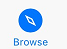
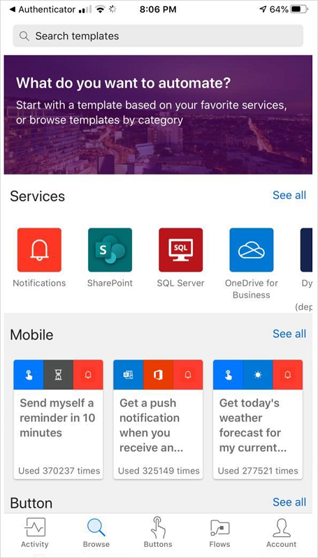
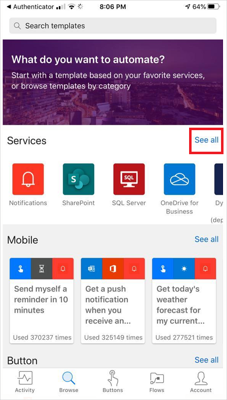
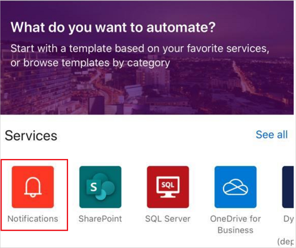
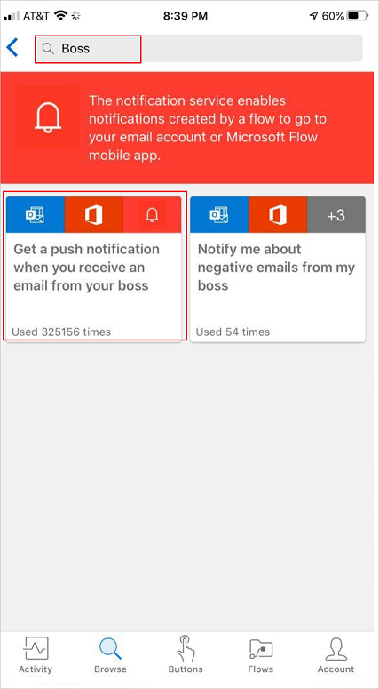
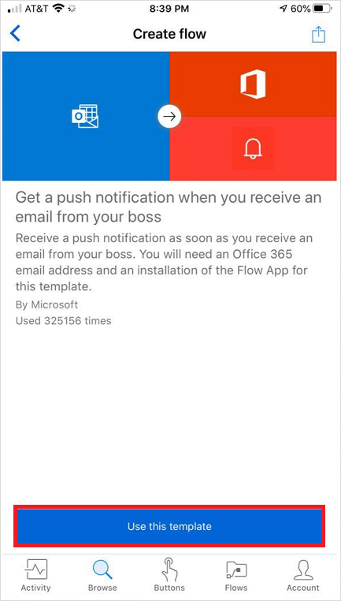
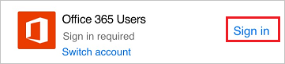
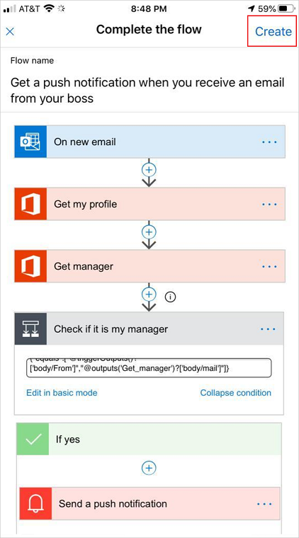
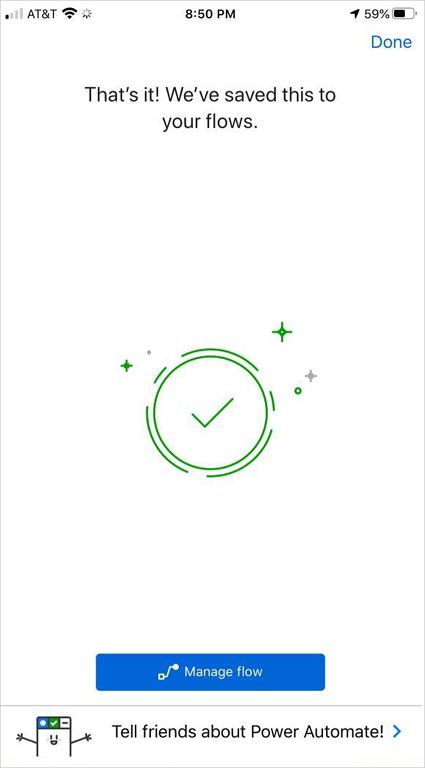

# Create a cloud flow from your phone by using Power Automate

Create a cloud flow from your phone by using a template, which you can find by searching through a list of services, browsing categories, or by specifying keywords.

Follow the steps in this topic to create a cloud flow that sends a push notification to your phone when you get mail from your boss.

If you're unfamiliar with Power Automate, [get an overview](getting-started.md).

## Prerequisites
* An [account for Power Automate](sign-up-sign-in.md).
* The Power Automate mobile app for [Android](https://aka.ms/flowmobiledocsandroid), [iOS](https://aka.ms/flowmobiledocsios), or [Windows Phone](https://aka.ms/flowmobilewindows) on a [supported device](getting-started.md#use-the-mobile-app). The graphics in this topic reflect the iPhone version of the app, but the interface on an Android device or Windows Phone is similar.
* To use the template demonstrated in this topic, you'll also need:
  
  * Office 365 credentials.
  * Push notifications enabled on your phone.

## Find a template
1. Open the mobile app, and then tap **Browse** at the bottom of the screen.
   
    
   
    You can find a template in any of these ways:
   
   * Specify a keyword in the search box at the top of the screen.
   * Tap an option in the list of services.
   * Scroll down to show a variety of categories, and then tap a template in any category.
     
  
       
     
     For this tutorial, you'll open the template that sends a push notification when you get mail from your boss.
1. In the list of services, tap **See all**.
   

    
1. Tap the **Notifications** service icon.
    
    
1. In the search bar, type **boss**, and then tap the template to send a push notification when you receive a message from your boss.
   
  
    
1. In the screen that gives details about the template that you've selected, tap **Use this template**.
   
    

## Finish the flow
1. If prompted, tap **Sign in**, and provide your credentials for Office 365 Outlook, Office 365 Users, or both.
   
    
   
    >[!TIP]
    >You can use the same connections when you create other flows.

1. In the upper-right corner, tap **Create**.
   
    

      
    Your flow is created and it checks for email from your boss until you pause or delete the flow.

    

## Next steps
* [Monitor your flow activity](mobile-monitor-activity.md).
* [Manage your flows](mobile-manage-flows.md).

