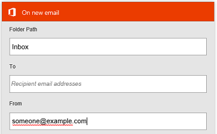
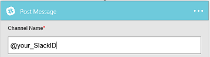
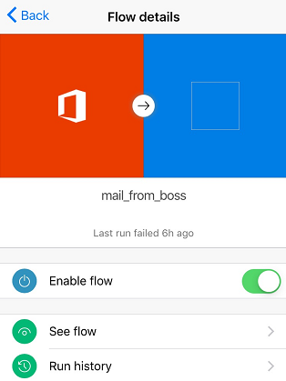
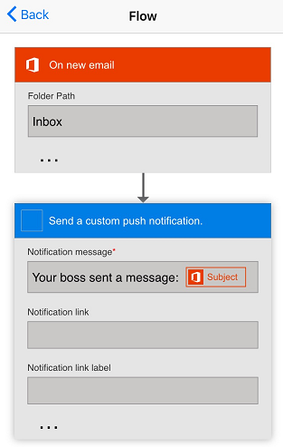
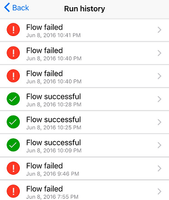
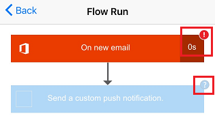

# Manage flows in Power Automate from your phone

View a list of all the flows that you created and, for each flow, view its events and actions, enable or disable it, and explore its run history.

## Prerequisites

* Install the Power Automate mobile app for [Android](https://aka.ms/flowmobiledocsandroid), [iOS](https://aka.ms/flowmobiledocsios), or [Windows Phone](https://aka.ms/flowmobilewindows) on a [supported device](getting-started.md#use-the-mobile-app). The graphics in this topic reflect the iPhone version of the app, but the graphics on an Android and Windows phone look similar.
* If you don't already have a cloud flow, create one on [Power Automate](https://flow.microsoft.com/). For easier testing, use a flow that you can trigger yourself instead of waiting for an external event.

The flow in this article runs when you receive a mail from a specific email address.

>[!div class="mx-imgBorder"]
>

You could configure such a cloud flow with your personal email address for testing and a different address (for example, your manager's) when the flow is ready for real use.

When the flow runs, it sends a custom push notification with the syntax shown in the following screenshot to your phone.

>[!div class="mx-imgBorder"]
>

>[!NOTE]
>You can also [monitor flow activity](mobile-monitor-activity.md) from the mobile app.

## Manage a cloud flow

1. Open the mobile app, and then tap **My flows** at the bottom of the screen to list all your flows.

    Each entry shows the name of the flow, icons for its events and actions, the time when it ran most recently, and an icon that indicates whether the most recent run succeeded.

    >[!div class="mx-imgBorder"]
    >

1. Tap a cloud flow to show the options to manage it.

    >[!div class="mx-imgBorder"]
    >

1. Tap the **Enable flow** toggle to enable or disable the flow.

1. Tap **See flow** to show the events and actions for that flow, tap each event or an action to expand it, and then tap **Back**.

    >[!div class="mx-imgBorder"]
    >

1. Tap **Run history** to show the flow's successes, failures, or both.

    >[!div class="mx-imgBorder"]
    >

1. Tap a run to show whether each event and action succeeded and, if so, how much time in seconds it took.

    >[!div class="mx-imgBorder"]
    >

[!INCLUDE[footer-include](includes/footer-banner.md)]
