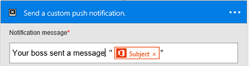
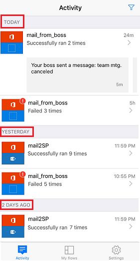
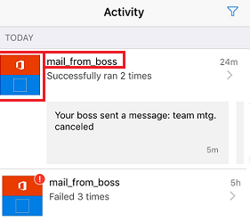
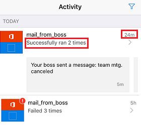
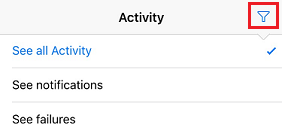
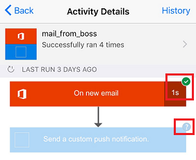
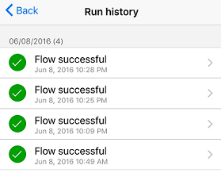

<properties
    pageTitle="Monitor activity from your phone | Microsoft Flow"
    description=""
    services=""
    suite="flow"
    documentationCenter="na"
    authors="AFTOwen"
    manager="erikre"
    editor=""
    tags=""/>

<tags
   ms.service="flow"
   ms.devlang="na"
   ms.topic="article"
   ms.tgt_pltfrm="na"
   ms.workload="na"
   ms.date="06/11/2016"
   ms.author="anneta"/>

# Monitor activity in Microsoft Flow from your phone #
Display a summary of how many times each flow succeeded or failed today, yesterday, and previous days. Show details about each run, such as when it ran, how long each step took and, if it failed, why.

**Prerequisites**
- Install the mobile app for Flow.
- If you don't already have a flow, create one. For easier testing, use one that you can trigger yourself instead of waiting for an external event.

The flow in this tutorial runs when you receive mail from a specific address:

You could configure such a flow with your personal email address for testing and a different address (for example, your manager's) when the flow is ready for real use.

When the flow runs, it sends a push notification to your phone:

## Display a summary of activity ##
1. If your flow hasn't run before, trigger a run to generate data.

1. Open the mobile app, which shows the **Activity** tab by default.

	This tab shows data organized by day, with today's data at the top.

	

	Each entry shows the name of a flow with icons that correspond to its trigger events and actions.

	

	If at least one run of a flow has succeeded in a day, an entry shows the number of successes and the time when it succeeded most recently. A different entry shows similar information if a flow has failed.

	

1. To filter the list, tap the icon in the upper-right corner.

	You can show all entries, only the failure entries, or only the entries that include push notifications.

	

## Show details of a run ##
1. On the **Display** tab, tap an entry to show details of the most recent run.

 	Each event and action appears with an icon that indicates whether the event or action succeeded or failed. If it succeeded, the amount of time it took (in seconds) also appears.

	

1. At the bottom of the screen, tap **See previous runs**.

	- If the run that you were showing succeeded, a list of previous successes appears.

	

	- If the run that you were showing failed, a list of previous failures appears.

1. Tap a run in the list to show its details, and then tap **Back** twice to return to the details of the most recent success or failure.

1. In the upper-right corner, tap **History** to list all runs of the flow, whether they succeeded or failed, and then tap a run to show its details.

	
