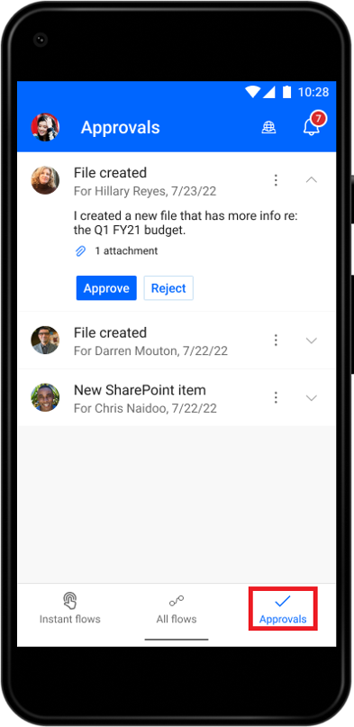
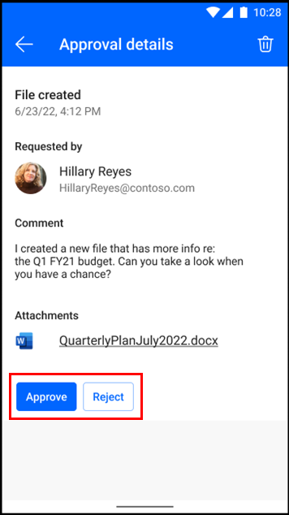

# Manage approvals in the Power Automate mobile app for Android

The approvals feature allows you to manage your approval requests while you’re away from your desk. 

You can approve or reject a request directly from the **Approvals** screen.

## View approval details

As an alternative, you can view additional details such as comments and attachments of each approval in a separate screen.

To view approval details:

1. On the **Approvals** screen, select the vertical (**…**) next to a request.

1. Select **Details**.

1. Select **Approve** or **Reject**.

    
    [!INCLUDE[footer-include](../includes/footer-banner.md)]