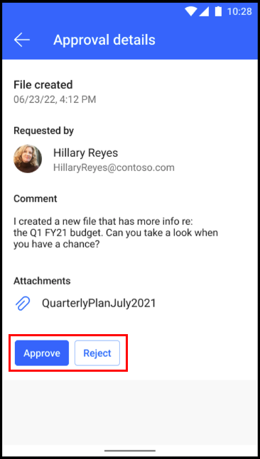

# Manage approvals on the go beta (preview)

[!INCLUDE[cc-beta-prerelease-disclaimer](./includes/cc-beta-prerelease-disclaimer.md)]

Power Automate mobile beta allows you to view and respond to approvals while you’re away from your desk.

> [!IMPORTANT]
> - This is a preview feature.
>
> - [!INCLUDE[cc_preview_features_definition](includes/cc-preview-features-definition.md)]

To respond to approvals:

1. Tap the down arrow to view the entire entry.
    If there's an attachment, tap the paper clip to open it.

1. Display the approval buttons by tapping the three dots.

1. Tap **Accept** or **Reject**.

> [!div class="mx-imgBorder"]
> 

[!INCLUDE[footer-include](../includes/footer-banner.md)]