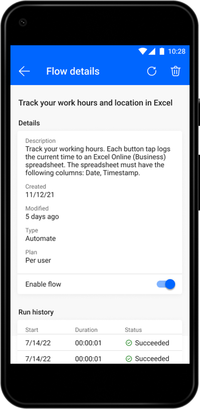

# Manage cloud flows

Power Automate mobile allows you to view the flows you've created. This includes non-solution and solution-aware flows. You can also view details of each individual flow,

## View a list of your cloud flows

You can view the flows that you've created as well as flows shared with you. This includes non-solution, solution-aware, and shared flows.

## View run history and connections

The Power Automate mobile app offers the following additional cloud flow management tools:

- View the description of your flow.

- View your flow's run history to confirm that it ran successfully.

- Keep track of connections for each cloud flow.

- Turn the flow on or off.

[!INCLUDE[footer-include](../includes/footer-banner.md)]
