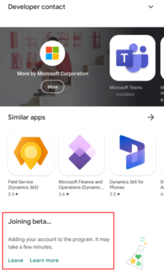

# Manage cloud flows in Power Automate mobile beta (preview)

[!INCLUDE[cc-beta-prerelease-disclaimer](../includes/cc-beta-prerelease-disclaimer.md)]

Experience the same familiar look and feel of the Power Automate portal with Power Automate mobile beta. If you've used the previous mobile version, you'll notice some improvements, such as quicker response times and easier navigation.

Use Power Automate mobile to do the following scenarios:

- [Run instant flows](run-instant-flows.md).

- [Manage approvals](manage-approvals.md).

- [Send and receive push notifications](send-receive-push.md).

- [Manage cloud flows](manage-cloud-flows.md).

> [!IMPORTANT]
> - This is a preview feature.
>
> - [!INCLUDE[cc_preview_features_definition](../includes/cc-preview-features-definition.md)]

## Prerequisite

Install the Power Automate app on your device.

## Install Power Automate mobile beta

Before you can install the beta version, the Power Automate app must be installed on your device.

To download the beta version:

1. Tap **Play Store**. Depending on the version of your device, the icon might be named Google Play Store.

1. In the search bar at the top, enter **power automate**.

1. Tap **Power Automate** to open the app page.

1. Swipe to the bottom of the page until you reach the **Join the beta** heading.

1. Tap **Join**.  

> [!div class="mx-imgBorder"]
> 

> [!NOTE]
> Plans to update Power Automate mobile for iOS are in the works.
 
[!INCLUDE[footer-include](../includes/footer-banner.md)]