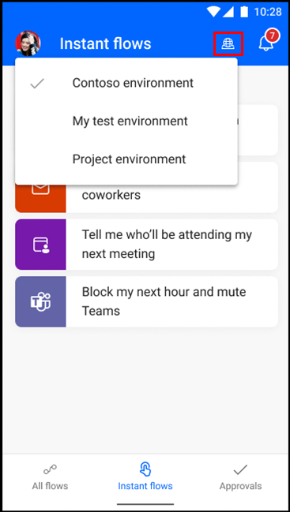

# Overview

Experience the same familiar look and feel of the Power Automate portal with Power Automate mobile app for Android. If you've used the previous mobile version, you'll notice some improvements, such as quicker response times and easier navigation.

Use Power Automate mobile to do the following scenarios:

- [Run instant flows](run-instant-flows.md)

- [Manage approvals](manage-approvals.md)

- [Send and receive push notifications](send-receive-push.md)

- [Manage cloud flows](manage-cloud-flows.md)

## Install the Power Automate mobile app

If you're not signed up for Power Automate, [sign up for free](../sign-up-sign-in.md). Then choose the download link or scan the QR code to download the Power Automate mobile app.

| Android |
| :---:   |
|    |
|   |

> [!NOTE]
> - You can sign in with either Azure Active Directory (AAD) or your Microsoft account (MSA).
> - You'll need the new version of the app (version 3.x.x or later) for the functionality described in this article. This version is currently being rolled out and may not be available for you yet.

## Change environments

You might have different environments set up depending on the purpose of your work (for example, testing, projects, and customers). You can easily change your environment so that you can access your flows, approvals, notifications, and more, based on the environment you're in.

 
## Limitations

Following are the known limitations for the mobile app for Android:

- Geofencing (location-based trigger) isn't supported. This was formerly a preview feature and was never generally available.

- Flow creation and editing aren't supported. Customers told us that they prefer to create and edit in the web portal when building or changing flows. If you’re on the go and need to create or edit, you can log into Power Automate on your mobile’s browser.
- 
- [!INCLUDE[footer-include](../includes/footer-banner.md)]