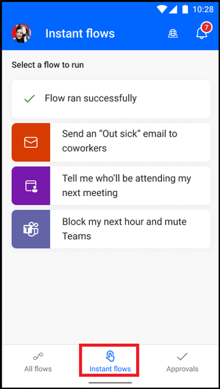

# Run instant flows

The instant flows feature allows you to easily run repetitive tasks from any place, at any time with your mobile device. Running instant cloud flows are automated, which saves you time. You might also encounter fewer errors than if you performed the tasks manually.

If you've used the previous Power Automate mobile app version, you know instant flows as button flows.

To run an instant flow:

1. Select the flow you would like to run from the **Instant flows** screen.

1. Select **Run flow**.

    Some flows might require you to fill in parameters before running the flow.

    

[!INCLUDE[footer-include](../includes/footer-banner.md)]