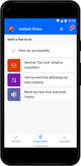

# Run instant flows in Power Automate beta (preview)

[!INCLUDE[cc-beta-prerelease-disclaimer](../includes/cc-beta-prerelease-disclaimer.md)]

Power Automate mobile enables you to run your instant flows. If you've used the previous Power Automate mobile version, you know these as *button* flows. The mobile app also supports widgets. This allows you to create shortcuts to your instant flows on your device’s home screen.

> [!IMPORTANT]
> - This is a preview feature.
>
> - [!INCLUDE[cc_preview_features_definition](includes/cc-preview-features-definition.md)]
## Why create instant flows?

Create instant flows so that you can easily run repetitive tasks from any place, at anytime with your mobile device. Running instant cloud flows are automated, which saves you time. You might also encounter fewer errors than if you performed the tasks manually.

> [!div class="mx-imgBorder"]
> 

[!INCLUDE[footer-include](../includes/footer-banner.md)]