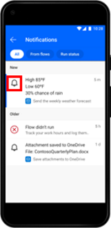

# Send and receive push notifications in Power Automate mobile

Power Automate mobile beta allows you to send and receive push notifications. You can also view a list of recent notifications and flow alerts from a notification bell. If you've used the previous Power Automate mobile version, you know these as *Activity Feeds*.

> [!div class="mx-imgBorder"]
> 

[!INCLUDE[footer-include](../includes/footer-banner.md)]