<properties
    pageTitle="Create a modern approval workflow with multiple approvers | Microsoft Flow"
    description="Create a modern approval workflow with multiple approvers "
    services=""
    suite="flow"
    documentationCenter="na"
    authors="MSFTMan"
    manager="anneta"
    editor=""
    tags=""/>

<tags
   ms.service="flow"
   ms.devlang="na"
   ms.topic="article"
   ms.tgt_pltfrm="na"
   ms.workload="na"
   ms.date="02/16/2017"
   ms.author="deonhe"/>

# Create a sequential approval with Microsoft Flow

In this walkthrough, we create a flow that requires pre-approval from one person (the pre-approver) before the final approver receives the request to approve or reject the request. If pre-approver rejects the request, final approver does not receive the request.

Note: Go to the [modern approvals walkthrough](./modern-approvals.md) if you want to see a detailed walkthrough to create, and test a single approver flow.

## Create an approval flow

In this walkthrough, we'll create a flow that performs the following steps:

1. Starts when a vacation request is created in a SharePoint Online list.

1. Adds the vacation request to the approval center, and then emails the request to the pre-approver.

1. Sends the pre-approver's decision via email to the person who requested vacation, after the pre-approver decides.

1. Updates the SharePoint Online list with the pre-approver's decision, and any comments from the pre-approver.

   No further action takes place if the pre-approver rejects the vacation request.

   If the pre-approver approves the vacation request, the flow continues with these steps:

1. Sends an approval request to the final approver.

1. Updates the SharePoint list with the final approver's decision.

1. Sends an email with the final approver's decision to the person who requested vacation.

This diagram shows the details of the flow we'll create:

   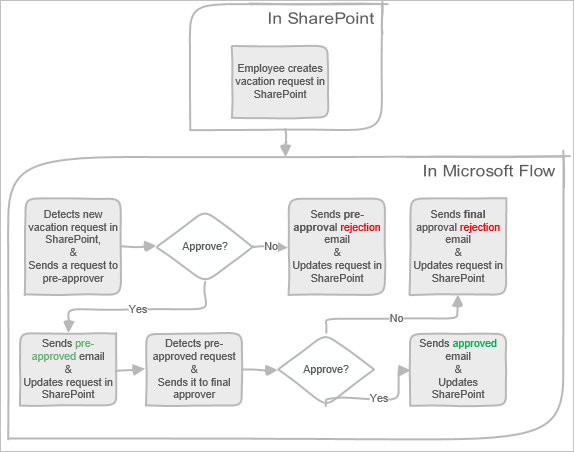

## Prerequisites

[AZURE.INCLUDE [INCLUDEDCONTENT](../includes/prerequisites-for-modern-approvals.md)]

The SharePoint Online list that you create must include the following columns:

   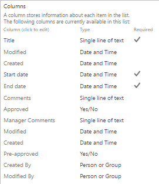

Make note of the name and URL of the SharePoint Online list. You'll need these items later when you configure the **SharePoint - When a new item is created** trigger.

### Create your flow from the blank template

[AZURE.INCLUDE [INCLUDEDCONTENT](../includes/sign-in-and-create-flow-from-blank-template.md)]

### Add a trigger

[AZURE.INCLUDE [INCLUDEDCONTENT](../includes/add-trigger-when-sharepoint-item-created.md)]

<!--update image-->
   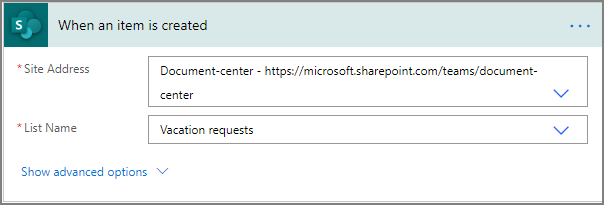

### Add a profile action

[AZURE.INCLUDE [INCLUDEDCONTENT](../includes/add-get-profile-action.md)]

   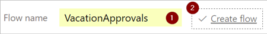

### Add an approval action for pre-approvals

[AZURE.INCLUDE [INCLUDEDCONTENT](../includes/add-an-approval-action.md)]

>[AZURE.NOTE]This approval action sends vacation requests to the pre-approver's email address that's entered into the **Assigned To** box.

### Add a condition

[AZURE.INCLUDE [INCLUDEDCONTENT](../includes/add-approval-condition-response.md)]

>[AZURE.NOTE]This condition checks the response from the **Start an approval** action.

### Add an email action for pre-approvals

Follow these steps to send an email when vacation requests are pre-approved:

[AZURE.INCLUDE [INCLUDEDCONTENT](../includes/add-action-to-send-email-when-vacation-approved.md)]

   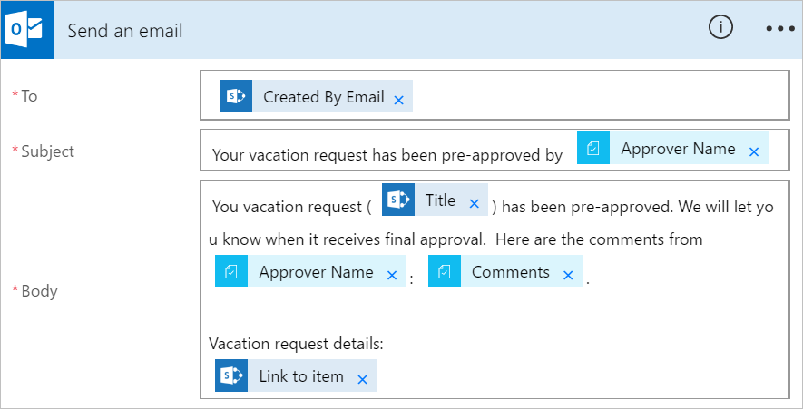

### Add an update action for pre-approved requests

[AZURE.INCLUDE [INCLUDEDCONTENT](../includes/add-action-to-update-sharepoint-with-approval.md)]

   [update item configuration](./media/sequential-modern-approvals/configure-update-item.png)

1. Select **Update flow** to save the work we've done.

   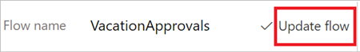

If you've followed along, your flow should resemble this screenshot:
<!--update this image -->
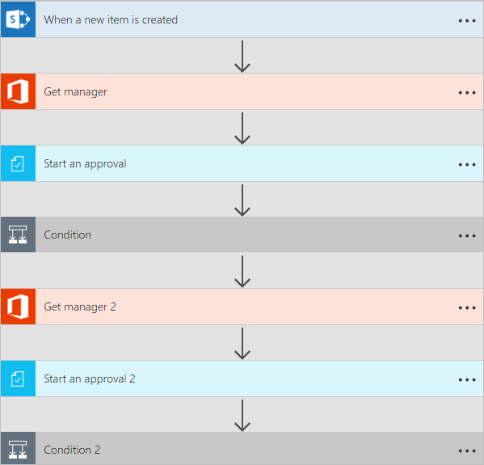

<!--add save step-->

### Add the final approval action

1. Use the [add an approval action for pre-approvals](modern-approvals-sequential.md/#Add-an-approval-action-for-pre-approvals) steps we did earlier to add, and then configure another **Start an approval** action.

This action sends an email to the *final approver* so be sure to use an email address ( in the **Assigned To** box) that's different from the address you used for the pre-approver earlier.

1. When you're done, the card should resemble this image:

     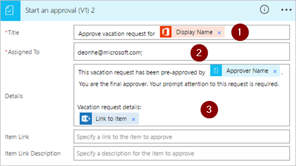

### Add final approval condition

1. Use the steps from [add a condition](modern-approvals-sequential.md/#Add-a-condition) earlier in the walkthrough to add, and then configure a **Condition**. This condition checks the final approver's decision.

## Add email action for final approval

1. Use the steps from [Add an email action for pre-approvals](modern-approvals-sequential.md/#Add-an-email-action-for-pre-approvals) earlier in the walkthrough to add, and then configure an action that sends an email when the vacation request is approved.

1. When you're finished, your card should resemble this image:

   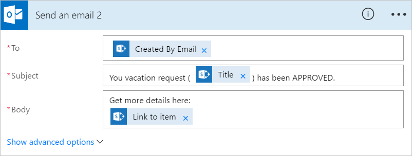

## Add action to update SharePoint with approval

1. Use the steps from [Add an update action for pre-approved requests](modern-approvals-sequential.md/#Add-an-update-action-for-pre-approved-requests) earlier in the walkthrough to add, and then configure an action that updates SharePoint when the vacation request is approved.

1. When you're finished, the card should resemble this image:

     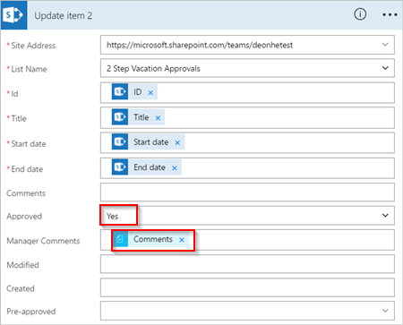

### Add email action for final rejection

1. Use the steps from [Add an email action for pre-approval rejections](modern-approvals-sequential.md/#Add-an-email-action-for-pre-approval-rejections) earlier in the walkthrough to add, and then configure an action that sends an email when the vacation request is rejected.

1. When you're finished, the card should resemble this image:

   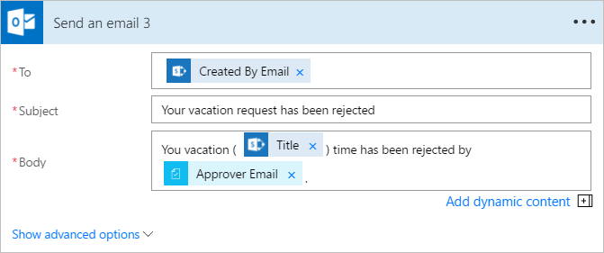

## Add action to update SharePoint with rejection

<!--the section that this section refers to comes after this one...swap who referencing who :-))-->

1. Use the steps from [Add an update action for rejected requests](modern-approvals-sequential.md/#Add-an-update-action-for-rejected-requests) earlier in the walkthrough to add, and then configure an action that updates SharePoint if the final approver rejects the vacation request.

1. When you're finished, the card should resemble this image:

   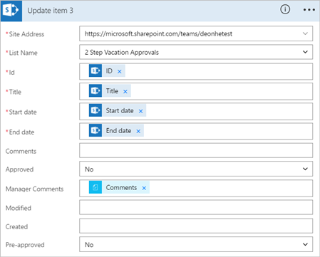

### Add an email action for pre-approval rejections

Follow these steps to configure the email template that is used if the vacation request is rejected by the pre-approver:

[AZURE.INCLUDE [INCLUDEDCONTENT](../includes/add-action-to-send-email-when-vacation-rejected.md)]

   

### Add an update action for rejected requests

[AZURE.INCLUDE [INCLUDEDCONTENT](../includes/add-action-to-update-sharepoint-with-rejection.md)]

   

Now that we've created the flow, let's see it in action.

## Request an approval

[AZURE.INCLUDE [INCLUDEDCONTENT](../includes/request-vacation-approval.md)]

Your request should resemble this image:

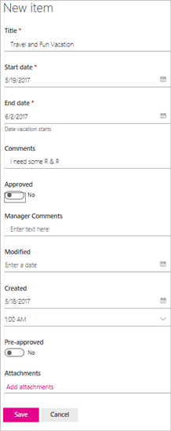

## View pending approval requests

[AZURE.INCLUDE [INCLUDEDCONTENT](../includes/view-pending-approvals.md)]

## Pre-approve a request

[AZURE.INCLUDE [INCLUDEDCONTENT](../includes/approve-request-from-different-locations.md)]

## Approve the request

The steps to approve a request are identical to the steps to [pre-approve a request](modern-approvals-sequential.md/#Pre-approve-a-request)

Note: The final approver gets the vacation request only after the request has been pre-approved.

## Reject a request

[AZURE.INCLUDE [INCLUDEDCONTENT](../includes/reject-a-request.md)]