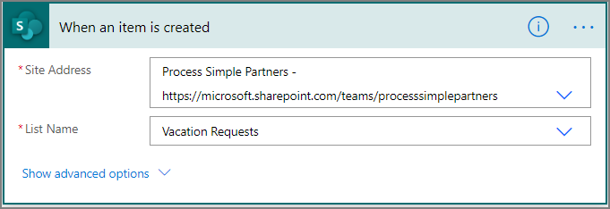
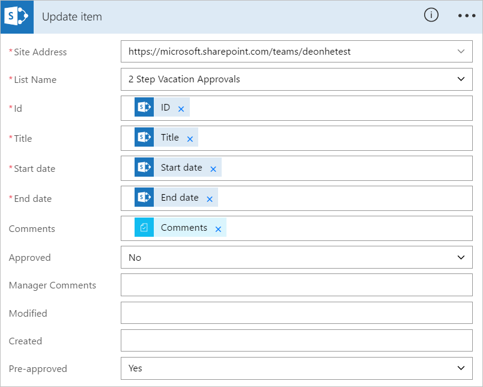
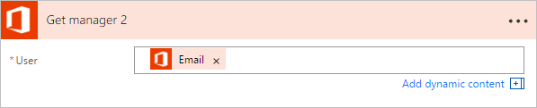
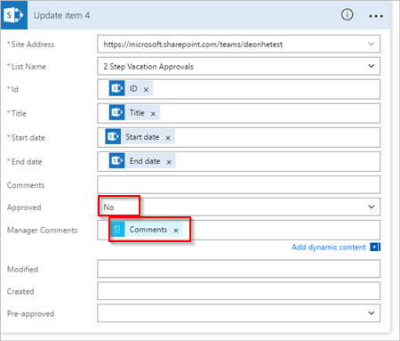

<properties
    pageTitle="Create a modern approval workflow with multiple approvers | Microsoft Flow"
    description="Create a modern approval workflow with multiple approvers "
    services=""
    suite="flow"
    documentationCenter="na"
    authors="MSFTMan"
    manager="anneta"
    editor=""
    tags=""/>

<tags
   ms.service="flow"
   ms.devlang="na"
   ms.topic="article"
   ms.tgt_pltfrm="na"
   ms.workload="na"
   ms.date="05/25/2017"
   ms.author="deonhe"/>

# Manage sequential approvals with Microsoft Flow

You can use Microsoft Flow to automate almost any workflow. Some workflows require pre-approval before the final approver is required to sign off. For example, a company may have a sequential approval policy that requires pre-approval for invoices over $1000.00 before they're approved by the Finance department.

In this walkthrough, we create a sequential approval flow that manages employee vacation requests. The flow starts after an employee creates a request for vacation in SharePoint. The flow then routes the request to someone for pre-approval. If the vacation request is pre-approved, the flow sends it to another person for final approval. If the pre-approver rejects the request, the final approver doesn't receive it. The flow also sends email to the employee whenever the status of the vacation request is changed by the pre-approver or the approver.

Note: Go to the [modern approvals walkthrough](./modern-approvals.md) if you want to create, and then test a single approver flow.

## Detailed steps in the flow

The flow:

1. Starts when an employee creates vacation request in a SharePoint Online list.

1. Adds the vacation request to the approval center, and then emails the request to the pre-approver.

1. Emails the pre-approval decision to the employee.

1. Updates the SharePoint Online list with the pre-approver's decision and comments.

   Note: If the request is pre-approved, the flow continues with these steps:

1. Sends the request to the final approver.

1. Emails the final decision to the employee.

1. Updates SharePoint list with the final decision.

This diagram summarizes the preceding steps:

   

## Prerequisites

[!INCLUDE [INCLUDEDCONTENT](../includes/prerequisites-for-modern-approvals.md)]

The SharePoint Online list that you create must include the following columns:

   

Make note of the name and URL of the SharePoint Online list. We use these items later when you configure the **SharePoint - When a new item is created** trigger.

## Create your flow from the blank template

[!INCLUDE [INCLUDEDCONTENT](../includes/sign-in-and-create-flow-from-blank-template.md)]

## Add a trigger

[!INCLUDE [INCLUDEDCONTENT](../includes/add-trigger-when-sharepoint-item-created.md)]

   

## Get the manager for the person who created the vacation request

[!INCLUDE [INCLUDEDCONTENT](../includes/add-get-manager-action.md)]

1. Provide a name for your flow, and then select **Create flow** to save the work we've done so far.

   

>[AZURE.NOTE] Select **Update flow** from the top of the screen periodically to save the changes to your flow.

   

After you save your flow, select **Edit flow** from the top of the screen, and then continue making changes.

## Add an approval action for pre-approvals

[!INCLUDE [INCLUDEDCONTENT](../includes/add-an-approval-action.md)]

This approval action sends vacation requests to the pre-approver's email address that's entered into the **Assigned To** box.

Note: Here, I've used a static email address in the **Assigned To** box. However, you may want to use the email address of the employee's manager as the pre-approver. If your organization uses Office 365, you can use the [Office 365 Users](https://flow.microsoft.com/services/shared_office365users/office-365-users/) service to dynamically get the email address for person's manager while the flow runs.

## Add a condition

[!INCLUDE [INCLUDEDCONTENT](../includes/add-approval-condition-response.md)]

>[AZURE.NOTE]This condition checks the response from the **Start an approval** action.

## Add an email action for pre-approvals

Follow these steps to send an email when vacation requests are pre-approved:

[!INCLUDE [INCLUDEDCONTENT](../includes/add-action-to-send-email-when-vacation-approved.md)]

   

## Add an update action for pre-approved requests

[!INCLUDE [INCLUDEDCONTENT](../includes/add-action-to-update-sharepoint-with-approval.md)]

   

## Get the pre-approver's manager

1. Use the [Get the manager for the person who created the vacation request](modern-approvals-sequential.md/#Get-the-manager-for-the-person-who-created-the-vacation-request) steps we did earlier to add, and then configure another **Get manager** action. This time we get the pre-approver's manager.

1. The **Get manager 2** card should look like this when you are finished. Be sure to use the **Email** token from the **Get manager** category on the **Add dynamic content from the apps and services used in this flow.** card.

   

## Add the final approval action

1. Use the [add an approval action for pre-approvals](modern-approvals-sequential.md/#Add-an-approval-action-for-pre-approvals) steps we did earlier to add, and then configure another **Start an approval** action. This action sends an email request for final approval.

1. When you're done, the card should resemble this image:

     

## Add the final approval condition

1. Repeat the steps from [add a condition](modern-approvals-sequential.md/#Add-a-condition) to add, and then configure a **Condition** that checks the final approver's decision.

## Send email with final approval

1. Use the steps from [Add an email action for pre-approvals](modern-approvals-sequential.md/#Add-an-email-action-for-pre-approvals) to add, and then configure an action that sends an email when vacation requests are approved.

1. When you're finished, your card should resemble this image:

   

## Update SharePoint with approval

1. Use the steps from [Add an update action for pre-approved requests](modern-approvals-sequential.md/#Add-an-update-action-for-pre-approved-requests) to add, and then configure an action that updates SharePoint when the vacation request is approved.

1. When you're finished, the card should resemble this image:

     

## Send email with pre-approval rejection

Expand the **Condition** card, and then perform the following steps:

[!INCLUDE [INCLUDEDCONTENT](../includes/add-action-to-send-email-when-vacation-rejected.md)]

   

## Update SharePoint with pre-approval rejection

[!INCLUDE [INCLUDEDCONTENT](../includes/add-action-to-update-sharepoint-with-rejection.md)]

   

## Send email with final rejection

1. Use the steps from [Send email with pre-approval rejection](modern-approvals-sequential.md/#Send-email-with-pre-approval-rejection) to add, and then configure an action that sends an email when the vacation request is rejected by the final approver.

1. When you're finished, the card should resemble this image:

   

## Update SharePoint with final rejection

1. Use the steps from [Update SharePoint with pre-approval rejection](modern-approvals-sequential.md/#Update-SharePoint-with-pre-approval-rejection) to add, and then configure an action that updates SharePoint if the final approver rejects the vacation request.

1. When you're finished, the card should resemble this image:

   

1. Select **Update flow** to save the work we've done.

   

If you've followed along, your flow should resemble this screenshot:

Now that we've created the flow, let's see it in action.

## Request an approval

[!INCLUDE [INCLUDEDCONTENT](../includes/request-vacation-approval.md)]

Your request should resemble this image:

## View pending approval requests

[!INCLUDE [INCLUDEDCONTENT](../includes/view-pending-approvals.md)]

## Pre-approve a request

[!INCLUDE [INCLUDEDCONTENT](../includes/approve-request-from-different-locations.md)]

## Approve the request

The steps to approve a request are identical to the steps to [pre-approve a request](modern-approvals-sequential.md/#Pre-approve-a-request)

Note: The final approver gets the vacation request only after the request has been pre-approved.

## Reject a request

[!INCLUDE [INCLUDEDCONTENT](../includes/reject-a-request.md)]