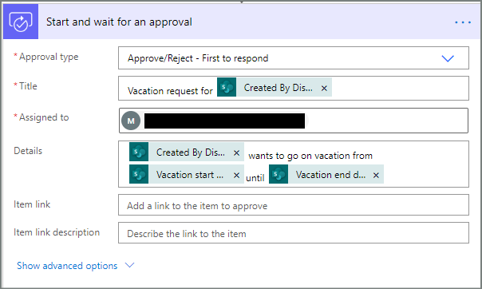
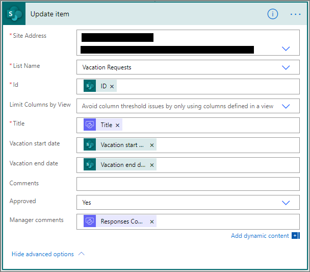

<properties
    pageTitle="Regions overview for Microsoft Flow | Microsoft Flow"
    description="Overview with question and answer about regions in Microsoft Flow"
    services=""
    suite="flow"
    documentationCenter="na"
    authors="MSFTMan"
    manager="anneta"
    editor=""
    tags=""/>

<tags
   ms.service="flow"
   ms.devlang="na"
   ms.topic="article"
   ms.tgt_pltfrm="na"
   ms.workload="na"
   ms.date="02/16/2017"
   ms.author="deonhe"/>

# Create a sequential approval with Microsoft Flow

In this walk-through, we create a flow that requires pre-approval from one person (the pre-approver) before the final approver receives the request to approve or reject the request. If pre-approver rejects the request, final approver does not receive the request.

Note: Go to the [modern approvals walk-through](./modern-approvals.md) if you want to see a detailed walk-through to create, and test a singler approver flow.

## Create an approval flow

In this walk-through, we'll create a flow that performs the following steps:

1. Starts when a vacation request is created in a SharePoint Online list.

1. Adds the vacation request to the approval center, and then emails the request to the pre-approver.

1. Sends the pre-approver's decision via email to the person who requested vacation, after the pre-approver makes a decision.

1. Updates the SharePoint Online list with the pre-approver's decision, and any comments from the pre-approver.

   No further action takes place if the pre-approver rejects the vacation request.

   If the pre-approver approves the vacation request, the flow continues with these steps:

1. Sends an approval request to the final approver.

1. Updates the SharePoint list with the final approver's decision.

1. Sends an email with the final approver's decision to the person who requested vacation.

This diagram shows the details of the flow we'll create:

   

## Prerequisites

[AZURE.INCLUDE [INCLUDEDCONTENT](../includes/prerequisites-for-modern-approvals.md)]

[AZURE.INCLUDE [INCLUDEDCONTENT](../includes/modern-approvals-setup.md)]

### Create your flow from the blank template

[AZURE.INCLUDE [INCLUDEDCONTENT](../includes/sign-in-and-create-flow-from-blank-template.md)]

### Add a trigger

[AZURE.INCLUDE [INCLUDEDCONTENT](../includes/add-trigger-when-sharepoint-item-created.md)]

     

### Add a profile action

[AZURE.INCLUDE [INCLUDEDCONTENT](../includes/add-get-profile-action.md)]

     

### Add an approval action

[AZURE.INCLUDE [INCLUDEDCONTENT](../includes/add-an-approval-action.md)]

### Add a condition

[AZURE.INCLUDE [INCLUDEDCONTENT](../includes/add-approval-condition-response.md)]

### Add an email action for pre-approvals

<!-- need to update this email to show it is a pre-approval -->
[AZURE.INCLUDE [INCLUDEDCONTENT](../includes/add-action-to-send-email-when-vacation-approved.md)]

### Add an update action for approved requests

<!--Need to update this to update the pre-approved elelement-->
[AZURE.INCLUDE [INCLUDEDCONTENT](../includes/add-action-to-update-sharepoint-with-approval.md)]

### Add an email action for rejections

[AZURE.INCLUDE [INCLUDEDCONTENT](../includes/add-action-to-send-email-when-vacation-rejected.md)]

### Add update action for rejected requests

[AZURE.INCLUDE [INCLUDEDCONTENT](../includes/add-action-to-update-sharepoint-with-rejection.md)]

If you've followed along, your flow should resemble this screenshot:

<!--add save step-->

### Add the final approval action

1. Use the [add an approval action](modern-approvals-sequential.md/#Add-an-approval-action) steps we did earlier to add and configure a **Start an approval** action. This action sends an email to the *final approver* so be sure to use a different email address in the **Assigned To** box.

1. When you're done, the **Start an approval** card should resemble this image:

<!--update this image -->
     

### Add final approval condition

1. Use the steps from [add a condition](modern-approvals-sequential.md/#Add-a-condition) earlier in the walkthrough to add and configure a **Condition**. This condition checks the final approver's decision.

1. Your **Condition** card should now resemble this image:

<!--update this image -->
     

## Add email action for final approval

1. Use the steps from [Add an email action for pre-approvals](modern-approvals-sequential.md/#Add-an-email-action-for-pre-approvals) earlier in the walkthrough to add and configure a **Condition**. This condition checks the final approver's decision.

1. Your **Send an email** card should now resemble this image:

<!--update this image -->
<!--update the card name? -->

## Add action to update SharePoint with approval

1. Use the steps from [Add an update action for approved requests](modern-approvals-sequential.md/#Add-an-update-action-for-approved-requests) earlier in the walkthrough to add and configure a **Condition**. This condition checks the final approver's decision.

1. Your **Condition** card should now resemble this image:

<!--update this image -->
     

### Add email action for final rejection

1. Use the steps from [Add an email action for rejections](modern-approvals-sequential.md/#Add-an-email-action-for-rejections) earlier in the walkthrough to add and configure a **Condition**. This condition checks the final approver's decision.

1. Your **Condition** card should now resemble this image:

<!--update this image -->
   

## Add action to update SharePoint with rejection

1. Use the steps from [Add update action for rejected requests](modern-approvals-sequential.md/#Add-update-action-for-rejected-requests) earlier in the walkthrough to add and configure a **Condition**. This condition checks the final approver's decision.

1. Your **Condition** card should now resemble this image:

<!--update this image -->

Now that we've created the flow, it's time to test it!

## Request an approval

[AZURE.INCLUDE [INCLUDEDCONTENT](../includes/request-vacation-approval.md)]

## View pending approval requests

[AZURE.INCLUDE [INCLUDEDCONTENT](../includes/view-pending-approvals.md)]

## Pre-approve a request

[AZURE.INCLUDE [INCLUDEDCONTENT](../includes/approve-request-from-different-locations.md)]

## Approve the request

## Reject a request

[AZURE.INCLUDE [INCLUDEDCONTENT](../includes/reject-a-request.md)]

