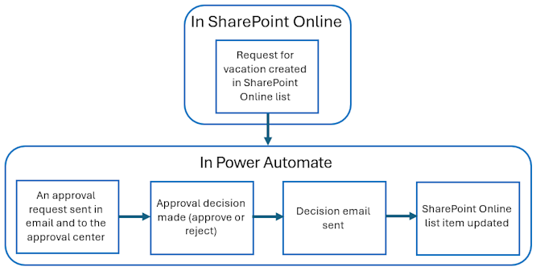
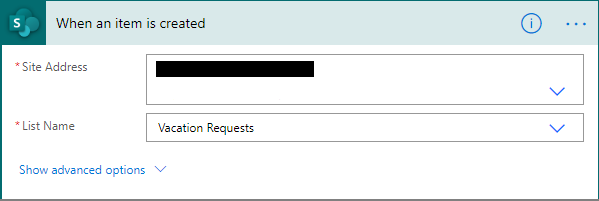

<properties
    pageTitle="Easily Automate approval workflows. | Microsoft Flow"
    description="Automate approval workflows that integrate with SharePoint, Dynamics CRM, Salesforce, OneDrive for Business, Zendesk, or WordPress."
    services=""
    suite="flow"
    documentationCenter="na"
    authors="msftman"
    manager="anneta"
    editor=""
    tags=""/>

<tags
   ms.service="flow"
   ms.devlang="na"
   ms.topic="article"
   ms.tgt_pltfrm="na"
   ms.workload="na"
   ms.date="06/15/2017"
   ms.author="deonhe"/>

# Create and test an approval workflow with Microsoft Flow

To automate an approval workflow, add the **Approvals - Start an approval** action to any flow. After you add this action, your flow can manage the approval of documents or processes. For example, you can create document approval flows that approve invoices, work orders, or sales quotations. You can also create process approval flows that approve vacation requests, overtime work, or travel plans.

Approval flows can leverage several services, including SharePoint, Dynamics CRM, Salesforce, OneDrive for Business, Zendesk, or WordPress.

Approvers manage requests from their email inbox, [the approvals center](https://flow.microsoft.com/manage/approvals/received/) on the Microsoft Flow website, or the Microsoft Flow app.

## Create an approval flow

Here's an overview of the flow we'll create:

   

The flow performs the following steps:

1. Starts when someone creates a vacation request in a SharePoint Online list.

1. Adds the vacation request to the approval center, and then emails it to the approver.

1. Sends an email with the approver's decision to the person who requested vacation.

1. Updates the SharePoint Online list with the approver's decision comments.

## Prerequisites

To complete this walkthrough, you must have access to:

[AZURE.INCLUDE [prerequisites-for-modern-approvals](../includes/prerequisites-for-modern-approvals.md)]

Create these columns in your SharePoint Online list:

   

Make note of the name and URL of the SharePoint Online list. You'll need these items later when you configure the **SharePoint - When a new item is created** trigger.

### Create your flow from the blank template

[AZURE.INCLUDE [sign-in-and-create-flow-from-blank-template](../includes/sign-in-and-create-flow-from-blank-template.md)]

### Add a trigger

[AZURE.INCLUDE [add-trigger-when-sharepoint-item-created](../includes/add-trigger-when-sharepoint-item-created.md)]

The **Site Address** and the **List Name** are the items you noted earlier in this walkthrough.

### Add a profile action

1. Select **New step**, and then select **Add an action**.

     

1. Enter **profile** into the **Choose an action** search box.

     

1. Find, and then select the **Office 365 Users - Get my profile** action.

     

1. Provide a name for your flow, and then select **Create flow** to save the work we've done so far.

     

### Add an approval action

[AZURE.INCLUDE [add-an-approval-action](../includes/add-an-approval-action.md)]

Note: This action sends the approval request to the email address in the **Assigned To** box.

### Add a condition

[AZURE.INCLUDE [add-approval-condition-response](../includes/add-approval-condition-response.md)]

### Add an email action for approvals

Follow these steps to send an email if the vacation request is approved:

[AZURE.INCLUDE [add-action-to-send-email-when-vacation-approved](../includes/add-action-to-send-email-when-vacation-approved.md)]

   

### Add an update action for approved requests

[AZURE.INCLUDE [add-action-to-update-sharepoint-with-approval](../includes/add-action-to-update-sharepoint-with-approval.md)]

Note: **Site Address**, **List Name**, **Id**, and **Title** are required.

### Add an email action for rejections

[AZURE.INCLUDE [add-action-to-send-email-when-vacation-rejected](../includes/add-action-to-send-email-when-vacation-rejected.md)]

### Add update action for rejected requests

[AZURE.INCLUDE [add-action-to-update-sharepoint-with-rejection](../includes/add-action-to-update-sharepoint-with-rejection.md)]

   Note: **Site Address**, **List Name**, **Id**, and **Title** are required.

1. Select **Update flow** to save the work we've done.

     

If you've followed along, your flow should resemble this screenshot:

Now that we've created the flow, it's time to test it!

## Request an approval

[AZURE.INCLUDE [request-vacation-approval](../includes/request-vacation-approval.md)]

## View pending approval requests

[AZURE.INCLUDE [view-pending-approvals](../includes/view-pending-approvals.md)]

## Approve a request

[AZURE.INCLUDE [approve-request-from-different-locations](../includes/approve-request-from-different-locations.md)]

## Reject a request

[AZURE.INCLUDE [reject-a-request](../includes/reject-a-request.md)]

Now that you've created and tested your flow, be sure to let others know how to use it.

## Learn more

- Create [sequential approval flows.](./sequential-modern-approvals.md)
- Create [parallel approval flows.](./parallel-modern-approvals.md)
- Install the Microsoft Flow mobile app for [Android](https://aka.ms/flowmobiledocsandroid), [iOS](https://aka.ms/flowmobiledocsios), or [Windows Phone](https://aka.ms/flowmobilewindows).