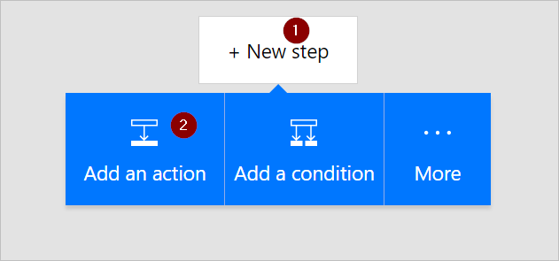

<properties
    pageTitle="Add an advanced option and multiple actions | Microsoft Flow"
    description="Expand a flow to include an advanced option, such as setting email to high priority, and add another action for the same event."
    services=""
    suite="flow"
    documentationCenter="na"
    authors="stepsic-microsoft-com"
    manager="anneta"
    editor=""
    tags=""/>

<tags
   ms.service="flow"
   ms.devlang="na"
   ms.topic="article"
   ms.tgt_pltfrm="na"
   ms.workload="na"
   ms.date="04/20/2017"
   ms.author="stepsic"/>

# Add multiple actions and advanced options to a flow #

Customize a flow by adding one or more advanced options and multiple actions for the same trigger. For example, add an advanced option that sends an email message as high priority. In addition to sending mail when an item is added to a SharePoint list, create a file in Dropbox that contains the same information.

## Prerequisites ##

- [Create a flow](get-started-logic-flow.md)

## Add another action ##

In this procedure, you'll add an action in the middle of the flow. This action will save a file in your Dropbox, archiving the item in the list.

1. In [flow.microsoft.com](https://flow.microsoft.com), select **My flows** in the top navigation bar.

1. In the list of flows, select the flow that you want to edit.

1. Select **New step**, and then select **Add an action**.

    

1. In the list of possible actions, search for **Create file**, and then select **Dropbox - Create file**.

    

1. If prompted, provide your Dropbox credentials.

1. Select the folder icon on the right side of the **Folder path** box.
1. Find and then select the folder in which you want to place the new file.

    

1. Enter the name of the new file into the **File name** box. Be sure to append an extension, such as ".txt", to the file name. Here, let's use the **TweetId** in the file's name to ensure uniqueness of the files. You may have to select **See more** to find the **TweetId** token.
1. Add the text that you want the file to contain by typing into the **File content** box. You can also add tokens into the **File content** box.

     

     >[AZURE.IMPORTANT]If you give the file a name that matches an existing file's name (in the selected folder), the existing file will be overwritten.

1. Select **Update flow**, which is located on the menu at the top of the screen.

1. Send a tweet that contains the keyword you specified.

    Within a minute, a file is created in your Dropbox account.

## Reorder or delete an action ##

To receive email after the file is created in Dropbox, move the Dropbox action by dragging its title bar above the email action. Release the Dropbox action over the arrow between the trigger (**When a new tweet is posted**) and the email action. (The cursor indicates whether the action is positioned correctly.)

     **Note:** You can't move a step before another if you're using any outputs from that step.

    

- To delete an action, select the ellipsis (...) near the right edge of the title bar for the action you want to delete, select **Delete**, and then select **OK**.

    

     **Note:** You can't delete an action if you're using any outputs from it anywhere in the flow. First, remove those outputs from the fields, and then you can delete the action.

## Add advanced options ##

Start with a flow that has a **Send an email** action.

1. Select **Show advanced options**, which is located at the bottom of the **Send an email** card.

     You'll then see the advanced options for sending an email.

    

1. Select **High** from the **Importance** list, and then select **Hide advanced options** to hide the advanced options.

1. Select **Update flow**, which is located on the menu at the top of the screen.

     This step saves your changes.
