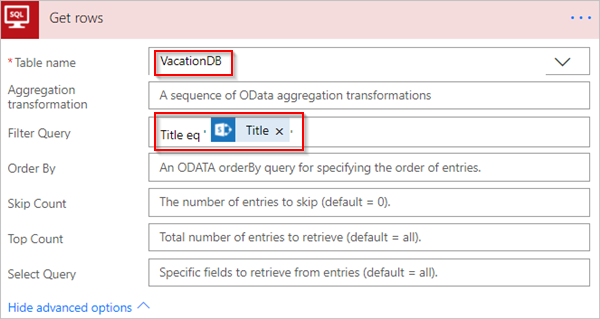
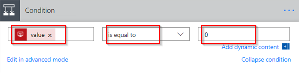
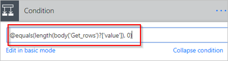

# Filter and copy data with Power Automate

This tutorial shows you how to create a cloud flow that monitors a source for new or changed items and then copies those changes to a destination. You may create a cloud flow like this one if your users enter data in one location, but your team needs it in a different location or format.

While this tutorial copies data from a Microsoft SharePoint [list](https://support.office.com/article/SharePoint-lists-I-An-introduction-f11cd5fe-bc87-4f9e-9bfe-bbd87a22a194) (the source) to an [Azure SQL Database](/azure/sql-database/sql-database-technical-overview) table (the destination), you can copy data among any of the more than [900 connectors](https://flow.microsoft.com/connectors/) that Power Automate supports.

[!INCLUDE [sharepoint-detailed-docs](includes/sharepoint-detailed-docs.md)]

## Prerequisites

- Access to a data source and a destination. This tutorial doesn’t include steps to create the source and destination.

- Access to [Power Automate](http://make.powerautomate.com/).

- A basic understanding of how your data is stored.

- Familiarity with the basics of creating flows. You can review how to add [actions, triggers](work-with-triggers-actions.md), and [conditions](add-condition.md). The following steps assume that you know how to perform these actions.

> [!TIP]
> Every column name in the source and destination doesn't need to match. However, you must provide data for all *required* columns when you insert or update an item. Power Automate identifies the required fields for you.

## Quick overview of the steps

If you're comfortable with Power Automate, use these quick steps to copy data from one data source to another.

> [!IMPORTANT]
> Changes you make in the destination aren't copied to the source because two-way syncs aren't supported. If you attempt to set up a two-way sync, you'll create an infinite loop where changes are sent endlessly between the source and destination.

1. Identify the source you'll monitor and the destination to which you'll copy changed data. Confirm you've access to both.

1. Identify at least one column that uniquely identifies items in the source and destination. In the example that follows, we use the **Title** column, but you could use any column(s) you want.

1. Set up a trigger that monitors the source for changes.

1. Search the destination to determine if the changed item exists.

1. Use a **Condition** like this:
    - If the new or changed item doesn't exist in the destination, create it.
    - If the new or changed item exists in the destination, update it.

1. Trigger your flow, and then confirm that new or changed items are being copied from the source to the destination.

If you haven't created a connection to SharePoint or Azure SQL Database previously, follow the instructions when you're prompted to sign in.

Here are the detailed steps to create the flow.

## Monitor the source for changes

1. Sign in to [Power Automate](https://make.powerautomate.com).

1. Select **My flows** > **Create from blank**.

1. Search for **SharePoint** > select the **SharePoint - When an item is created or modified** trigger from the list of triggers.

1. Enter the **Site Address** and then select the **List Name** on the **When an item is created or modified** card.

1. Provide the **Site Address** and **List Name** for the SharePoint list your flow monitors for new or updated items.

## Search the destination for the new or changed item

Use the **SQL Server - Get rows** action to search the destination for the new or changed item.

1. Select **New step** > **Add an action**.

1. Search for **Get rows**, select **SQL Server - Get rows**, and then select the table you want to monitor from the **Table name** list.

1. Select **Show advanced options**.

1. In the **Filter Query** box, enter **Title eq '**, select the **Title** token from the dynamic content list, and then enter **'**.

    The previous step assumes you're matching the titles of the rows in the source and the destination.

    The **Get rows** card should now look like the following screenshot:

    

## Check if the new or changed item was found

We use the **Condition** action to check if the new or changed item was found.

1. Select **New step** > **Add a condition** to open the **Condition** card.

1. On the condition card:

    1. Select the box on the left.
   
        The **Add dynamic content from the apps and connectors used in this flow** list opens.

    1. Select **value** from the **Get rows** category.

   > [!TIP]
   > Confirm you've selected **value** from the **Get rows** category. Don't select **value** from the **When an item is created or modified** category.

1. Select **is equal to** from the list in the center box.

1. Enter **0** (zero) in the box on the right side.

    The **Condition** card now resembles this image:

    

1. Select **Edit in advanced mode**.

    When advanced mode opens, you see **\@equals(body('Get_rows')?['value'], 0)** expression in the box. Edit this expression by adding **length()** around the **body('Get_items')?['value']** function. The entire expression now appears like this: **@equals(length(body('Get_rows')?['value']), 0)**

    The **Condition** card now resembles this image:

    
  
   > [!TIP]
   > Adding the **length()** function allows the flow to check the **value** list and determine if it contains any items.

When your flow gets items from the destination, there are two possible outcomes.

| Outcome | Next step |
| --- | --- |
| The item exists |[Update the item](odata-filters.md#update-the-item-in-the-destination) |
| The item doesn't exist |[Create a new item](odata-filters.md#create-the-item-in-the-destination) |

> [!NOTE]
> The images of the **Insert row** and **Update row** cards shown next may differ from yours because these cards show the names of the columns in the Azure SQL Database table that's being used in the flow.

## Create the item in the destination

If the item doesn't exist in the destination, create it using the **SQL Server - Insert row** action.

On the **If yes** branch of the **Condition**:

1. Select **Add an action**, search for **insert row**, and then select **SQL Server - Insert row**.

    The **Insert row** card opens.

1. From the **Table name** list, select the table into which the new item will be inserted.
  
    The **Insert row** card expands and displays all columns in the selected table. Fields with an asterisk (*) are required and must be populated for the row to be valid.

1. Select each column that you want to populate and enter the data.
  
    You can enter the data manually, select one or more tokens from the **Dynamic content**, or enter any combination of text and tokens into the columns.

    The **Insert row** card now resembles this screenshot:

    :::image type="content" alt-text="Screenshot of the Condition card in the new state." source="media/odata-filters/insert-row.png":::

## Update the item in the destination

If the item exists in the destination, update it with the changes.

1. Add the **SQL Server - Update row** action to the **If no** branch of the **Condition**.

1. Follow the steps in the [create the item](odata-filters.md#create-the-item-in-the-destination) section of this document to populate the columns of the table.

    :::image type="content" alt-text="Screenshot of the destination items." source="media/odata-filters/update-row.png":::

1. At the top of the page, enter a name for your flow in the **Flow name** box, and then select **Create flow** to save it.

Now, whenever an item in your SharePoint list (source) changes, your flow triggers and either inserts a new item or updates an existing item in your Azure SQL Database (destination).

> [!NOTE]
> Your flow isn't triggered when an item is deleted from the source. If this is an important scenario, consider adding a separate column that indicates when an item is no longer needed.

## Related information

[Use data operations](data-operations.md)

[!INCLUDE[footer-include](includes/footer-banner.md)]
