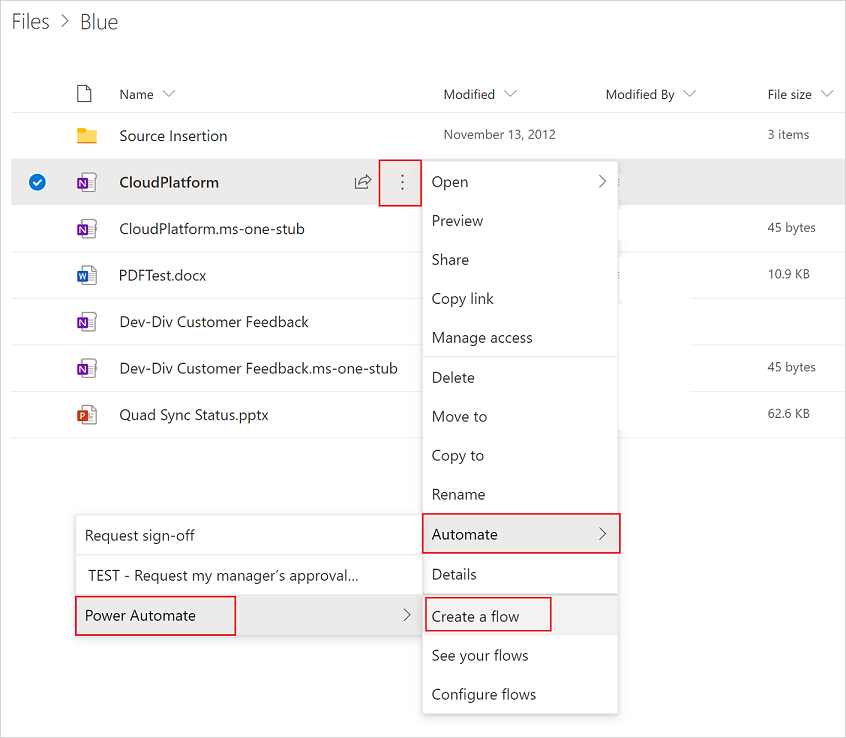

# Create flows from the OneDrive for Business launch panel

Similar to the Power Automate [Launch Panel in SharePoint](https://flow.microsoft.com/blog/introducing-flow-launch-panel-in-sharepoint-lists-and-libraries/), you can run flows on specific files in OneDrive for Business. 

This feature enables the person running the flow to use their own credentials, which is especially applicable for flows that have been created by an IT department. 

Users can also get prompts for runtime inputs like **Approver** or **Message**, which can be of type text, file, email, Boolean, or number.

In this walkthrough, we'll create a simple flow that uses one of the many [OneDrive for Business templates](https://flow.microsoft.com/search/?q=OneDrive) to request approval of a file by the requestor's manager.

## Create a cloud flow that requests manager approval for a file in OneDrive for Business

1. Sign into OneDrive for Business.
1. Find, and then select the file for which you want to create the flow.
1. Select the **Show actions** link (three dots).
1. Select **Automate** > **Power Automate** > **Create a flow**.

      

1. Select one of the templates.

    In this example, select the **Request my manager's approval for the selected file** template.

     >[!TIP]
     >Sign into all connectors that request that you sign in.

1. Select **Continue**.
1. Make any changes you want to the template and then save your flow with a name that you'll remember easily.

## Run the flow

1. Sign into OneDrive for Business.
1. Find, and then select the file for which you want to request manager approval.
1. Select the **Show actions** link (three dots).
1. Select **Flow**. You'll see the flow that you created earlier.
1. Select the flow you created earlier.

     

>[!TIP]
>While this walkthrough shows how to create a cloud flow from a template, you can also create a cloud flow from blank to use any of the hundreds of connectors available in Power Automate.

## Learn more

- [Get started with Power Automate](getting-started.md) 
- [Build multi-step flows](multi-step-logic-flow.md)

[!INCLUDE[footer-include](includes/footer-banner.md)]