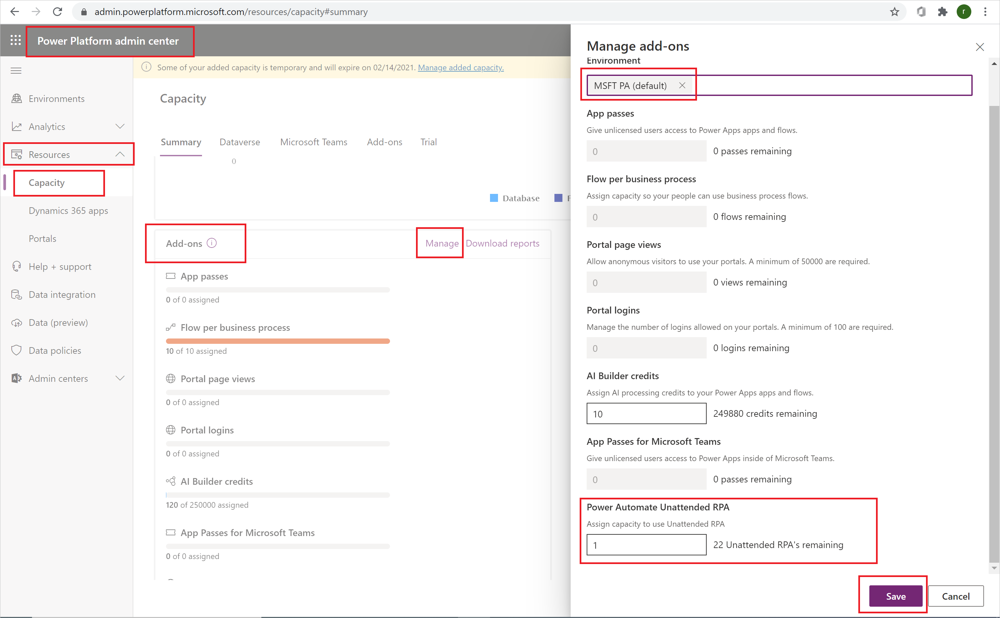
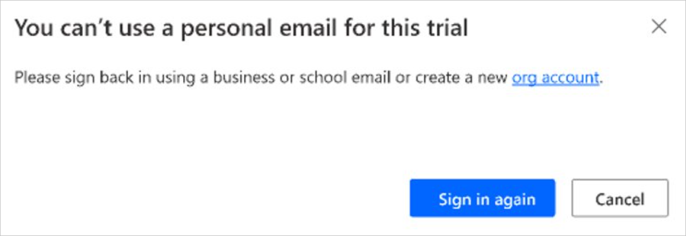

# Power Automate sign-up Q&A in your organization

This topic describes how users in your organization can use Power Automate, and how you can control the Power Automate service.

## Signing up for Power Automate

### What is Power Automate?

Power Automate is a public cloud service to help individuals and teams to set up automated workflows between their favorite apps and services to synchronize, get notifications, collect data, and more. 

### How can I sign up for Power Automate?

Just go to [flow.microsoft.com](https://flow.microsoft.com), select **Try free** on the top right-side of the screen, and then provide your information to complete the sign-up process.

[Sign up for Power Automate](sign-up-sign-in.md) includes more details.

### What is the Power Automate free license?

The Power Automate Free license is used only for tracking purposes. Enabling or disabling it has no effect on a user's ability to create flows. If you disable the Power Automate Free license, it becomes enabled again when a user logs in. This is the expected behavior.

### Can I block another person from signing up for Power Automate?

Power Automate is a fully public cloud service, and everyone in the world can sign up and use it to automate their day-to-day tasks. To use Power Automate there is no requirements that users have or use an Office 365 account. Because of this, there’s no mechanism at this time for you to block another person from using Power Automate (as everyone in the world can, irrespective of their email address).

However, if a person signs up for Power Automate, and you choose to not support them inside of your organization, they can in no way incur costs to your company. When an individual signs up for Power Automate, the relationship is between that individual and Microsoft, which is like many other cloud services from Microsoft such as Bing, OneDrive, or Outlook.com. An individual's use of Power Automate does not in any way imply that the service is provided by your organization.

Finally, if your company wishes to restrict the use of organization-only data inside of Power Automate, that is possible through [Data loss prevention (DLP) policies](/power-platform/admin/wp-data-loss-prevention).

### How can people gain access to the paid features of Power Automate?

Individuals can gain access to the paid features of Power Automate in three different ways:

1. They can individually sign up for a Power Automate Trial license for 90 days at no cost.
2. You can assign a Power Automate license to them within the [Microsoft 365 admin center](https://admin.microsoft.com/).
3. The user has been assigned a Microsoft 365 and Dynamics 365 plans that includes access to Power Automate. See the [Power Automate pricing page](https://flow.microsoft.com/pricing/) for the list of Office 365 and Dynamics 365 plans that include Power Automate capabilities.

### Can I block another person from using the paid features of Power Automate?

Any individual can try out the paid features of Power Automate for 90 days, and incur no costs. However, you can fully manage the assignment of the perpetual paid licenses inside of your organization through the Office 365 admin portal.

As with the free offerings, if an individual chooses to sign up for the trial that is a direct relationship between the individual and Microsoft, not necessarily endorsed by your company.

## Administration of Power Automate

### Why has the Power Automate icon appeared in the Office 365 app launcher?

As announced in August, Power Automate is now a fundamental part of the Office 365 suite. Three months after this announcement Power Automate was enabled as a service as a part of all existing Office 365 SKU's. As users everywhere in the world can now use Power Automate, it has appeared in the app launcher for them.

See the following section if you'd like to remove the Power Automate tile from the app launcher by default.

### How do I remove Power Automate from the app launcher for my organization?

If a user was assigned a Power Automate license,  you can take the following steps to remove the license for that user, which will remove the Power Automate icon from the app launcher:

1. Go to the [Office 365 Admin Portal](https://admin.microsoft.com/).
1. In the left navigation bar, select **Users** > **Active Users**.
1. Find the user for whom you want to remove the license, and then select their name.
1. On the user details pane, select the **Licenses and Apps** tab, and then uncheck the license for Power Automate. 
1. At the bottom of the pane, select **Save changes**.

Bulk removal of licenses is also possible through PowerShell. See [Remove licenses from user accounts with Office 365 PowerShell](/microsoft-365/enterprise/remove-licenses-from-user-accounts-with-microsoft-365-powershell) for a detailed example.   Finally, further guidance about bulk removal of services within a license can be found at [Disable access to services with Office 365 PowerShell](/microsoft-365/enterprise/disable-access-to-services-with-microsoft-365-powershell).

Removing of the Power Automate license or service for a user in your organization will result in the removal of the Power Automate icon from the following locations for that user:

>[!NOTE]
>This action removes the Power Automate tile by default. A user may still choose to use Power Automate as an individual.

### Why did 10,000 licenses for Power Automate show up in my Office 365 tenant?

Any person can try out Power Automate Free for 90 days, and these trial licenses represent the available capacity for new Power Automate users in your tenant. There is no charge for these licenses.

If at least one user in your tenant has signed-up for a **Microsoft Power Automate Free** license, you will see 10,000 licenses (minus any assigned) under **Billing** > **Licenses** for your organization.

You can choose to assign additional licenses to users yourself through the Office 365 admin portal, but note that these are trial licenses for Power Automate, and they will expire after 90 days of being assigned to a user.

### Is this free? Will I be charged for these licenses?

No user can incur any cost to your organization without your express consent, so neither free nor trial licenses can cause any charges to your organization. Moreover, they also do not use any quotas, such as run quotas.

### I removed the Power Automate Free license and users can still access it.

The Power Automate Free license is included only for tracking purposes. As covered in the first section, it is not possible to prevent another person from using Power Automate for individual purposes. Thus, the presence of a Power Automate Free license does not actually grant or remove any capabilities.

### Why can't I see all Power Automate licenses in the Office 365 Admin portal?

Users can use Power Automate either as individuals or as a part of their organization. Licenses at the organization level will always be visible in the Office 365 portal. However, if a user signs up for a trial as an individual then that is not managed by their Office 365 admin and will not show up in the portal.

### How does an individual find out what plan they are on?

1. Sign into [Power Automate](https://powerautomate.com).
1. Select your profile picture in the top right corner of the screen.
1. Select **View account**.
1. Select the **Subscriptions** tile.
1. Search for **Power Automate** under the **Licenses** section.

   You will see the license that you have for Power Automate.

### Will Power Automate sign up impact the identities in my organization?

If your organization already has an existing Office 365 environment and all users in your organization have Office 365 accounts, then identity management is not impacted.

If your organization already has an existing Office 365 environment but not all users in your organization have Office 365 accounts, then we create a user in the tenant and assign licenses based on the user’s work or school email address. This means that the number of users you are managing at any particular time will grow as users in your organization sign up for the service.

If your organization does not have an Office 365 environment connected to your email domain, there is no change in how you manage identity. Users will be added to a new, cloud-only user directory, and you will have the option to take over as the tenant admin and manage them.

### A new tenant was created by Power Automate, how do I manage this?

If a new tenant was created by Power Automate, then you can claim and manage that tenant using the following steps:

1. Join the tenant by signing up for Power Automate using an email address domain that matches the tenant domain you want to manage. For example, if Microsoft created the contoso.com tenant, then join the tenant with an email address ending with @contoso.com.
1. Claim admin control by verifying domain ownership: once you are in the tenant, you can promote yourself to the admin role by verifying domain ownership. To do so, follow these steps:    

   1. Go to [https://admin.microsoft.com](https://admin.microsoft.com/Start?sku=flow_free).
   1. Select the app launcher icon in the upper-left and choose Admin.
   1. Read the instructions on the **Become the admin** page, and then choose **Yes, I want to be the admin**.  

       >[!TIP]
       >If this option doesn’t appear, an Office 365 administrator is already in place.

### If I have multiple domains, can I control the Office 365 tenant that users are added to?

If you do nothing, a tenant is created for each user email domain and subdomain.

If you want all users to be in the same tenant regardless of their email address extensions, you can create a target tenant ahead of time or use an existing tenant. Add all the existing domains and subdomains that you want consolidated within that tenant. Then all the users with email addresses ending in those domains and subdomains automatically join the target tenant when they sign up.

>[!IMPORTANT]
>There is no supported automated way to move users across tenants. To learn about adding domains to a single Office 365 tenant, see [Add your users and domain to Office 365](https://support.office.com/article/Add-your-users-and-domain-to-Office-365-ffdb2216-330d-4d73-832b-3e31bcb5b2a7).

### How can I restrict my users' ability to access my organization's business data?

Power Automate allows you to create data zones for business and non-business data, as shown below. Once these data loss prevention policies are implemented, users are prevented from designing or running Power Automate that combine business and non-business data. For more details, See [Data loss prevention (DLP) policies](prevent-data-loss.md).

  

  

## Power Automate RPA license

### How can I apply unattended RPA licenses to my flow
Follow these steps to apply unattended RPA licenses to your flows.

1. The tenant admin must purchase or get trial a version of the unattended RPA add-on capacity for the tenant. The tenant admin can do this from the [Microsoft 365 admin portal](https://admin.microsoft.com/AdminPortal/Home#/catalog). Just search the purchase services page for the add-on.

   

1. The environment admin must assign the available (paid or trial) unattended add-on capacities to a specific environment.

   

1. Makers can now run unattended desktop flows within the environment that has the unattended capacity. 

> [!NOTE]
> The unattended add-on is environment-specific. So, if you have multiple environments that need to run unattended RPA, you need to assign add-on capacity to each of them. 
> Also if you need to run multiple unattended desktop flows in parallel in a single environment, you need to assign the right number of unattended add-ons to the environment to support the flow runs.

### What are the prerequisites for using RPA?

- An environment that has Dataverse enabled.
- You must have a work or school account. You cannot start a trial with a personal account.
- The admin needs a paid or trial attended plan or a per flow plan before they can turn on to start an unattended trial.

   

### How can I check which license I am currently using?

A user can press CTRL+ALT+A from Power Automate to check their license status.

>[!NOTE]
>There's no user interface available to check license status.

### Can trials be disabled for a tenant?
Yes. Tenant admins can use PowerShell to disable all trials activations for a tenant.

### How to start an unattended trial

1. Select **Purchase services** in the Microsoft 365 admin center, and then select **Add-ons**.

   

1. Select **Power Automate unattended RPA add-on Trial**. 

   

1. Select **Get free trial**.

   

You'll now see that the unattended trial is now active in your list of add-ons.

   

### Assign unattended RPA add-on capacity to an environment

Before you can assign add-ons, such as trial licenses, you must [get the add-ons](#how-to-start-an-unattended-trial).

1. Select **Action items** > **Admin center** in the Power Platform admin center.

   

1. Select **Resources** > **Capacity** > **Manage**.

   

1. Select the environment to which you want to assign the unattended RPA licenses, assign the capacity, and then select **Save**. 

   

>[!TIP]
>You will need to assign add-on capacity to each environment that needs to run RPA unattended.

>[!IMPORTANT]
>You will need to ensure you assign enough capacity if you will run desktop flows in parallel.

>[!NOTE]
>Only admins can assign unattended trial capacity.

 
[!INCLUDE[footer-include](includes/footer-banner.md)]