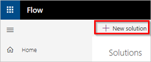
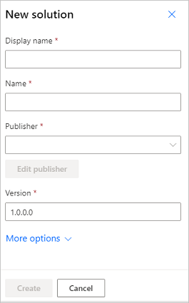
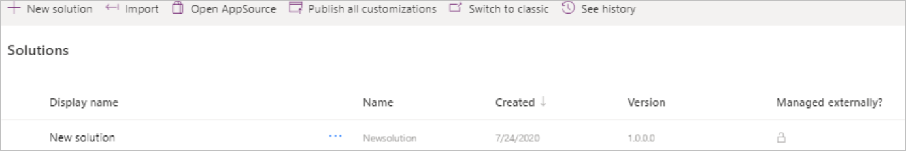

# Overview of solution-aware flows

When you host your flows in a [solution](/power-platform/alm/solution-concepts-alm), they become portable, making it effortless to move them and all their components from one environment to another. A typical use case is for an independent software vendor (ISV) to develop flows in a sandbox environment, and then move those flows to a test environment. After testing, the ISV would then move the flows to a production environment for clients who purchase these flows. This process is much easier when you create your flows in solutions, and then move the solutions and their contents.

Flows created in a solution are known as *solution-aware* flows. You can add multiple flows in a single solution. You cannot move non-solution-aware flows (flows not created in a solution) into a solution.

> [!NOTE]
> For detailed information about solution concepts and implementing a healthy application lifecycle management (ALM) practice in your organization, see [Application lifecycle management (ALM) with Microsoft Power Platform](/power-platform/alm/).

## Prerequisites

You must have the following components to create solutions, and solution-aware flows:

- [Dataverse](/powerapps/maker/data-platform/data-platform-intro)
- An environment with version 9.1.0.267 or later.

  To check your version, go to [Power Platform admin center](https://admin.powerplatform.microsoft.com/), select **Environments**, and then select the environment in which you are interested. The **Details** tab displays all configuration information for the environment that you selected.

## Create a solution

Follow these steps to create a solution:

1. Sign in to [Power Automate](https://flow.microsoft.com).
1. Select **Solutions** from the navigation bar on the left side of the screen.
1. Select **New solution**.

   

1. Provide all required information for your new solution, including the **Display Name**,  **Name**, **Publisher**, and **Version**. It's also a good idea to provide a description of your solution.

   

1. Select the **Create** button.

  
   Your new solution might appear like this image:

   

## Known limitations

There are certain limitations when using flows with solutions. For information about these limitations, see [Known limitations](/powerapps/maker/data-platform/solutions-overview#known-limitations) in the Power Apps docs.
  
## Learn more

- [Create a cloud flow in a solution](./create-flow-solution.md)
- [Export a solution](./export-flow-solution.md)
- [Import a solution](./import-flow-solution.md)
- [Edit a solution-aware flow](./edit-solution-aware-flow.md)
- [Remove a solution-aware flow](./remove-solution-aware-flow.md)

[!INCLUDE[footer-include](includes/footer-banner.md)]