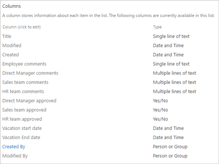
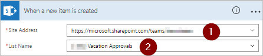
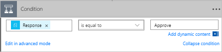
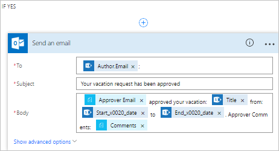

<properties
    pageTitle="Create a parallel modern approval workflow | Microsoft Flow"
    description="Create a parallel modern approval workflow"
    services=""
    suite="flow"
    documentationCenter="na"
    authors="MSFTMan"
    manager="anneta"
    editor=""
    tags=""/>

<tags
   ms.service="flow"
   ms.devlang="na"
   ms.topic="article"
   ms.tgt_pltfrm="na"
   ms.workload="na"
   ms.date="06/02/2017"
   ms.author="deonhe"/>

# Create parallel approval workflows with Microsoft Flow

In a parallel approval workflow, multiple persons are required to approve items such as invoices, purchase orders, vacation requests, etc. Each person's approval is independent of all other approvers.

In this walk-through, we use Microsoft Flow to create a flow that automates a parallel approval workflow. This flow automates an employee vacation request process that requires approval from all persons (or teams) that the employee supports regularly. Employees use a SharePoint list to request vacation. Vacation approvals are required from the employee's direct manager, the Sales team, and the Human Resources. Each vacation request is routed each approver for a decision. The flow sends email with status changes, and then updates SharePoint with the decisions.

## Prerequisites

[!INCLUDE [INCLUDEDCONTENT](../includes/prerequisites-for-modern-approvals.md)]

The SharePoint Online list that you create must include the following columns:

<!-- update the sharepoint list 

   

   -->

Make note of the name and URL of the SharePoint Online list. We use these items later when you configure the **SharePoint - When a new item is created** trigger.

## Create your flow from the blank template

[!INCLUDE [INCLUDEDCONTENT](../includes/sign-in-and-create-flow-from-blank-template.md)]

## Add a trigger

[!INCLUDE [INCLUDEDCONTENT](../includes/add-trigger-when-sharepoint-item-created.md)]

<!--update this image... the name of the list needs updating-->

   

## Get the manager for the person who created the vacation request

[!INCLUDE [INCLUDEDCONTENT](../includes/add-get-manager-action.md)]

## Name and save your flow

1. Provide a name for your flow, and then select **Create flow** to save the work we've done so far.

<!--update image

   

    -->

>[AZURE.NOTE] Select **Update flow** from the top of the screen periodically to save the changes to your flow.

<!--update image

   

    -->

If you want to continue making changes to your flow after you save or update it, select **Edit flow** from the top of the screen, and then continue making changes.

## Add an approval action for immediate manager

[!INCLUDE [INCLUDEDCONTENT](../includes/add-an-approval-action.md)]

>[AZURE.IMPORTANT]This action sends the vacation request to the email address in the **Assigned To** box, so insert the **Email** token from the **Get manager** list.

## Insert a parallel branch approval action for the sales team

1. Select the down arrow that's located between the **Get manager** card and the **Start an approval** card.

1. Select the plus sign that shows up on the down arrow after you select it.

1. Select **Add a parallel branch**.

1. Select ** **Add an action**.

   

1. Search for, select, and then configure a **Start an approval** action that sends the vacation request to the sales team. See the [steps used to Add an approval action for immediate manager](parallel-modern-approvals.md/#Add-an-approval-action-for-immediate-manager) if you're not sure how to add the **Start an approval** action.

>[AZURE.IMPORTANT]Use the sales team's email address in the **Assigned To** box of the **Start an approval** action.

## Insert a parallel branch approval action for the human resources team

1. Repeat the steps used to [insert a parallel branch approval action for the sales team](parallel-modern-approvals.md/#Insert-a-parallel-branch-approval-action-for-the-sales-team) to search for, add, and then configure a **Start an approval** action that sends the vacation request to the human resources team.

>[AZURE.IMPORTANT]Use the human resources team's email address in the **Assigned To** box of the **Start an approval** action.

If you've followed along, your flow should resemble this image:

<!--update this image to reflect the token names in sharepoint-->

   

## Options after adding parallel branches

After you've added actions to parallel branches, you have two options for adding more steps to your flow:

- Use the small **Insert a new step** button (the circular plus button that appears when you select any white space on a branch or the area immediately below a branch). This button adds a step to that **specific branch**. With this approach, steps run in parallel and sequence in multiple branches.

- Use the larger **New step** button at the bottom of the entire workflow. This button adds an action that runs after **all branches** complete. When you use this button, you're merging the flow into sequential steps, after it branched.

In the following sections, we use the small **Insert a new step** button to perform these steps on each branch:

- Add a condition that checks is the vacation request was approved or rejected.

- Send an email that informs the employee of the decision.

- Update the vacation request in SharePoint with the approval decision.

Then, we use the larger **New step** button to send an email that summarizes all the decisions made on the vacation request.

Let's continue:

## Add a condition to each branch

1. Select any white space on the **Start an approval** branch.
1. Select the small **Insert a new step** button (the circular plus button that appears after you select the white space in the previous step).
1. Select **Add a condition** from the menu that appears.
1. Select the first box on the **Condition** card, and then select the **Response** token from the **Start an approval** category in the dynamic content list.

   

1. Confirm the list (in the middle of the **Condition card**) is set to **is equal to**.
1. Enter **Approve** (this text is case-sensitive) into the last box.
1. Your condition card should now resemble this image:

   

>[AZURE.NOTE]This condition checks the response from the **Start an approval** action that goes to the employee's manager.

Repeat the preceeding steps on the **Start an approval 2** (sales) and **Start an approval 3** (human resources) branches.

## Add email actions to each branch

Perform these steps on the **IF YES, DO NOTHING** side of the **Condition** branch.

   Note: Your flow uses these steps to send an email when the request is approved:

[!INCLUDE [INCLUDEDCONTENT](../includes/add-action-to-send-email-when-vacation-approved.md)]

<!--add the png to includes to make this work    -->
   

To report a rejection, use the **IF NO, DO NOTHING** side of the **Condition** branch, and then repeat these steps to add a template for the rejection email.

   Note: Your flow uses the preceeding steps (on the **IF NO, DO NOTHING** branch) to send an email when the vacation request is rejected.

Repeat the preceeding steps on the **Start an approval 2** (sales) and **Start an approval 3** (human resources) branches.

## Update the vacation request with the decision

Perform these steps to update SharePoint when decisions are made.

   Note: Be sure perform these steps on both the **IF YES** and the **IF NO** sides of the branch.

[!INCLUDE [INCLUDEDCONTENT](../includes/add-action-to-update-sharepoint-with-approval.md)]

<!-- confirm this image works in this context
   
   -->

Repeat the preceeding steps on the **Start an approval 2** (sales) and **Start an approval 3** (human resources) branches.

## Complete the flow

1. Select **New step** > **Add an action**

   

1. Use the steps provided previously to send an email that summarizes the results of each approval. Send this email to the employee who requested vacation. Your card may resemble this image:

   

   Note: This email is sent after each approver give their decision.

## Learn more about modern approval

[Introduction to modern approvals](./modern-approvals.md)
