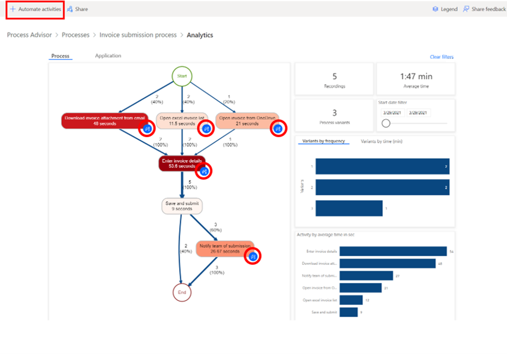
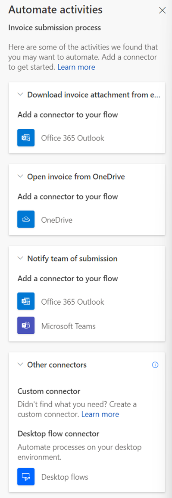

# Automation recommendation

Process advisor automation recommendation feature helps you identify automation opportunities and guides you in automating your processes using Power Automate.

The blue recommendation icons on the process map activity show the automation opportunities.

> [!div class="mx-imgBorder"]
> 

When you select **+Automate activities** in the menu at the top, you are shown the cloud flow connectors recommendations relevant to your process.

By selecting **+Automate activities** you will be taken to Power Automate form desginer where you will see the connector recommendations for the activities in your process map. You can click and add the connectors to your flow to automate your process

> [!div class="mx-imgBorder"]
> 

### See also

[Connector overview](/connectors/connectors) 
[Visualize processes](process-advisor-visualize.md)

[!INCLUDE[footer-include](includes/footer-banner.md)]
