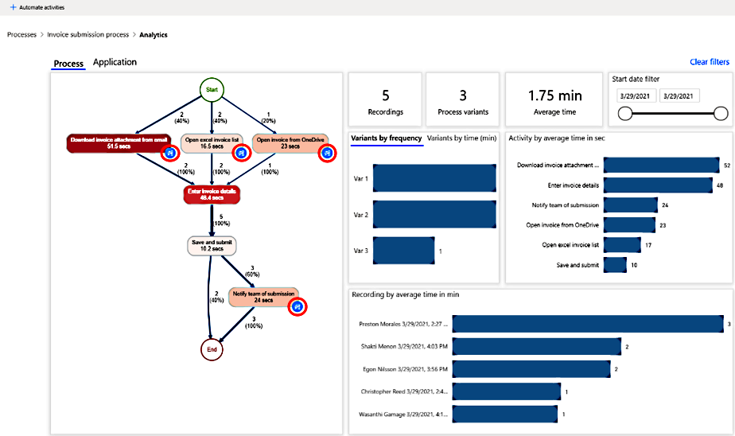
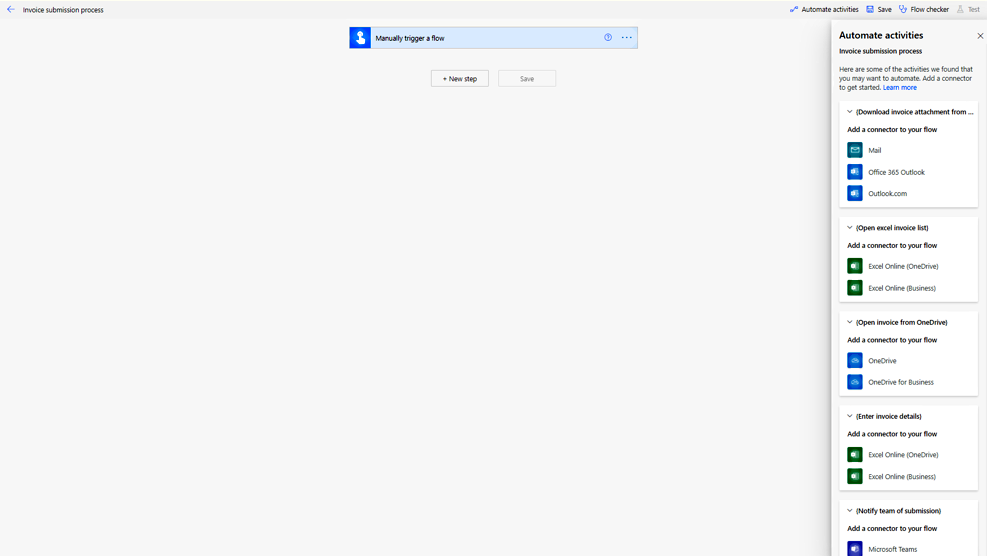

# Identify automation opportunities in process advisor

The process advisor automation recommendation feature helps you identify automation opportunities. It also guides you in automating your processes using Microsoft Power Automate.

Here's a short video on how to use the automation recommendation feature in process advisor: 
 
> [!VIDEO https://www.microsoft.com/en-us/videoplayer/embed/RWN6PS ]

The blue recommendation icons on the process map activity show the automation opportunities.

> [!div class="mx-imgBorder"]
> 

When you select **+Automate activities** above the process map, you'll be taken to Power Automate form designer. This is where you'll see the connector recommendations for the activities in your process map. You can select and add the connectors to your flow to automate your process.

> [!div class="mx-imgBorder"]
> 

### See also

[Connector overview](/connectors/connectors) 
[Visualize processes](process-advisor-visualize.md)

[!INCLUDE[footer-include](includes/footer-banner.md)]
