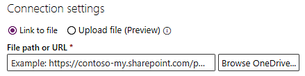

# Work with processes and data in process advisor

## Log data requirements

Event logs and activity logs are tables stored in your system of record which document when an event or activity occurs. For example, activities you perform in your Customer Relationship Management (CRM) app are saved as an event log in your CRM application. For process mining to take place, the following fields are necessary:

### Case ID (caseId when mapping)

Case ID should represent an instance of your process and is often the object that the process acts on. It doesn't need to be a case. It can be a "patient ID" for an inpatient check-in process, an "order ID" for an order submission process, or a "request ID" for an approval process. This ID must be present for all activities in the log.

### Activity Name (activityName when mapping)

Activities are the steps of your process, and activity names describe each step. For example, in a typical approval process, the activity names may be "submit request", "request approved", "request rejected", and "revise request".

### Start Timestamp (startTimestamp) and End Timestamp (endTimestamp)

Timestamps indicate the exact time that an event or activity took place. Event logs have only one timestamp. This indicates the time that an event occurred in the system. Activity logs have two timestamps: a start timestamp and an end timestamp. These indicate the start and end of each activity.

## Where to get log data from your application

Regardless of your application, one important thing to note is that Process advisor needs log data, and many of the tables that exist in your application’s database will contain the current state of the data, and not a historical record of the events that happened, which is what an event log is. Fortunately, in many larger applications, this historical record or log is often stored in a separate table. For example, many Dynamics applications keep this record in the Activities table. Other applications, like SAP or Salesforce, also have similar concepts, but the name may be different.

While there may be tables that log historical records, the way that data is structured can be very complex. You may need to join the log table with other tables in the application database to get specific IDs or names. In addition, not all events that you are interested in are logged, and you may need to determine what events should be kept or filtered out. If you need help, you should reach out to the IT team that manages this application to understand more.

## Connect to a data source

Power query supports a large variety of connectors. A connector provides a way for Process advisor to connect and import data from the corresponding data source. Common connectors include Text/CSV, Dataverse and SQL Server database. If you are using an application like SAP or Salesforce, you may be able to connect to those data sources directly. Please see the Power Query connectors documentation for information on supported connectors and how to use them.

The benefit of connecting to database directly is the ability to keep process advisor up-to-date with the latest data from the data source.

### Text/CSV connector

One easy way to try out process advisor regardless of where your data source is located is using the Text/CSV connector. You might need to work with your database admin to export a small sample of the event log as a CSV file. Once you have the CSV file, you can import it into process advisor using the following steps in the data source selection screen.

> [!NOTE]
You must have OneDrive for business to use Text/CSV connector. If you don't have OneDrive for business, consider using **Blank table** instead of **Text/CSV**, as in step 1. You won't be able to import as many records.

1. On the toolbar at top, select **Data** > **Get data** > **Text/CSV** on the Power Query - Choose data source screen.

    > [!div class="mx-imgBorder"]
    > 

1. Select **Browse OneDrive**. You might need to authenticate.

    > [!div class="mx-imgBorder"]
    > 

1. Upload your event log by selecting the **Upload** icon in the top-right and then selecting **Files**. <!-- My screen has an Upload file link. -->

    > [!div class="mx-imgBorder"]
    > 

1. Upload your event log, select your file from the list, and then choose **Select** to use that file.

### Dataverse

The Dataverse connector is currently not supported in Power Platform. You need to connect to it using the OData connector, which will require a few more steps.

1. Make sure you have access to the Dataverse environment.

2. You need the environment URL of the Dataverse environment you are trying to connect to. Normally it looks like https://<environmentid>.crm.dynamics.com/. See this documentation on how to find your environment URL.

1.	Select OData option from the data sources screen. 

    > [!div class="mx-imgBorder"]
    > 

1.	In the URL textbox, add **api/data/v9.2** to the end of the URL so it looks like this:

    > [!div class="mx-imgBorder"]
    > 

1.	Under **Connection credentials**, select **Organizational account** in the **Authentication kind** field.

1. Select **Sign in** and enter your credentials.

    > [!div class="mx-imgBorder"]
    > 

1. Select **Next**.

1. Expand the OData folder, you should see all the Dataverse tables in that environment. As an example, the **Activities** table is called *activitypointers*.

1. Select the checkbox next to the table you want to import and select **Next**.

    > [!div class="mx-imgBorder"]
    > 