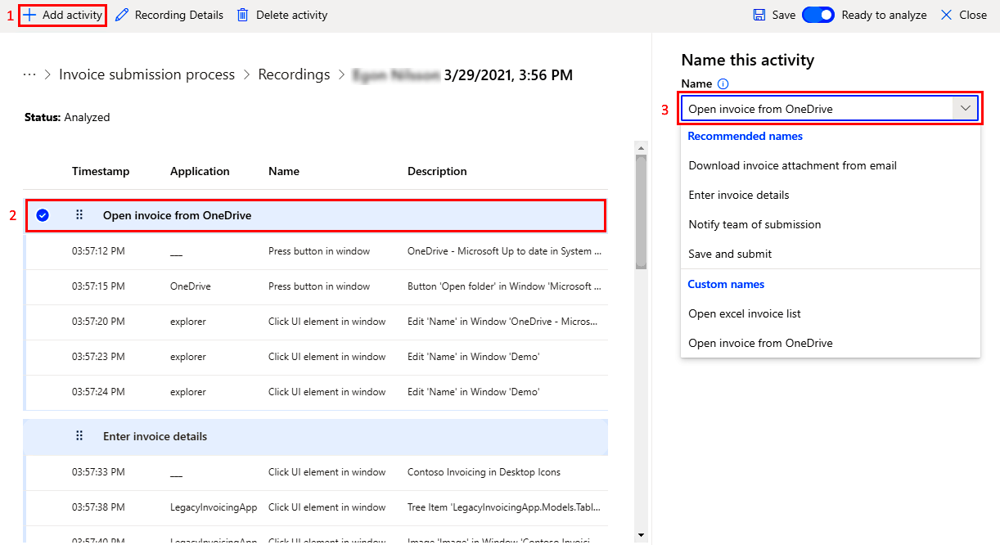

# Prepare processes and recordings in process advisor

Before you can use process advisor task mining to visualize and analyze your processes, you need to:

- [Create your process](#create-a-process) in process advisor.
- [Record the activities](#record-your-process) that make up the process using the Power Automate recorder.
- [Prepare the recording for analysis](#prepare-a-recording-for-analysis).
- (Optional) [Manage activity names](#manage-activity-names) to make it easier for you and others to prepare the recording for analysis.

## Create a process

In general, processes that you think might be inefficient or repetitive are good candidates for analysis.

1. Sign in to [Power Automate](https://flow.microsoft.com/).

1. Select **Process advisor** in the left-side navigation pane.

1. Select **Create** under **Process advisor**.

1. Select the **Create a new process** tile.

1. Give your process a name and description, and then select **Create**.

## Record your process

Create a recording in one of three ways:

- [From the **Create** screen](#create-a-recording-from-the-create-screen) in process advisor.
- [Right after process creation](#create-a-recording-right-after-process-creation).
- [From the process details page](#create-a-recording-from-the-process-details-screen).

Here's a short video on how to record a process in process advisor: 
 
> [!VIDEO https://www.microsoft.com/en-us/videoplayer/embed/RWN6PR]

### Create a recording from the Create screen 
 

1. From the **Process advisor** > **Create** screen, select **Add a new recording**.
 
1. On the **Process** screen, select the process you want to record for.

1. Select **Open recorder**.

    >[!NOTE]
    >If you aren't able to see the process in the dropdown, ensure that the process has been correctly shared with you.

### Create a recording right after process creation

After you create the process, you'll see a creation successful screen with a few options as next steps.

- Select **Add a recording**.

### Create a recording from the process details screen

1. From the **Process advisor** > **Processes** screen, select the process you want to record from the list view.

1. Select the name of the process to go to the process details screen.

1. Select **New recording** from the menu at the top.

1. Select **Open recorder**.

### Launching the recorder in Power Automate

1. By using any of the methods described above, you should see a message that says **Launching the recorder in Power Automate**.

    > [!NOTE]
    > You should have [downloaded Power Automate](https://go.microsoft.com/fwlink/?linkid=2102613) before you started. However, you can select **Get the app** to install it.

1. If you've installed Power Automate, you should see an **Open Power Automate** browser pop-up window. Select it to open the app.

1. If Power Automate is installed but didn’t open correctly, select **Open again**.

   > [!div class="mx-imgBorder"]
   > 

## Power Automate recorder

1. On the Desktop recorder screen, select **Record**.

1. Perform the actions that you want to record, and then select **Finish** at the bottom of the recorder screen.

   > [!div class="mx-imgBorder"]
   > 

1. Once the recording has saved successfully, select **Got it** to close the message.

1. Return to the web portal in your browser, and select **View recording**.
   
   > [!NOTE]
   > Depending on the length of the recording, it may take some time before the actions will be available.

### Recorder features

- As you record your actions, the action descriptions will be listed in the recorder screen. You can select the trash can icon to delete any action from your recording.

- Select **Pause recording** at any time during the recording.

- Select **Start recording again** to continue recording from where you left off.

- Select **Reset recording** to erase all the recorded actions and start over.

### Recording tips

- Be methodical in your actions to improve the readability of the recording. There's a slight delay so wait for the red box to focus on the item you're trying to interact with before selecting.

- If there were mis-clicks, delete the action in the recorder screen.

## Prepare a recording for analysis

Once the recording has completed, you can view the recorded actions in the recording details screen. More importantly, you need to prepare the recording to be ready for analysis. What does this mean?

- The actions recorded can be granular. Group them into activities. These will be the building blocks for the process map that is created through analysis.

- Remove any sensitive information from the recording. For more information, go to [Protect your data in process advisor](process-advisor-protect.md).

Here's a short video on how to prepare a recording for analysis with process advisor: 
 
> [!VIDEO https://www.microsoft.com/en-us/videoplayer/embed/RWN6PQ]

### Grouping actions into activities

1. Select **Add activity** to add an activity header. All actions under the activity header and before the next activity header are considered part of the group.

1. Move the activity header up or down the actions list to where you want the activity to start.

1. Name your activity on the right side of the screen. Use the dropdown menu to find activity names that already exist for the process or create your own.

   > [!div class="mx-imgBorder"]
   > 
 
1. If you made a mistake and want to delete an activity, use the **Delete activity** button in the command bar.

1. At any time, select **Save** on the top right to save your work.

   To analyze, you need at least two activities. Otherwise, the process map wouldn't be meaningful.

1. When you finish grouping, set **Ready to analyze** next to **Save**.

1. Select **Close** to return to the process details screen.

### Grouping tips

- As much as possible, use an existing activity name. This creates a more consistent and accurate process map.

- Activity names will be available in the dropdown list whenever a recording is saved. To remove an activity name from the dropdown list after it was removed from all recordings that used that activity name, you need to analyze the recording.

### Manage activity names

As a process owner or co-owner, you can create recommended activity names for a process. This will ensure there will be more consistency in naming across recordings. To do this:

1. In the process details screen, select **Create activity names** to bring up the panel.

1. Select **New name** to add a new activity name entry to the recommended list.

1. Select **Save** when you're done.

The activity names you added will now show up under **Recommended names** in the activity name dropdown list when grouping actions for a recording. Any activities that aren't defined in the recommended list will show up under **Custom names**.

[!INCLUDE[footer-include](includes/footer-banner.md)]
