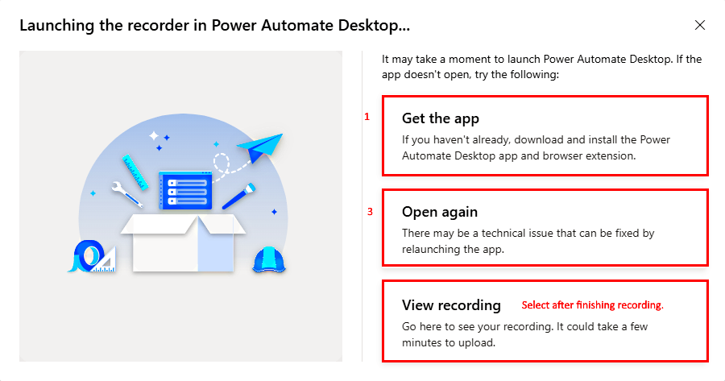

# Prepare processes and recordings in process advisor

Before you can use process advisor task mining to visualize and analyze your processes, you need to:

- [Create your process](#create-a-process) in process advisor.
- [Record the activities](#record-your-process) that make up the process using the Power Automate recorder.
- [Prepare the recording for analysis](#prepare-a-recording-for-analysis).
- (Optional) [Manage activity names](#manage-activity-names) to make it easier for you and others to prepare the recording for analysis.

Learn more about process advisor processes in the following video. 
 
>[!VIDEO <https://www.microsoft.com/videoplayer/embed/RWKx7r>]

## Create a process

In general, processes you think might be inefficient or repetitive are good candidates for analysis.

1. Sign in to [Power Automate](https://flow.microsoft.com/).

1. Select **Process advisor** on the left-side navigation pane.

1. Select the **Create a new process** tile.

1. Enter a name for your process and description, and then select **Create**.

1. Select **Recordings** > **Create**.

## Record your process

Create a recording in one of two ways:

- [Right after process creation](#create-a-recording-right-after-process-creation).
- [From the process details page](#create-a-recording-from-the-process-details-screen).

Here's a short video on how to record a process in process advisor. 
 
> [!VIDEO <https://www.microsoft.com/en-us/videoplayer/embed/RWN6PR>]

### Create a recording right after process creation

After you create a process, you'll see a screen with two options as next steps.

- Select **Add a recording**.

### Create a recording from the process details screen

1. On the **Process advisor** > **Processes** screen, select the process you want to record from the list view.

1. Select the name of the process to go to the process details screen.

1. On the menu at the top, select **New recording**.

1. Select **Open recorder**.

### Launching the recorder in Power Automate

1. By using any of the methods described previously, you should receive a message that says **Launching the recorder in Power Automate**.

    > [!NOTE]
    > You should've [downloaded Power Automate](https://go.microsoft.com/fwlink/?linkid=2102613) before you started. However, you can also select **Get the app** to install it.

1. If you've installed Power Automate, you should see an **Open Power Automate** browser pop-up window. Select it to open the app.

1. If Power Automate is installed but doesn’t open correctly, select **Open again**.

   > [!div class="mx-imgBorder"]
   > 

## Power Automate recorder

1. On the Desktop recorder screen, select **Record**.

1. Perform the actions that you want to record, and then select **Finish** at the bottom of the recorder screen.

   > [!div class="mx-imgBorder"]
   > 

1. After the recording has been saved successfully, select **View recording** to view the recorded steps and prepare the recording for analysis.

   > [!NOTE]
   > Depending on the length of the recording, it may take some time before the actions will be available.

### Recorder features

As you record your actions, the action descriptions will be listed in the recorder screen.
- To delete any action from your recording, select the trash can icon.

- To temporarily stop recording, select **Pause recording** at any time during the recording.

- To continue recording from where you left off, select **Start recording again**.

- To erase all the recorded actions and start over, select **Reset recording**.

### Recording tips

- Be methodical in your actions to improve the readability of the recording. There's a slight delay, so wait for the red box to focus on the item you're trying to interact with before selecting.

- If there were any selections made by mistake, delete the action in the recorder screen.

## Prepare a recording for analysis

After the recording has been completed, you can view the recorded actions on the recording details screen. More importantly, you need to prepare the recording to be ready for analysis.

What does this mean?

- The actions recorded can be granular, and they need to be grouped into activities. These will be the building blocks for the process map that's created through analysis. Fortunately, process advisor now supports auto create activities from recordings.

- Remove any sensitive information from the recording. For more information, go to [Protect your data in process advisor](process-advisor-protect.md).

Here's a short video on how to prepare a recording for analysis with process advisor. 
 
> [!VIDEO <https://www.microsoft.com/en-us/videoplayer/embed/RWN6PQ>]

### Grouping actions into activities

You should already have some activities that are created automatically. You can accept auto created activities as is, or you can change them.

#### Edit an existing activity

1. If you want to change from which action the activity starts, drag the activity header up or down the actions list to where you want the activity to start.

2. If you want to change the activity name, select the activity to bring up the activity name combo box on the right side of the screen.

3. If you want to find activity names that already exist for the process or create your own, select from the dropdown list.

#### Add a new activity

1. Select **Add activity** to add an activity header. All actions under the activity header and before the next activity header are considered part of the group.

1. Move the activity header up or down the actions list to where you want the activity to start.

1. Name your activity on the right side of the screen. Use the dropdown list to find activity names that already exist for the process or create your own.

    > [!div class="mx-imgBorder"]
    > 

#### Delete an activity

1. If you don't want an auto create activity or made a mistake and want to delete an activity, select **Delete activity** in the command bar.

1. If you don’t want any of the auto created activities or just want to start over from scratch, select **Delete all activities** in the command bar.

1. At any time, select **Save** on the top right to save your work.

> [!NOTE]
> To analyze, you need at least two activities. Otherwise, the process map wouldn't be meaningful.

#### Save and analyze

1. When you finish grouping, select **Save and analyze** on the top right.

1. Once analyzed, select **View analytics** in the notification bar to go to the analytics page. For more information, go to [Analyze processes in process advisor](process-advisor-analyze.md).

1. Alternatively, you can save without analyzing by selecting the carat next to **Save and analyze**, then select **Save**.  

1. Select **Close** to return to the process details screen.

### Grouping tips

- As much as possible, use an existing activity name. This creates a more consistent and accurate process map.

- Activity names will be available in the dropdown list whenever a recording is saved. To remove an activity name from the  list after it was removed from all recordings that used that name, you need to analyze the recording.

### Create recommended activity names

As a process owner or co-owner, you can create recommended activity names for a process. This will ensure more consistency in naming across recordings.

1. On the process details screen, select **Create activity names** to bring up the panel.

1. To add a new activity name entry to the recommended list, select **New name**.

1. When you're done, select **Save**.

The activity names you added will now show up under **Recommended names** in the dropdown list when grouping actions for a recording. Any activities that aren't defined in the recommended list will show up under **Custom names**.

[!INCLUDE[footer-include](includes/footer-banner.md)]
