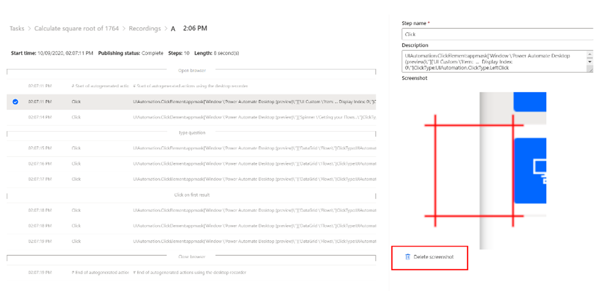
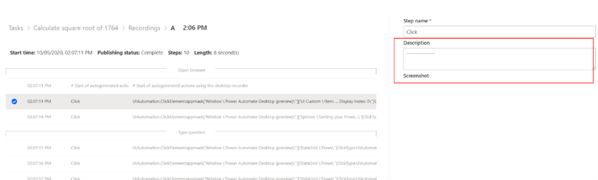

# Protect your data in process advisor (preview)

[!INCLUDE [cc-beta-prerelease-disclaimer](includes/cc-beta-prerelease-disclaimer.md)]

During the private preview you can use Power Automate Desktop features to remove screenshots and text entries stored during the recording session, if they contain sensitive data.

## Delete screenshots

To delete screenshots, in the labeling experience, select the step that contains the screenshot you want to remove and select **Delete screenshot**.

> [!div class="mx-imgBorder"]
> 

## Remove text

To remove sensitive data from a text entry, select the text entry and modify the step description.

> [!div class="mx-imgBorder"]
> 

[!INCLUDE[footer-include](includes/footer-banner.md)]