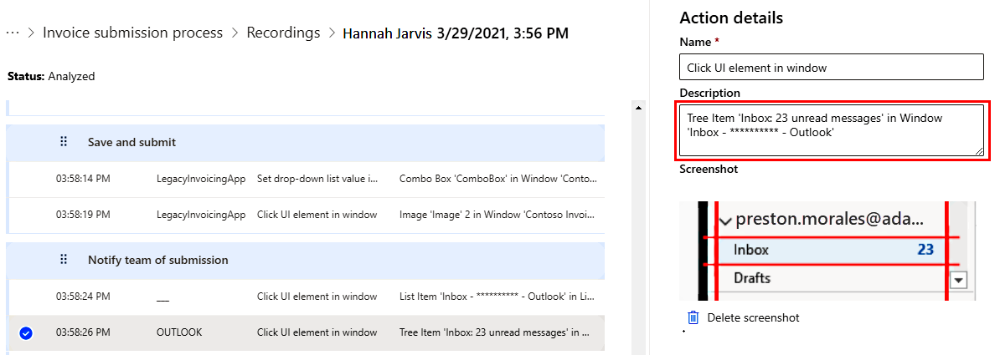

# Protect your data in process advisor

You can use Power Automate Desktop features to remove screenshots and text entries stored during the recording session if they contain sensitive data. You can also remove any confidential information in the text or images from your recordings when preparing them.

## Delete screenshots

To delete screenshots when preparing your recording, select the step that contains the screenshot you want to remove and select **Delete screenshot**.

> [!div class="mx-imgBorder"]
> 

## Remove text

To remove sensitive data from a text entry, select the text entry and modify the step description.

> [!div class="mx-imgBorder"]
> 

[!INCLUDE[footer-include](includes/footer-banner.md)]
