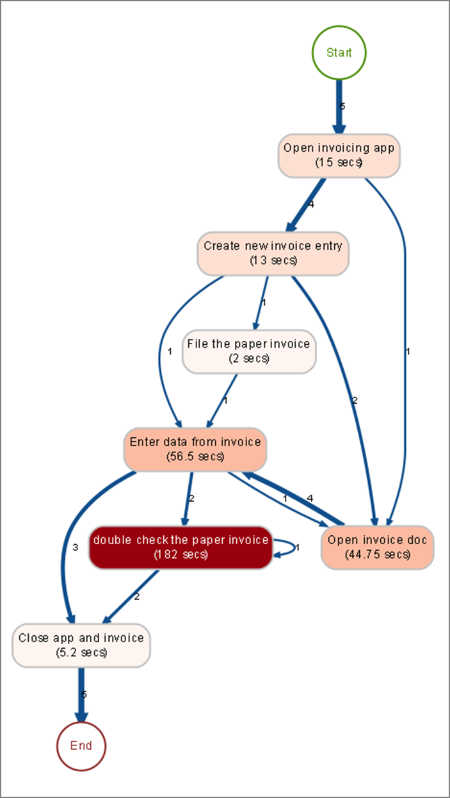
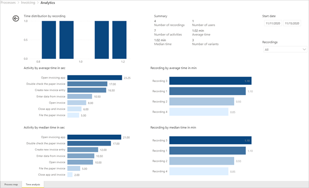

# Visualize processes (preview)

[!INCLUDE [cc-beta-prerelease-disclaimer](includes/cc-beta-prerelease-disclaimer.md)]

## Process map

> [!div class="mx-imgBorder"]
> 

The process map makes it possible to visualize and analyze processes. By looking at a graphical representation of how your business processes are performed, you can glean insights about where opportunities exist.  To get to the process map go to Analytics and select Process map tab.

Activities describe tasks or actions, the sequence of which makes up a business process. Activities can be performed by humans, or in the case of automation – by machines. In the process map, different activities appear as nodes, and transitions between activities appear as edges.  Each process sequence will have a start and an end.

Different activity combinations and variants are shown separately on the process map. A process variant is a unique path from the very beginning to the very end of the process. In other words, a process variant is a specific activity sequence, like a “trace” through the process, from start to end. Each variant differs from the others by at least one activity.
You can see additional metrics, frequency of the activities, as well as Throughput time, on the process map.
Frequency shows you the total number of recordings/cases passing through it.  Throughput time is the time between the very first event of the case and the very last.
There are various filters available to you to drill down into the process:

- Variant selector allows you to select one variant, or a set of process variants to visualize in your process map.
- Recording selector allows you to select one recording, or a set of recordings to visualize in your process map.
- Time filter allows you to see the process visualization in a particular period.
Additionally, there are key performance indicators available to help you better understand your process. They are described in this topic.

## Time analysis

> [!div class="mx-imgBorder"]
> 

 In order to view additional process analytics select the **Time analysis** tab. Out of the box you will get several key performance indicators (KPIs) and visualizations to help you understand your process. Here is the list of metrics and visuals, and what they could tell you about your process:

## KPIs:

- **/# of recordings**: Shows you how many recordings of the same process were submitted to analyze this process. The more recordings you have available, the more insights you will be getting. For example, if you provide only a few recordings of the process that often has different paths to completion, you might not get insights into all the variations that the process could take.
- **/# of users**: Informs you how many people recorded the process. If the process is usually performed by many people you would ideally want to have as many people as possible to submit their process recordings to get understanding of variations the process could take. 
- **/# of activities**: Shows how many steps in a process there are. The process owner can define steps on their own, and/or let others define activities during preparation of recording for analysis. In order to analyze a process, the user activities on the desktop could be grouped into meaningful activities. For example in an invoicing process, activities could be: opening an invoice, entering the data into an invoicing app, and closing the app and the invoice. 
- **Throughput time (average)**: Shows you the average time it takes for a process to be completed across all recordings associated with the process. It is one of the most important data points for process mining because deep diving into throughput time informs you of the bottlenecks in your process.
- **Throughput time (median)**: Median in general shows, the most frequent time it takes for a process to complete. It is a very useful metric in cases where a small number of recordings or even a single recording is so different than most recording that the average time for completion would look skewed towards this offending recording. To prevent the user from misinterpreting the time to completing the process, this measure will provide insight by showing the most frequent time as opposed to a simple average.
- **/# of variants**: Shows how many different paths users took in order to complete a process.. For example, a person might have 11 steps in a process to complete a purchase order, while another only 7.

## Visualizations

- **Time distribution by recording**: Shows how many recordings where in the most common time ranges.
- **Activity by average time**: Shows average time each activity takes so you could identify the most time-consuming activities with a glance at this visual.
- **Activity by median time**: Shows median time  each activity takes so you could identify the most time-consuming activities, making sure the outliers are not skewing, what is most probably the most frequent time spent per activity.
- **Recording by average and median times**: Shows recording by average and median times. You can use this visualization to easily filter for desired recording, according to their duration. Filters:
- **Recording name**: Filters for a specific recording or set of recordings. This enables you to filter for a specific recording you might be interested in, or a set of recordings.
- **Start date**: Filters for the time range when recording has started and ended. For example, if your process changed over time you want to see if there was any impact on your metrics after the process change by filtering for recordings that started after a certain time.

[!INCLUDE[footer-include](includes/footer-banner.md)]