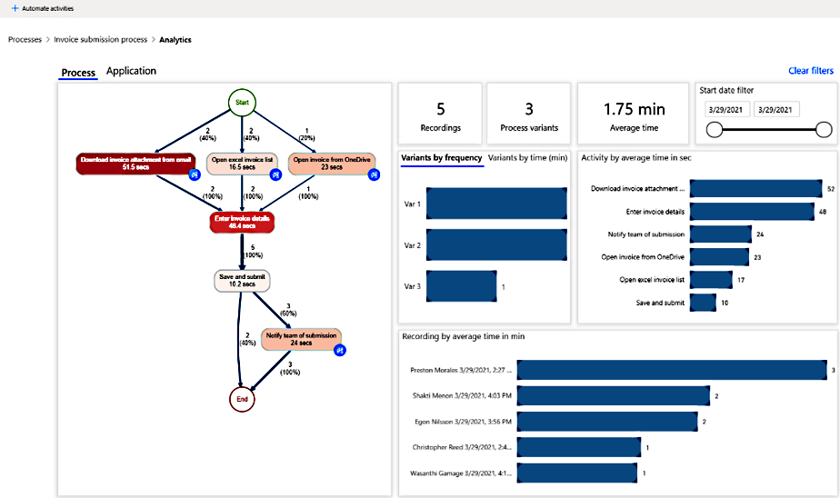

# Visualize processes

## Process map

The process map makes it possible to visualize and analyze processes. By looking at a graphical representation of how your business processes are performed, you can glean insights about where opportunities exist. To get to the process map, select the **Analytics** > **Process** tab.

> [!div class="mx-imgBorder"]
> 

Activities describe tasks or actions that make up a business process. Activities can be performed by humans, or in the case of automation, by machines. In the process map, different activities appear as nodes, and transitions between activities appear as edges.  Each process sequence will have a start and an end.

Different activity combinations and variants are shown separately on the process map. A process variant is a unique path from the very beginning to the very end of the process. In other words, a process variant is a specific activity sequence, like a “trace” through the process, from start to end. Each variant differs from the others by at least one activity. You can see more metrics, frequency of the activities, and throughput time, on the process map. Frequency shows you the total number of recordings/cases passing through it. Throughput time is the time between the first event of the case and the last.

There are various filters available to you to drill down into the process:

- Variant selector allows you to select one variant, or a set of process variants to visualize in your process map.
- Recording selector allows you to select one recording, or a set of recordings to visualize in your process map.
- Time filter allows you to see the process visualization in a particular period. Additionally, there are key performance indicators available to help you better understand your process. They're described in this topic.

### Process KPIs

- **Number (#) of recordings**&mdash;Shows you how many recordings of the same process were submitted to analyze this process. The more recordings you have available, the more insights you will get. For example, if you provide only a few recordings of the process that often has different paths to completion, you might not get insights into all the variations that the process could take.

- **Number of variants**&mdash;Shows the number of paths a process could take. For example, if a process has one other activity, that would be counted as one additional variant of a process.

- **Average time**&mdash;Shows you the average time it takes for a process to be completed across all recordings associated with the process. It is one of the most important data points for process mining because deep diving into the duration of the process informs you of the bottlenecks in your process.

### Process map visualizations

- **Variants by frequency**&mdash;Shows how many times a particular process path was taken by the process.

- **Variants by time**&mdash;Average time spent to finish the process per variant.

- **Activity by average time**&mdash;Shows average time each activity takes so you could find the most time-consuming activities with a glance at this visual.

- **Recordings by time**&mdash;Shows the time it took for each recording in a process.

- **Start date**&mdash;Filters for the time range when recording has started. For example, if your process changed over time, you want to see if there was any impact on your metrics after the process change by filtering for recordings that started after a certain time.

## Application analytics

Application analytics allows you to gain more insights from recordings by understanding application usage. This report informs you about:

- The top apps used.
- Access patterns and what apps are used together.
- App insights for each activity or recording.

> [!div class="mx-imgBorder"]
> 

### Application analytics KPIs

- **Apps used**&mdash;Total number of apps used in a process.

- **Number (#) times accessed**&mdash;Number of accesses. An access is when an app comes back into focus.

- **Time spent**&mdash;Amount of time spent in using apps. This does not count time spent when not focused on an app—for example, desktop.

- **Actions**&mdash;Count of actions in apps.

### Application analytics visualizations

- **Application usage**&mdash;A scatter plot, which shows time spent on one axis and times accessed on the other for each app used. The size of the circles represents how many recordings use that app. The goal of this plot is to understand usage patterns. Some apps are used a lot but only in terms of times accessed. This means the recorder is jumping back and forth between this application and other applications. This may occur in cases where copy and paste is happening, as an example. Other apps are used for a long time and the action is limited to that application. It does not depend on other recordings for completion of the necessary activity.

    The size of the circles clarifies what applications are used in most or all recordings. It represents an application that is needed for the process and something to concentrate on from an optimization or automation perspective.

- **Application switching**&mdash;A bar chart that shows which application pairs are most often used together. This extends the number of times accessed in the application usage visual to help identify what two applications are most often used together. This can denote some information transfer (copy and paste) between these applications, something to consider when automating.

- **Time spent by application**&mdash;A pie chart that shows a distribution of the time spent on KPI per app. This helps you understand which applications the user spends the most time on.

- **Actions by application**&mdash;A pie chart that shows a distribution of the actions on KPI per app. This helps you understand which apps have the most actions or manual inputs.

### See also

[Connector overview](/connectors/connectors) 
[Overview of cloud flows](overview-cloud.md)

[!INCLUDE[footer-include](includes/footer-banner.md)]
