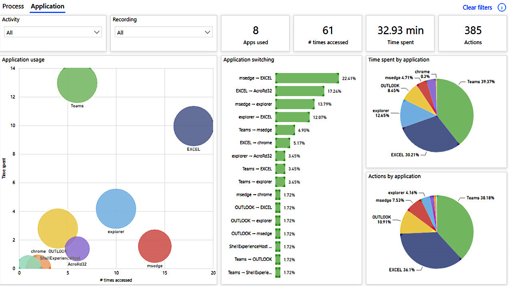

# Visualize processes in process advisor

## Process map

The process map makes it possible to visualize and analyze processes. By looking at a graphical representation of how your business processes are performed, you can glean insights into where opportunities for improvement exist. To get to the process map, select the **Analytics** > **Process** tab.

> [!div class="mx-imgBorder"]
> 

Activities describe tasks or actions that make up a business process. Activities can be performed by humans or by machines during automation. In the process map, different activities appear as nodes, and transitions between activities appear as edges. Each process sequence will have a start and an end.

Different activity combinations and variants are shown separately on the process map. A process variant is a unique path from the very beginning to the very end of the process. In other words, a process variant is a specific activity sequence, like a “trace” through the process, from start to end. Each variant differs from the others by at least one activity. You can see more metrics, frequency of the activities, and throughput time on the process map. Frequency shows you the total number of recordings/cases passing through it. Throughput time is the time between the first event of the case and the last.

There are various filters available for you to drill down into the process:

- Variant selector allows you to select one variant or a set of process variants to visualize in your process map.

- Recording selector allows you to select one recording or a set of recordings to visualize in your process map.

- Time filter allows you to see the process visualization in a particular period. Additionally, there are key performance indicators available to help you better understand your process. They're described in more detail below.

### Process KPIs

- **Number (#) of recordings**: Shows you how many recordings of the same process were submitted to analyze this process. The more recordings you have available, the more insights you will get. For example, if you provide only a few recordings of a process that often has different paths to completion, you might not get insights into all the variations that the process could take.

- **Number of variants**: Shows the number of paths a process could take. For example, if a process has one other activity, that would be counted as one additional variant of a process.

- **Average time**: Shows you the average time it takes for a process to be completed across all recordings associated with the process. It's one of the most important data points for process mining because deep-diving into the duration of a process can inform you of any bottlenecks.

### Process map visualizations

- **Variants by frequency**: How many times a particular process path was taken by the process.

- **Variants by time**: The average time spent to finish the process per variant.

- **Activity by average time**: The average time each activity takes. A quick glance at this visual can reveal the most time-consuming activities of a process.

- **Recordings by time**: The time it took for each recording in a process.

- **Start date**: A filter for the time when recording started. For example, if your process changed over time, you may want to see if there was any impact on your metrics after the process changed by filtering for recordings that started after a certain time.

## Application analytics

Application analytics allow you to gain more insights from recordings by understanding application usage. This report informs you about:

- The top apps used
- Access patterns and what apps are used together
- App insights for each activity or recording

> [!div class="mx-imgBorder"]
> 

### Application analytics KPIs

- **Apps used**: The total number of apps used in a process.

- **Number (#) of times accessed**: The number of app accesses. Times accessed is when an app comes back into focus.

- **Time spent**: The amount of time spent using apps. This does not count time spent when not focused on an app—for example, desktop.

- **Actions**: The count of actions within apps.

### Application analytics visualizations

- **Application usage**: A scatter plot that shows time spent on one axis and times accessed on the other for each app used. The size of the circles represents how many recordings use that app. The goal of this plot is to understand usage patterns. Some apps are used a lot but only in terms of times accessed. This means the recorder is jumping back and forth between this application and others. For example, this may occur in cases where copy-and-paste is happening. Other apps are used for a long time and the action is limited to that application. It does not depend on other recordings for completion of the necessary activity.

    The size of the circles clarifies what applications are used in most or all recordings. It represents an application that's needed for the process and something to concentrate on from an optimization or automation perspective.

- **Application switching**: A bar chart that shows which pairs of application are most frequently used. This extends the number of times accessed in the application usage visual to help identify what two applications are most often used together. This can denote some information transfer (such as copy-and-paste) between these applications, which is something to consider when automating.

- **Time spent by application**: A pie chart that shows a distribution of the time spent per app. This helps you understand which applications are being used the most.

- **Actions by application**: A pie chart that shows a distribution of the actions per app. This helps you understand which apps have the most actions or manual inputs.

### See also

[Connector overview](/connectors/connectors) 
[Overview of cloud flows](overview-cloud.md)

[!INCLUDE[footer-include](includes/footer-banner.md)]
