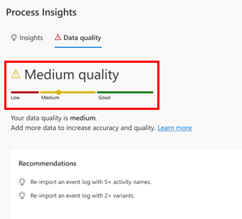
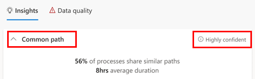

# Get automated recommendations to improve your processes (preview)

[!INCLUDE[cc-beta-prerelease-disclaimer](./includes/cc-beta-prerelease-disclaimer.md)]

Process mining offers insights and recommendations that are designed to guide you in your process optimization journey. These insights and recommendations appear next to the [process map and analytics](process-mining-visualize.md).

> [!IMPORTANT]
> - This is a preview feature.
>
> - [!INCLUDE[cc_preview_features_definition](includes/cc-preview-features-definition.md)]

## Data quality

The Data quality panel provides an indicator for the *event log* data used to generate the [process map and analytics](process-mining-visualize.md). To learn more about event logs, go to [Data requirements](process-mining-processes-and-data.md#data-requirements).

Issues in the event log could affect confidence in the generated insights for the process. For example, not having enough sample case IDs or activity names would lower the confidence in the insights that can be drawn, usually because the sample size is too small.

> [!div class="mx-imgBorder"]
> 

<!--Graphical user interface, text, application, email. Description automatically generated. screenshot likely to be updated--> 

If the data quality indicator shows **Low quality** or **Medium quality**, you should re-import an event log with the recommended elements.  

## Confidence rating

The confidence rating provides an indicator of how relevant we think the *insight category* (for example, **Common path** is the insight category in the following screenshot), is to your process. Having a lower number of candidate variants and high event log data quality lead to higher confidence ratings. To learn more about variants, go to [Visiualize processes](process-advisor-visualize.md).

For example, having ten potential variants for the *shortest paths* insight category doesn't have a highly confident level, especially if the event log data only has 10 sample cases captured. Shortest paths represent the paths with the fastest runtime or cycle time that your process takes.

> [!div class="mx-imgBorder"]
> 

## Insight categories

Understanding the insight category assigned to your process will help you determine how to evaluate the appropriate path for your process. Insight categories are classified according to path. The following table descries the various paths, and the recommended ways to evaluate your process.

|Path name  |Description  |Recommended evaluation  |
|---------|---------|---------|
|Common    | Common paths represent the most common paths that your process takes. If this insight is found with medium or high confidence, the default process map and analytics will filter to show one or more common path variants.   | Evaluate these paths for optimization potential, since they are the most used. They are also great candidates for standardization.        |
|Complex     |  Complex paths represent the paths with the greatest number of activities that your process takes.        | Evaluate these paths for process inefficiencies, especially if activities are looping or erratic.  |
|Simple     | Simple paths represent the paths with the fewest number of activities that your process takes. | Evaluate these paths to check if they might be optimal path(s) that others should adopt. They may also represent incomplete process executions.        |
|Longest     | Longest paths represent the paths with the longest runtime or cycle time that your process takes.  | Evaluate these paths for process inefficiencies, especially if certain activities seem to be bottlenecks.        |
|Shortest     | Shortest paths represent the paths with the fastest runtime or cycle time that your process takes.  | Evaluate these paths to check if they may be optimal path(s) that others should adopt. They may also represent incomplete process executions.         |
