# Azure templates for process mining

Easily onboard your data for process mining with a process advisor template. Templates help you start mining your processes for insights with just a few selections. You'll avoid the data identification and manipulation that's required with traditional process mining tools. [Azure DevOps Work Tracking](#azure-devops-work-tracking-template), [Azure Pipelines](#azure-devops-pipelines-template), [Logic Apps with App Insights](#logic-apps-with-app-insights-template), and [Logic App Consumption Plan](#logic-app-consumption-plan-template) templates provide insights that help you identify opportunities and optimize your development processes.

Creating and running a template is similar for all the process advisor templates.

## Azure DevOps Work Tracking template

The Azure DevOps Work Tracking template analyzes the execution and handling of tracked Azure DevOps (ADO) work items to help you maximize your development processes and manage dependencies. To learn more, go to [What is Azure DevOps?](/azure/devops/what-is-azure-devops).

<!-- I removed the Prerequisites sections because users won't have anything to analyze in the first place if they don't have the proper licenses. -->

The Azure DevOps Work Tracking template uses data from your Azure DevOps boards to analyze your work items. That means you'll need to gather some information from ADO before you can run the template.

### Gather information from ADO

1. In your Azure DevOps environment in the left panel, select **Project settings**. Under **Boards**, select **Team configuration**. Then select the **Area** tab.

    :::image type="content" source="media/process-mining-azure-templates/az-boards.png" alt-text="Screenshot of an Azure DevOps Project Settings page with organization, project name, and other information highlighted.":::

1. Find the organization name and project name at the top of the Project Settings page. Take note of the area name.

### Create and run the Azure DevOps Work Tracking template

1. In Power Automate in the left panel, select **Process advisor**.

1. In the **Start with a popular template** section, select the **Azure** tab, and then select the **Azure DevOps Work Tracking** tile.

1. In the **Process name** box, enter a name for your process.

1. In the **Organization name** box, enter the organization name from ADO.

1. In the **Project name** box, enter the project name from ADO.

1. In the **Area name** box, enter the area name from ADO.
<!-- I stopped here -->
    c. (Optional) Enter a description of the process in the **Description** field.

    d. Select **Create**.

    > [!div class="mx-imgBorder"]
    > 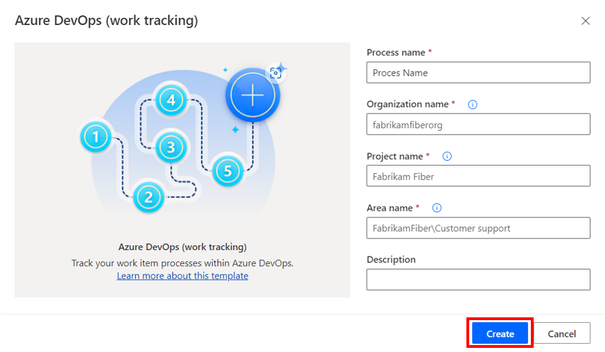

1. In the **Connect to data source** screen in the **Authentication kind** field, replace "Anonymous" with **Organizational account**.

1. Select **Sign in** and authenticate through AAD.

    > [!div class="mx-imgBorder"]
    > 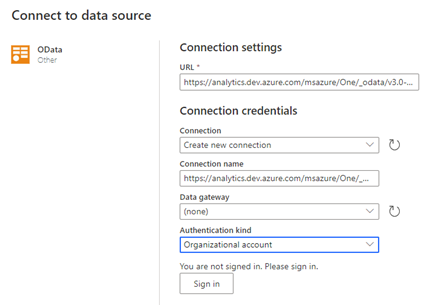

1. After connection credentials are established, select **Save**. Process advisor will analyze your process.

   The process might take at least two minutes to complete.

### Visualize the process map for the Azure DevOps Work Tracking template

After your process report has been published, you can visualize the process map and use the **Custom attributes** filter to dig deeper into your insights.

> [!div class="mx-imgBorder"]
> 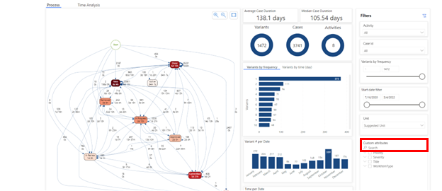

## Azure DevOps (pipelines) template

The process advisor **Azure Pipelines** template will enable you to visualize the execution process and handling of tracked Azure pipelines and boards. Insights will allow you to maximize your development processes and manage dependencies.

To learn more about Azure DevOps, go to the [Azure DevOps documentation](/azure/devops).

### Prerequisite

Before you can visualize your Azure pipelines, you must have an Azure DevOps Individual or User license. To learn more, go to [Pricing for Azure DevOps](https://azure.microsoft.com/pricing/details/devops/azure-devops-services/).

### Create and run the Azure Pipelines template

1. On the **Azure** tab in the **Start with a popular template** section, select the **Azure Pipelines** tile.

    > [!div class="mx-imgBorder"]
    > 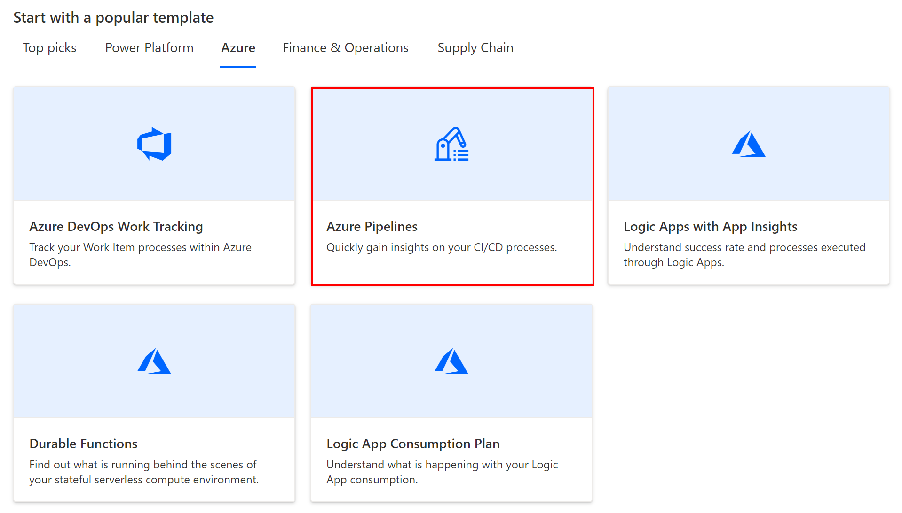

1. In the **Process name** field, enter a name for your process.

1. Go to your Azure DevOps environment and select **Pipelines** on the left panel to find the information you'll need to enter in the **Create a new process** screen.

    1. Find the names for the **Organization name**, **Project name**, ad **Pipeline Name** fields (as indicated in the following screenshot).

    > [!div class="mx-imgBorder"]
    > 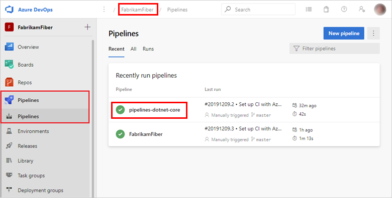

    c. (Optional) Enter a description of the process in the **Description** field.
    
    d. Select **Create**.

    > [!div class="mx-imgBorder"]
    > 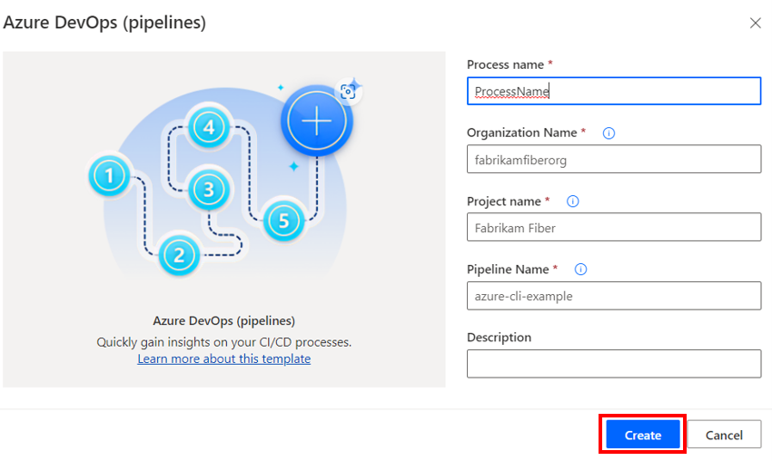

1. Complete the **Connect to data source** screen by doing steps 4 through 6 in the **Create and run the Azure DevOps Work Tracking template** section earlier in this article.

### Visualize the process map for the Azure Pipelines template

After your process report has been published, you can visualize the process map.

> [!div class="mx-imgBorder"]
> 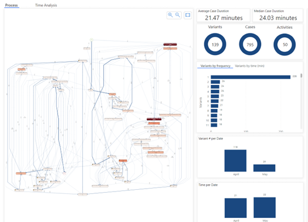

## Logic Apps with App Insights template

The process advisor **Logic Apps with App Insights** template will enable you to visualize the execution and orchestration of your Logic Apps. Insights will allow you to maximize your automated processes and manage dependencies.

To learn more about Logic Apps, go to the [Azure Logic Apps documentation](/azure/logic-apps/).

### Prerequisite

Before you can visualize your Logic Apps, you must have an Azure Logic Apps Standard Plan (Single-tenant) license. To learn more, go to [Logic Apps pricing](https://azure.microsoft.com/pricing/details/logic-apps/).

### Create and run the Logic Apps with App Insights template

1. In order to deploy the template, you'll need to create an Application Insights Resource. For instructions, go to [Create an Application Insights resource](/azure/azure-monitor/app/create-new-resource).

1. On the **Azure** tab in the **Start with a popular template** section, select the **Logic Apps with App Insights** tile.

    > [!div class="mx-imgBorder"]
    > 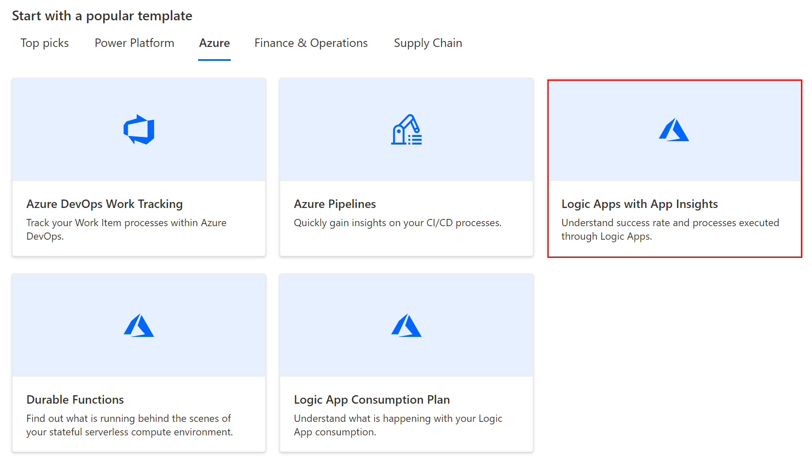

1. In the **Process name** field, enter a name for your process.

1. Go to the Application Insights Azure Resource you created in step 1 to find the information you'll need to enter in the **Create a new process** screen.

1. On left panel, select **Configure** > **API Access**.

    > [!div class="mx-imgBorder"]
    > 

1. Copy the Power App **Application ID**.

    > [!div class="mx-imgBorder"]
    > 

1. Go back to the process advisor **Create a new process** screen and paste it in the **Logic App Application Insights Application Id** field.

1. (Optional) Enter a description of the process in the **Description** field.

1. Select **Create**.

    > [!div class="mx-imgBorder"]
    > 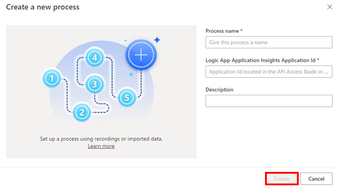

1. In the **Connect to data source** screen in the **Authentication kind** field, replace "Anonymous" with **Organizational account**.

1. Select **Sign in** and authenticate through AAD.

    > [!div class="mx-imgBorder"]
    > 

1. After connection credentials are established, select **Save**. Process advisor will analyze your process. This might take at least two minutes to complete.

### Visualize the process map for the Logic Apps with App Insights template

After your process report has been published, you can visualize the process map and use the **Custom attributes** filter to dig deeper into your insights.

> [!div class="mx-imgBorder"]
> 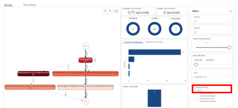

## Logic App Consumption Plan template

The process advisor **Logic App Consumption Plan** template will enable you to visualize the execution and orchestration of your Logic Apps. Insights will allow you to maximize your automated processes and manage dependencies.

To learn more about Logic Apps, go to the [Azure Logic Apps documentation](/azure/logic-apps/).

### Prerequisite

Before you can visualize your Logic Apps, you must have an Azure Logic Apps Consumption Plan (Multi-tenant) license. Find out more, go to [Logic Apps pricing](https://azure.microsoft.com/pricing/details/logic-apps/).

### Create and run the Azure Logic App Consumption Plan template

1. In order to deploy the template, you'll need to create an Application Insights Resource. For instructions, go to [Create an Application Insights resource](/azure/azure-monitor/app/create-new-resource).

1. On the **Azure** tab in the **Start with a popular template** section, select the **Logic App Consumption Plan** tile.

    > [!div class="mx-imgBorder"]
    > 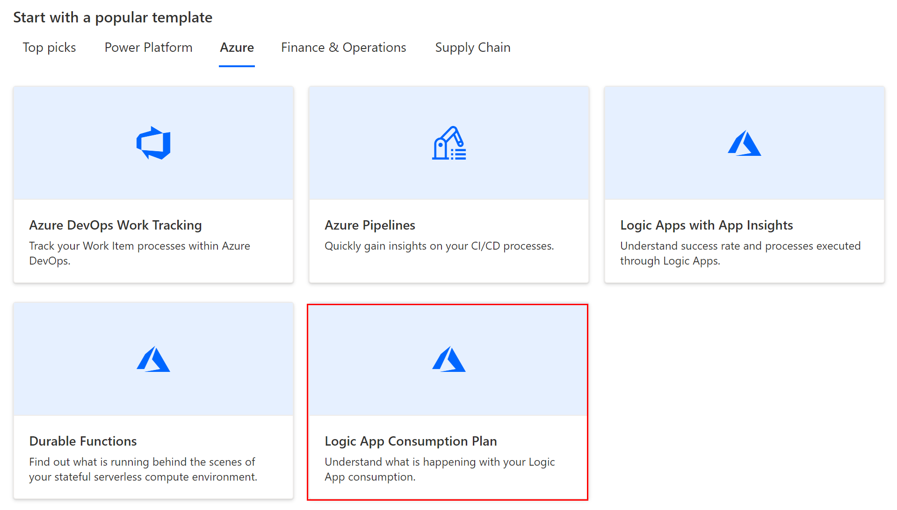

1. In the **Process name** field, enter a name for your process.

1. Go to the Application Insights Azure Resource you created in step 1 to find the information you'll need to enter in the **Create a new process** screen.

    1. Go to your Azure DevOps environment and select **Overview** on the left panel.

    1. Find the names for the **Azure subscription Id**, **Resource Group Name**, and **Logic App Name** fields (as indicated in the following screenshot).

        > [!div class="mx-imgBorder"]
        > 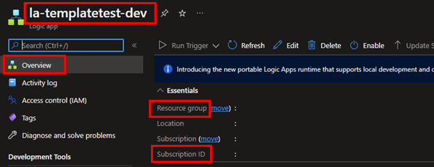

    1. (Optional) Enter a description of the process in the **Description** field.

    1. Select **Create**.

        > [!div class="mx-imgBorder"]
        > 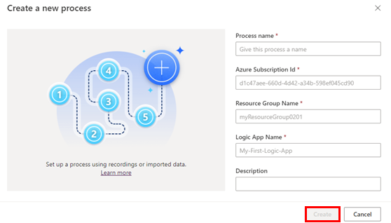

1. Complete the Connect to data source screen by doing steps 4 through 6 in the **Create and run the Azure DevOps Work Tracking template** section earlier in this article.

### Visualize the process map for the Azure Logic App Consumption Plan template

After your process report has been published, you can visualize the process map and use the **Custom attributes** filter to dig deeper into your insights.

If a map doesn't load, you'll get this message: **The data was too complex to load. Please select a variant to proceed.**

> [!div class="mx-imgBorder"]
> 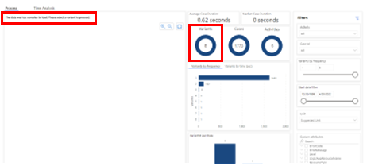

You can select a variant to get the map to show with filtered data.

> [!div class="mx-imgBorder"]
> 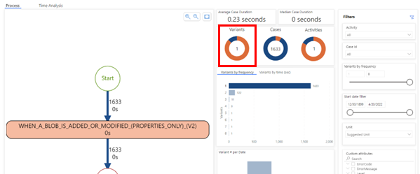

## Durable Functions template

The Process advisor **Durable Functions** template will enable you to visualize the execution process and handling of your durable functions. Insights will allow you to maximize your development processes and manage dependencies.

To learn more, go to [What are Durable Functions?](/azure/azure-functions/durable/durable-functions-overview)

### Prerequisite

Before you can visualize your Azure durable functions, you must have an Azure Durable Functions license. To learn more, go to [What are Durable Functions?](/azure/azure-functions/durable/durable-functions-overview)

### Create and run the Durable Functions template

1. On the **Azure** tab in the **Start with a popular template** section, select the **Durable Functions** tile.

    > [!div class="mx-imgBorder"]
    > 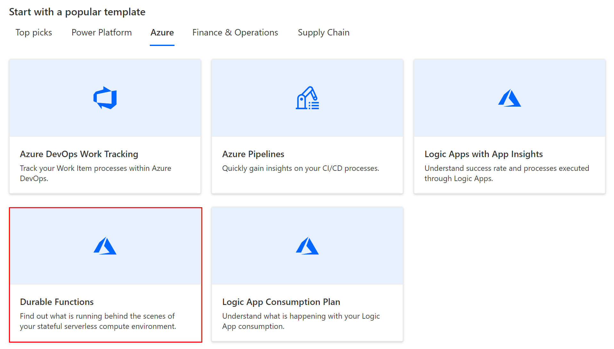

1. In the **Process name** field, enter a name for your process.

1. Go to your Azure Durable Functions Storage Account in the Azure portal to find the information you'll need to enter in the **Create a new process** screen.

    1. On the left panel under **Data storage**, select **Tables**.

        > [!div class="mx-imgBorder"]
        > 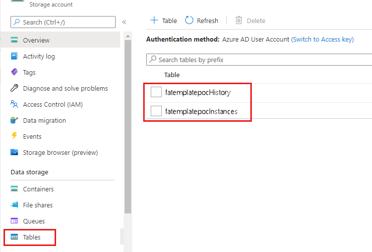

    1. You'll find at least two tables names. Copy the tables named (*your function app name*)**History** and (*your function app name*)**Instances**, and then paste them in the **Instance Table Storage Name** and **History Table Storage Name** in the **Create a new process** screen.

        > [!div class="mx-imgBorder"]
        > 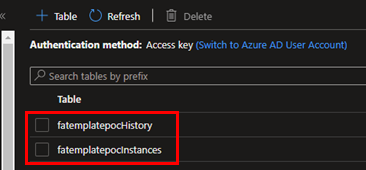

    1. Copy the Url, and then paste it in the **Table Storage Account URL** field in the **Create a new process** screen.

        > [!div class="mx-imgBorder"]
        > 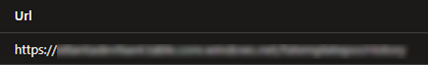

    1. (Optional) Enter a description of the process in the **Description** field.

    1. Select **Create**.

        > [!div class="mx-imgBorder"]
        > 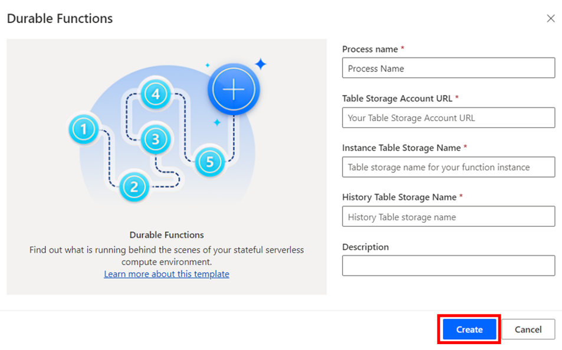

1. On the **Connect to data source** screen, copy the URL from the **Table Storage Account URL** field you just pasted in the **Create a new process** screen, and then paste it in the **Account name or URL** field in the **Connection settings** section.

    > [!div class="mx-imgBorder"]
    > 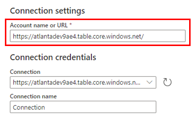

1. Go back to your Azure Durable Functions Storage Account in the Azure portal, and select **Security + Networking** > **Access keys** on the left panel.

    > [!div class="mx-imgBorder"]
    > 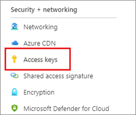

1. Select **Show keys**, copy **Key1** or **Key2**, and then paste it into the **Account key** field in the **Connect to data source screen** screen.

    > [!div class="mx-imgBorder"]
    > 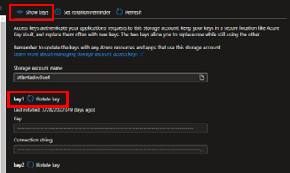

### Visualize the process map for the Durable Functions template

After your process report has been published, you can visualize the process map and use the **Custom attributes** filter to dig deeper into your insights.

> [!div class="mx-imgBorder"]
> 