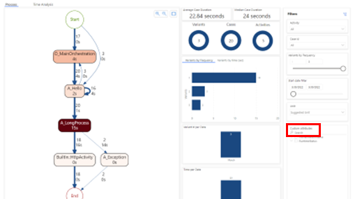

# Azure templates for process mining

Easily onboard your data for process mining with a process advisor template. Templates help you start mining your processes for insights with just a few selections. You'll avoid the data identification and manipulation that's required with traditional process mining tools. [Azure DevOps Work Tracking](#azure-devops-work-tracking-template), [Azure Pipelines](#azure-devops-pipelines-template), [Logic Apps with App Insights](#logic-apps-with-app-insights-template), [Logic App Consumption Plan](#logic-app-consumption-plan-template), and [Durable Functions](#durable-functions-template) templates provide insights that help you identify opportunities and optimize your development processes.

Creating and running a template is similar for all the process advisor Azure templates.

## Azure DevOps (work tracking) template

The Azure DevOps (work tracking) template analyzes the execution and handling of tracked Azure DevOps (ADO) work items to help you maximize your development processes and manage dependencies. To learn more, go to [What is Azure DevOps?](/azure/devops/what-is-azure-devops).

The Azure DevOps (work tracking) template uses data from your Azure Boards to analyze your work items. You'll need to gather some information from ADO before you can run the template.

### Gather information from ADO Boards

1. In your Azure DevOps environment in the left panel, select **Project settings**. Under **Boards**, select **Team configuration**. Then select the **Area** tab.

    :::image type="content" source="media/process-mining-azure-templates/az-boards.png" alt-text="Screenshot of an Azure DevOps Project Settings page with organization, project name, and other information highlighted.":::

1. Find the organization name and project name at the top of the Project Settings page. Take note of the area name.

### Create and run the Azure DevOps (work Tracking) template

1. In Power Automate in the left panel, select **Process advisor**.

1. In the **Start with a popular template** section, select the **Azure** tab, and then select the **Azure DevOps (work tracking** tile.

1. In the **Process name** box, enter a name for your process.

1. In the **Organization name**, **Project name**, and **Area name** boxes, enter the information from ADO.

1. (Optional) In the **Description** box, enter a description of the process.

1. Select **Create**.

    :::image type="content" source="media/process-mining-azure-templates/create-az-devops.png" alt-text="Screenshot of the Create a new process screen using the Azure DevOps (work tracking) template.":::

1. In the **Connect to data source** screen in the **Authentication kind** box, replace "Anonymous" with **Organizational account**.

    If you're signed in, you'll see your credentials. You can switch to a different account if needed. If you're not signed in, select **Sign in** and sign in to your account.

1. Select **Save**.

Process advisor will analyze your process. It may take a few minutes for the analytics to appear. You can leave the page and return later if you don't want to wait around.

[Learn how to visualize and gain insights from processes](process-mining-visualize.md). You can also use the custom attributes filter to dive deeper into your insights.

## Azure DevOps (pipelines) template

The Azure DevOps (pipelines) template analyzes the execution and handling of tracked pipelines and boards to help you maximize your development processes and manage dependencies. To learn more, go to [What is Azure Pipelines?](/azure/devops/pipelines/get-started/what-is-azure-pipelines).

The Azure DevOps (pipelines) template uses data from Azure DevOps to analyze your pipelines. You'll need to gather some information from ADO before you can run the template.

### Gather information from ADO Pipelines

1. In your Azure DevOps environment in the left panel, select **Pipelines**, and then select **Pipelines** again.

    :::image type="content" source="media/process-mining-azure-templates/az-pipelines-names.png" alt-text="Screenshot of the Azure Pipelines page with organization and pipeline name highlighted.":::

1. Find the organization name and project name at the top of the Pipelines page. Take note of the pipeline name.

### Create and run the Azure DevOp (pipelines) template

1. In Power Automate in the left panel, select **Process advisor**.

1. In the **Start with a popular template** section, select the **Azure** tab, and then select the **Azure DevOps (pipelines)** tile.

1. In the **Process name** box, enter a name for your process.

1. In the **Organization Name**, **Project name**, and **Pipeline Name** boxes, enter the information from ADO.

1. (Optional) In the **Description** box, enter a description of the process.

1. Select **Create**.

    :::image type="content" source="media/process-mining-azure-templates/create-az-pipelines.png" alt-text="Screenshot of the Create a new process screen using the Azure DevOps (pipelines) template.":::

1. In the **Connect to data source** screen in the **Authentication kind** box, replace "Anonymous" with **Organizational account**.

    If you're signed in, you'll see your credentials. You can switch to a different account if needed. If you're not signed in, select **Sign in** and sign in to your account.

1. Select **Save**.

Process advisor will analyze your process. It may take a few minutes for the analytics to appear. You can leave the page and return later if you don't want to wait around.

[Learn how to visualize and gain insights from processes](process-mining-visualize.md). You can also use the custom attributes filter to dive deeper into your insights.

## Logic Apps (standard plan) template

The Logic Apps (standard plan) template analyzes the execution of your Logic Apps to help you maximize your automated processes and manage dependencies. To learn more, go to [What is Azure Logic Apps?](/azure/logic-apps/logic-apps-overview).

The Logic Apps with App (standard plan) template uses telemetry data from [Azure Monitor Application Insights](/azure/azure-monitor/app/app-insights-overview) to analyze your apps. You'll need to get an Application ID for your app in an Application Insights resource before you can run the template.

### Get your app's Application Insights Application ID

**If you're not an Azure admin:** Ask your Azure admin to create an Application Insights resource for your app and give you the app's Application ID and the dimensions to enter for Case ID and Activity.

**If you're an Azure admin:**

### Create and run the Logic Apps with App Insights template

1. To deploy a template, you need to create an Application Insights resource. For instructions, go to [Create an Application Insights resource](/azure/azure-monitor/app/create-new-resource).

1. On the **Azure** tab in the **Start with a popular template** section, select the **Logic Apps (standard plan)** tile.

1. [Create an Application Insights resource](/azure/azure-monitor/app/create-new-resource) for your app.

1. In the left panel, select **Configure** > **API Access**.

1. Copy the **Application ID**.

### Create and run the Logic Apps (standard plan) template

1. In Power Automate in the left panel, select **Process advisor**.

1. In the **Start with a popular template** section, select the **Azure** tab, and then select the **Logic Apps (standard plan)** tile.

1. In the **Process name** box, enter a name for your process.

1. In the **Logic App Application Insights Application Id** box, paste the Application ID from Application Insights.

1. (Optional) In the **Description** box, enter a description of the process.

1. Select **Create**.

1. In the **Authentication kind** box, replace "Anonymous" with **Organizational account**.

    If you're signed in, you'll see your credentials. You can switch to a different account if needed. If you're not signed in, select **Sign in** and sign in to your account.

1. Select **Save**.

Process advisor will analyze your process. It may take up to two minutes for the analytics to appear. You can leave the page and return later if you don't want to wait around.

[Learn how to visualize and gain insights from processes](process-mining-visualize.md). You can also use the custom attributes filter to dive deeper into your insights.

## Logic Apps (consumption plan) template

The Logic Apps (consumption plan) template analyzes the execution of your Logic Apps to help you identify opportunities and optimize your Logic Apps (consumption plan) usage. To learn more, go to [Usage metering, billing, and pricing models for Azure Logic Apps](/azure/logic-apps/logic-apps-pricing).

The process advisor **Logic Apps (consumption plan)** template will enable you to visualize the execution and orchestration of your Logic Apps. Insights will allow you to maximize your automated processes and manage dependencies.

To learn more about Logic Apps, go to the [Azure Logic Apps documentation](/azure/logic-apps/).

### Prerequisite

Before you can visualize your Logic Apps, you must have an Azure Logic Apps Consumption Plan (Multi-tenant) license. Find out more, go to [Logic Apps pricing](https://azure.microsoft.com/pricing/details/logic-apps/).

### Create and run the Logic Apps (consumption plan) template

1. To deploy a template, you need to create an Application Insights resource. For instructions, go to [Create an Application Insights resource](/azure/azure-monitor/app/create-new-resource).

The Logic App Consumption Plan template uses data from Azure DevOps to analyze your consumption. You'll need to gather some information from ADO before you can run the template.

### Gather information from ADO Logic Apps

1. In your Azure Logic Apps environment, select your app, and then in the left panel, select **Overview**.

    :::image type="content" source="media/process-mining-azure-templates/az-overview.png" alt-text="Screenshot of the Logic Apps Overview page with resource group and subscription information highlighted.":::

1. Take note of the app name, resource group, and Subscription ID.

### Create and run the Logic Apps (consumption plan) template

1. In Power Automate in the left panel, select **Process advisor**.

1. In the **Start with a popular template** section, select the **Azure** tab, and then select the **Logic Apps (consumption plan)** tile.

1. In the **Process name** box, enter a name for your process.

1. In the **Azure subscription Id**, **Resource group name**, and **Logic app name** boxes, enter the information from ADO.

1. (Optional) In the **Description** box, enter a description of the process.

1. Select **Create**.

1. In the **Authentication kind** box, replace "Anonymous" with **Organizational account**.

    If you're signed in, you'll see your credentials. You can switch to a different account if needed. If you're not signed in, select **Sign in** and sign in to your account.

1. Select **Save**.

Process advisor will analyze your process. It may take a few minutes for the analytics to appear. You can leave the page and return later if you don't want to wait around.

[Learn how to visualize and gain insights from processes](process-mining-visualize.md). You can also use the custom attributes filter to dive deeper into your insights.

## Durable Functions template

The Durable Functions template analyzes the execution of your Durable Functions to help you identify opportunities and optimize states, checkpoints, and restarts. To learn more, go to [What are Durable Functions?](/azure/azure-functions/durable/durable-functions-overview).

The Durable Functions template uses data from your Azure Durable Functions storage account for its analysis. You'll need to gather some information from Azure before you can run the template.

### Create and run the Durable Functions template

1. Have both Power Automate process advisor and Azure portal open in separate browser tabs.

1. In Power Automate process advisor, in the **Start with a popular template** section, select the **Azure** tab, and then select the **Durable Functions** tile.

1. In the **Process name** box, enter a name for your process.

    :::image type="content" source="media/process-mining-azure-templates/create-durable-functions.png" alt-text="Screenshot of the Create a new process screen for the Durable Functions template.":::

1. In Azure portal, go to your Azure Durable Functions storage account. In the left panel under **Data storage**, select **Tables**. Copy the table names that end with **Instances** and **History**.

    :::image type="content" source="media/process-mining-azure-templates/durable-functions-tables.png" alt-text="Screenshot of the Azure storage account Tables page with two table names highlighted.":::

1. In process advisor, paste the **Instances** table name in the **Instance Table Storage Name** box and the **History** table name in the **History Table Storage Name** box.

1. In Azure portal, copy the value in the **Url** column.

1. In process advisor, paste the URL in the **Table Storage Account URL** box.

1. (Optional) In the **Description** box, enter a description of the process.

1. Select **Create**.

1. On the **Connect to data source** screen, paste the URL from Step 6 in the **Account name or URL** box.

    :::image type="content" source="media/process-mining-azure-templates/durable-functions-settings.png" alt-text="Screenshot of the Connection settings screen, with the Account name or URL box highlighted.":::

1. In Azure portal in the left pane, select **Security + Networking** > **Access keys**.

    :::image type="content" source="media/process-mining-azure-templates/durable-functions-access-keys.png" alt-text="Screenshot of the Security + Networking menu with Access keys highlighted.":::

1. Select **Show keys**. Copy the value of **Key1** or **Key2**.

1. In process advisor, paste the key value in the **Account key** box.

1. Once the connection credentials are established, select **Save**.

Process advisor will analyze your process. It may take a few minutes for the analytics to appear. You can leave the page and return later if you don't want to wait around.

[Learn how to visualize and gain insights from processes](process-mining-visualize.md). You can also use the custom attributes filter to dive deeper into your insights.

> [!div class="mx-imgBorder"]
> 

### See also

[What is Azure DevOps?](/azure/devops/what-is-azure-devops)  
[What is Azure Pipelines?](/azure/devops/pipelines/get-started/what-is-azure-pipelines)  
[What is Azure Logic Apps?](/azure/logic-apps/logic-apps-overview)  
[Azure Monitor Application Insights](/azure/azure-monitor/app/app-insights-overview)  
[Usage metering, billing, and pricing models for Azure Logic Apps](/azure/logic-apps/logic-apps-pricing)  
[What are Durable Functions?](/azure/azure-functions/durable/durable-functions-overview)
