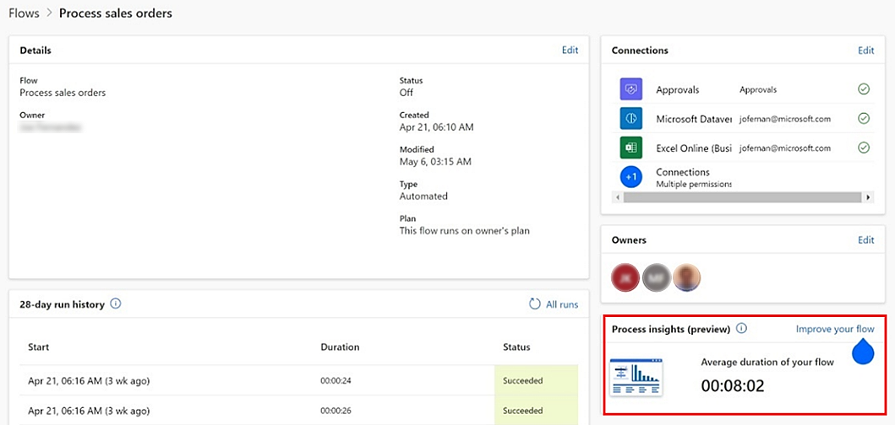
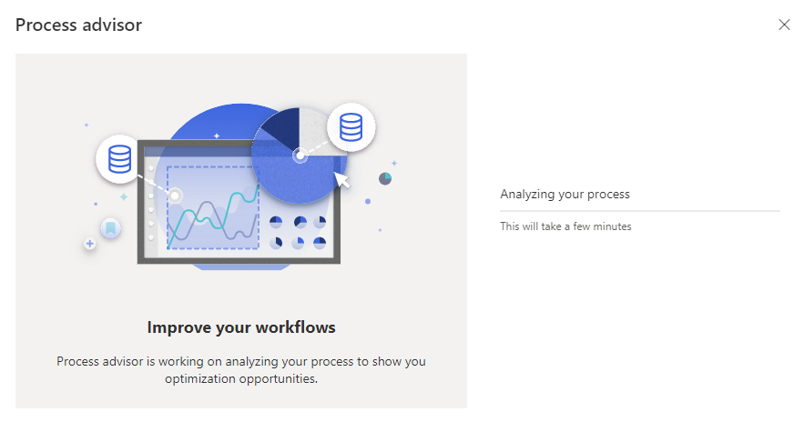
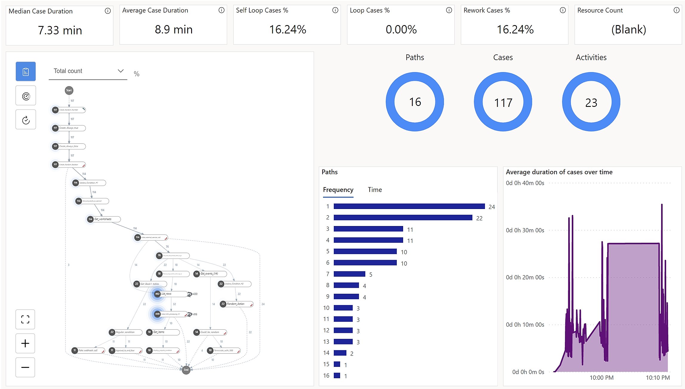

# Tutorial: Get started with cloud flow process insights (preview)

[!INCLUDE[cc-beta-prerelease-disclaimer](./includes/cc-beta-prerelease-disclaimer.md)]

This tutorial allows you to experience how to improve your flows with cloud flow process insights.

You can gain insights and improve your cloud flows with the help of process mining. With a few selections, you can visualize your flow’s performance, identify bottlenecks and optimization opportunities, and monitor for business drifts. You can generate these insights directly from the flow details page by having process advisor analyze your flow-run history with process mining techniques.

> [!IMPORTANT]
> - This is a preview feature.
>
> - [!INCLUDE[cc_preview_features_definition](includes/cc-preview-features-definition.md)]

## Prerequisites

- Flow runs generated in the last 28 days.

- Owner of flow to generate process insights.

- Access to Microsoft Dataverse.

- An Environment Maker security role if you want to set up dataflows for process mining.
    - If you're assigned an Environment Admin or System Admin role, go to [What are dataflows](/power-query/dataflows/overview-dataflows-across-power-platform-dynamics-365) to learn more.

## Known limitations

- After a flow runs, it takes about 15 to 30 minutes for data to be available for analysis.

- The feature isn't supported for Dataverse for Microsoft Teams environments.

## Terminology

- The flow runs translate to the cases shown in analytics view.

- A process variant is a specific activity sequence, like a "trace" through the process, from start to end. Each variant differs from the others by at least one activity. In a flow, each action is an activity.

- Custom metrics and filters allow you to generate custom insights such as based on your flow version, or successful versus failed flow run.

## Improve your flow with process insights

On your flow details page, you can see the **Process insights (preview)** card. When you engage with it, you'll be taken to the process advisor analytics page to see your flow process visualization and analytics.
  
1. Go to your flow details page.

1. Generate flow runs if the flow hasn't run in the last 28 days.

    > [!div class="mx-imgBorder"]
    > 

1. On the process advisor tile, select **improve your workflows**.

1. Wait for analysis to complete.

    > [!div class="mx-imgBorder"]
    > 

1. Display flow process analytics.

    > [!div class="mx-imgBorder"]
    > 

1. To get the most run path in your automation, select the most frequent variant.

1. Customize your insights based on custom filters for your flow like flow version, action status, action status code, or action error.

1. Select time analysis report to drill down into bottlenecks based on cases, variants, and time.

> [!NOTE]
> To re-analyze the process based on your latest flow runs, go to the process advisor analytics page and select **Refresh**. This will update your data and re-analyze the process. You can continue viewing the analytics while the analysis is processing.