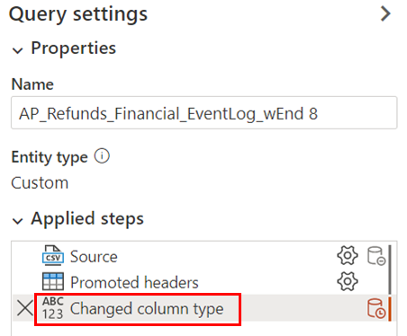

# Edit and refresh processes in process advisor (preview)

[!INCLUDE[cc-beta-prerelease-disclaimer](./includes/cc-beta-prerelease-disclaimer.md)]

Some of the reasons why you might want to edit the query are:

- Your data might have multiple ID columns that can be used as case ID. There often isn't a correct answer. You might discover more insights by changing what you use as case ID.

- You have more than five additional columns with useful data. You want to try analyzing other columns to see if they're potentially useful in uncovering root causes of bottlenecks.

> [!IMPORTANT]
> - This is a preview feature.
>
> - [!INCLUDE[cc_preview_features_definition](includes/cc-preview-features-definition.md)]

## Edit query

1. In the process details page, return to the Query Editor by selecting **Setup**.

1. Select (or double-click) the corresponding steps in the **Applied steps** area under **Query settings** to edit those steps.

   *Don't* select **Map to entity** or **Choose columns** again.

   > [!div class="mx-imgBorder"]
   > 

## Refresh data

If you have a data source that's transactional, like Dataverse or SQL, select **Refresh** on the right side of the Data Source card in the Process details page. You need to select **Analyze** again after selecting **Refresh**. You also need to do this if you want to see the Analytics page updated with the latest data from that data source.

## Disconnect data

If you want to change the data source for your process, you can easily do this. For example, you might have been using a CSV file before but now you want to connect to a transactional data source instead. In this example, select **Disconnect data** on the right side of the Data Source card. In the Process details page, once you disconnect, select **Setup** again to connect to your new data source.
