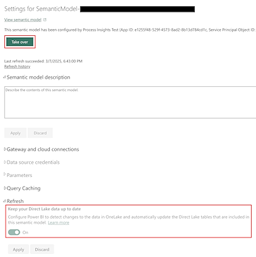

# Structure of semantic model in Fabric workspace (preview)

[!INCLUDE[cc-preview-features-top-note](./includes/cc-preview-features-top-note.md)]

The new optimized DirectLake semantic model leads to faster and more memory-efficient analysis of processes. By saving on memory, you can analyze larger processes and save on costs by using smaller Fabric capacities to perform analysis.
In addition, a more intuitive Power BI semantic model data structure is used, which allows you to dig deeper into insights with less time and effort.

> [!INCLUDE[cc_preview_features_definition](includes/cc-preview-features-definition.md)]

## Semantic model description

When a process is published to Fabric workspace, it creates a new semantic model and a corresponding report. This screenshot is an example of a semantic model structure published to Fabric.

Select the **magnifying glass** in the lower-right corner of the image to enlarge it.

### Relationships

Relationships necessary for filtering and interconnectivity of visuals are predefined in the published data model. There isn't a need to manually create more relationships unless other data sources are connected. For this scenario, use the Power BI composite semantic model and build relationships on top of that model.

### Data model summary

From a logical perspective, the data model consists of many entity subsets as depicted in the first paragraph of this section.

- **Process Data**: All process-related data without filtering and calculated measures.
- **Visuals data**: Entities providing precalculated data necessary for process mining custom visuals to display.
- **Helping entities**: Other entities needed by Power BI.

Following is the brief description of the subsets and included entities.

#### Process Data

The content of process data entities changes in specific scenarios.

- When process model data is refreshed
- When a new view is created
- When a new custom metric is created
- When a user changes the filtering definition in any process view

Working with these entities allows you to:

- Access the raw process data
- Process data influenced by applied filters
- Access the measures calculated based on the applied filters

|Entity|Description|
|------|-----------|
|Cases|List of all cases and their attributes in the process. Each case contains a unique Case ID display, and values for each of the *case attributes*, as defined in the mapping setup step. Combine with *CaseMetrics* entity to get complete case information.|
|Events|List of all event attributes in the process. Each event has a unique event identifier index, and values for each of the *event attributes*, as defined in the mapping setup step. Combine with *ProcessMapMetrics* entity filtered by `Is_Node` column to get a complete event information.|
|CaseMetrics|Entity holds all case-level metrics related to a specific combination of case and view. *Case level custom metrics* defined in Power Automate Process Mining desktop app are added to this entity.|
|AttributesMetadata|Entity holds the definition of all case/event-level attributes as defined in the import of event log data into process model. It includes its datatype, attribute type, and attribute level being either case or event.|
|MiningAttributes|Holds values of available mining attributes. A process view can be set up to look at the process from different perspective based on the selected mining attribute. If no other mining attribute is available, the entity holds the values of `Activity` attribute.|
|Views|List of available (published) views created in the Power Automate Process Mining desktop app. Only public process views are published to the data set. Entries can be used to filter report, report page, and visual to visualize only data from the specific process view.|
|Variants|Entity holds the relations between variants and process views. A record is included if a particular variant is included in a view after the filtering criteria are taken into account.|

#### Visuals data

Visuals data entities are recalculated only when there's a data refresh for the process model.

|Entity|Description|
|------|-----------|
|ProcessMapMetrics|Aggregated measures for all nodes and transitions in the process model that are needed for visualization in process map custom visual. This entity combines event (node) information and edge (transition) information - to use the events or edges in your other visuals, filter by the value in `Is_Node` column. *Event level custom metrics* defined in Power Automate Process Mining desktop app are added to this entity.|

#### Other entities

|Entity|Description|
|------|-----------|
|LocalizationTable|Internal table used for localization purpose.|

## Power BI composite model

We recommend that you use the Power BI composite model on top of the semantic model published by Power Automate Process Mining and create the necessary modifications there for these scenarios:

- You need to create more data sources
- You need to create more entities
- You need to create more relationships
- You need to create more custom DAX (Data Analysis Expressions) queries

> [!IMPORTANT]
> The semantic model is created in DirectLake access mode, but its option is set to *Automatic*. This setting means that using a nonoptimal DAX queries or incorrectly setting a composite model might result in fallback to DirectQuery mode. This means that your report won't break, but you might experience lower performance.

To learn more about creating Power BI composite data models on top of DirectLake semantic models, go to: [Building a composite models on a semantic model or model](/power-bi/transform-model/desktop-composite-models#building-a-composite-model-on-a-semantic-model-or-model).

## Semantic model refresh

By default, the semantic model provided by Power Automate Process Mining automatically kept up to date.

For large datasets, data refresh of underlying tables in OneLake might take longer. This can cause potential inconsistencies in the report. Although there's eventual consistency at the end of data refresh (semantic model is explicitly refreshed), you might want to remove the potential intermediate inconsistencies by turning off **Keep your Direct Lake data up to date** flag in the **Settings** screen of the semantic model.

Before you update this screen, you need to take ownership of the semantic model by selecting **Take over** at the top of the **Settings** screen.

