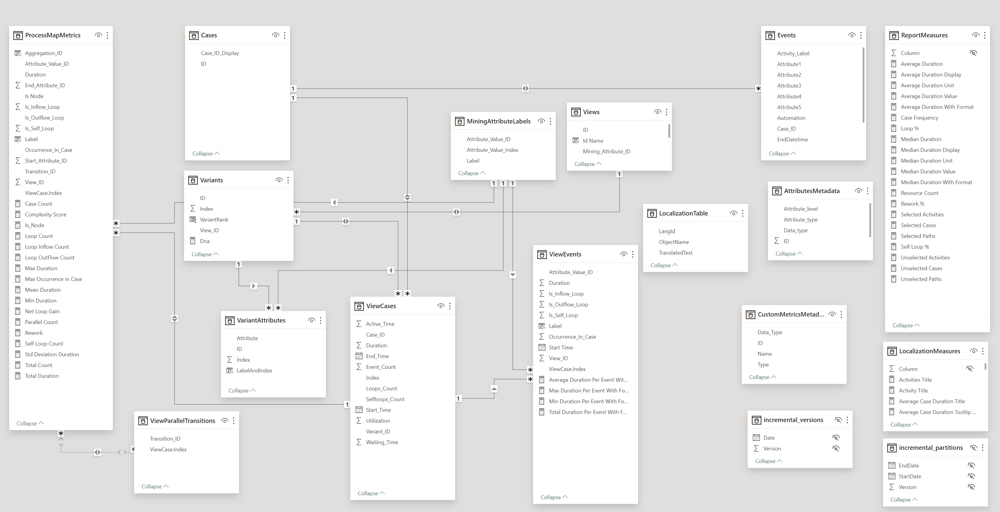

# Use the optimized data structure in a Power BI report

The new optimized data structure leads to faster and more memory efficient analysis of processes. By saving on memory, customers can analyze larger processes and save on costs by using smaller Power BI capacities to perform analysis.

In addition, a more intuitive Power BI model data structure is used, which allows customers to dig deeper into their insights with less time and effort. To learn more about this data model, go to the [Power BI data model structure](#power-bi-data-model-structure) section this article.

## Previous optimized structure to deprecate soon

The new optimized data structure replaces the previous structure completely and the previous data structure will be deprecated. To find out the date and necessary steps, go to the banner in the process **Details** page.

The new optimized data structure takes place in the background, so it displays only in the resulting model, as described in the following section.
  
## Enable XMLA read/write setting

To use the optimized data structure, the XMLA endpoint property must be enabled for read-write. By default, Premium capacity, Fabric capacity, or Premium Per User semantic model workloads have the XMLA endpoint property setting enabled for read-only.

   > [!IMPORTANT]
   > Enabling XMLA can only be done by the capacity admin.

### Enable read-write for a Premium capacity semantic model workload

1. Sign in to [Power BI](https://app.powerbi.com/).
1. Select **Settings** > **Admin portal**.
1. In the Power BI **Admin portal**, select **Capacity settings** > **Power BI Premium** > *capacity name*.
1. Expand **Power BI Workloads**.
1. In the **XMLA Endpoint** setting, select **Read Write**.

    The **XMLA Endpoint** setting applies to all workspaces and semantic models assigned to the capacity.

    :::image type="content" source="media/process-mining-pbi-data-structure/XMLAEndpoint.svg" alt-text="Screenshot of the XMLA endpoint settings for a Premium capacity semantic model workload.":::

### Enable read-write for a Premium Per User semantic model workload

1. Sign in to [Power BI](https://app.powerbi.com/).
1. Select **Settings** > **Admin portal**.
1. In the Power BI **Admin portal**, select **Premium Per User**.
1. Expand **Semantic model workload** settings.
1. In the **XMLA Endpoint** setting, select **Read Write**.

### Enable read-write for a Fabric capacity semantic model workload

1. Sign in to [Power BI](https://app.powerbi.com/).
1. Select **Settings** > **Admin portal**.
1. In the Power BI **Admin portal**, select **Capacity settings** > **Fabric Capacity** > *capacity name*.
1. Expand **Power BI Workloads**.
1. In the **XMLA Endpoint** setting, select **Read Write**.

    The **XMLA Endpoint** setting applies to all workspaces and semantic models assigned to the capacity.

    :::image type="content" source="media/process-mining-pbi-data-structure/XMLAEndpoint.svg" alt-text="Screenshot of the XMLA endpoint settings for a Premium Per User semantic model workload.":::

### Enable using the optimized data structure

For new processes that use a custom workspace, the optimized data structure is set to **true** by default. To enable it or confirm that it is enabled, perform the following steps.

1. Go to the process details page and select **Edit**.

    :::image type="content" source="media/process-mining-pbi-data-structure/Enable1.svg" alt-text="Screenshot of the Settings panel with Edit button highlighted."::: 

1. Select a custom workspace by selecting the dropdown menu under the **Power Bi Workspace (optional)** field.
1. Confirm that the **Use optimized data structure** toggle is **On**. If it's off, select the toggle to enable it.

    :::image type="content" source="media/process-mining-pbi-data-structure/Enable3.svg" alt-text="Screenshot of the Settings panel with toggle highlighted.":::

1. To save the changes, select **Save** if the button is enabled.

    If it isn't enabled, that means the value of the **Use optimized data structure** field was already set to **On**, thus you can skip this step.

## Power BI data model structure

When a process is published to Power BI, a default data source and a corresponding report are created. The following screenshot is an example of the structure of the dataset in the published data source in Power BI.

For an enlarged view of the screenshot, select the magnifying glass in the lower-right corner.

### Relationships

Relationships necessary for filtering and interconnectivity of visuals are predefined in the published data model. There isn't a need to manually create more relationships unless other data sources are connected. For this scenario, use the Power BI composite data model and build relationships on top of that model.

### Data model summary

From a logical perspective, the data model consists of many entity subsets as depicted in the first paragraph of this section.

- **Process Data**: All process related data without filtering and calculated measures.
- **View Data**: Entities giving the process data into the context of the created process analytical view&mdash;applied filters, calculated measures, and custom metrics.
- **Visuals data**: Entities providing precalculated data necessary for process mining custom visuals to display.
- **Helping entities**: Other entities needed by Power BI.

Following is the brief description of the subsets and included entities.

#### Process Data

The content of process data entities changes in specific scenarios.

- When process model data is refreshed.
- When a new view is created.

Working with these entities allows you to access the raw process data not influenced by the applied filters.

|Entity|Description|
|------|-----------|
|Cases|List of all cases in the process. Each case contains a unique case identifier index, Case ID display, and values for each of the *case attributes*, as defined in the mapping setup step.|
|Events|List of all events in the process. Each event references a case into which it belongs using `Case_ID`, has a unique event identifier index, and values for each of the *event attributes*, as defined in the mapping setup step.|
|AttributesMetadata|Entity holds the definition of all case/event-level attributes as defined in the import of event log data into process model. It includes its datatype, attribute type, and attribute level being either case or event.|
|MiningAttributeLabels|Holds values of available mining attributes. A process view can be set up to look at the process from different perspective based on the selected mining attribute. If no other mining attribute is available, the entity holds the values of `Activity` attribute.|
|CustomMetricsMetadata|Includes the definition of custom metrics created in the Process Mining desktop app. Based on the context in which the metric is available, many entries might exist for the same custom metric, having a different `Type`. It also includes the custom metric result data type that can be used for conversion or formatting of the values.|
|Views|List of available (published) views created in the Power Automate desktop app. Only public process views are published to the data set. Entries can be used to filter report, report page, and visual to visualize only data from the specific process view.|

#### View Data

The content of view data entities changes in the following scenarios.

- When a user changes the filtering definition in any process view.
- When a new custom metric is created.

View data entities allows you to access process data influenced by the applied filters and accesses the measures calculated based on the applied filters. As both case and event level filters can be used in the definition of a process view, we recommend to work with view data entities, as the influence on the resulting dataset might be significant.

|Entity|Description|
|------|-----------|
|ViewCases|Entity holds information on which cases are included in which view. In addition, it includes the information for which variant the case is following and precalculated measures for the case. If a case is included in several views, the entity holds a record for each case-view combination. This is important, as some of the values of calculated case measures depend on the filtering criteria set in the view. It also holds any precalculated custom metric values (if defined in process context and valid on case level). The case record is uniquely identified by the **Index** column.|
|ViewEvents|Entity holds information on which events are included in which view and which case they're connected to (event level process view filters might modify the events included in the case). In addition, it includes precalculated measures for the event. If an event is included in several views, the entity holds a record for each event-view combination. This is important, as some of the values of calculated event measures depend on the filtering criteria set in the view. It also holds any precalculated custom metric values (if defined in process context and valid on event level). The event record is uniquely identified by the **Index** column.|
|ViewTransitions|Entity holds information on which transitions are included in which view. In addition, it includes precalculated measures for the transition. If a transition is included in several views, the entity holds a record for each transition-view combination. This is important, as some of the values of calculated transition measures depend on the filtering criteria set in the view. It also holds any precalculated custom metric values (if defined in process context and valid on transition / edge level). The transition record is uniquely identified by the **Index** column. |
|ViewParallelTransitions|Entity holds a record for a combination of transition and case, when that transition is considered parallel in that case in a particular view.|
|Variants|Entity holds the relations between variants and process views. A record is included if a particular variant is included in a view after the filtering criteria are taken into account.|

#### Visuals data

Visuals data entities are recalculated only when there's a data refresh for the process model.

|Entity|Description|
|------|-----------|
|ProcessMapMetrics|Aggregated measures for all nodes and transitions in the process model that are needed for visualization in process map custom visual.|
|VariantDNA|Aggregated measures and relations to events and attributes that are needed for visualization in variant DNA custom visual.|

#### Other entities

|Entity|Description|
|------|-----------|
|LocalizationTable|Internal table used for localization purpose.|
|LocalizationMeasures|Internal measures used for localization purpose.|
|ReportMeasures|Precreated and preformatted most frequent measures that can be used for summary KPIs in the process report. Their evaluation might be subject to filtering and interactive selection in Power BI report.|

## Power BI composite data model

We recommend that you use the Power BI composite data model on top of the data model published by Power Automate Process Mining and create necessary modifications there for the following scenarios.

- When more data sources are needed
- When more entities should be created
- When more relationships are needed
- When custom DAX queries are needed

To learn more about creating Power BI composite data models, go to [Use composite models in Power BI Desktop](/power-bi/transform-model/desktop-composite-models).

