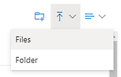

# Prepare processes and data in process advisor (preview)

[!INCLUDE[cc-beta-prerelease-disclaimer](./includes/cc-beta-prerelease-disclaimer.md)]

Before you can use process mining effectively, you need to understand:

- [Data requirements](#data-requirements).

- [Where to get log data from your application](#where-to-get-log-data-from-your-application).

- How to [connect to a data source](#connect-to-a-data-source).

Here's a short video on how to upload data for process mining: 
 
> [!VIDEO https://www.microsoft.com/videoplayer/embed/RWNG85]

> [!IMPORTANT]
> - This is a preview feature.
>
> - [!INCLUDE[cc_preview_features_definition](includes/cc-preview-features-definition.md)]

## Data requirements

Event logs and activity logs are tables stored in your system of record that document when an event or activity occurs. For example, activities you perform in your customer relationship management (CRM) app are saved as an event log in your CRM app. For process mining to analyze the event log, the following fields are necessary:

- **Case ID (caseId when mapping)**

  Case ID should represent an instance of your process and is often the object that the process acts on. It can be a "patient ID" for an inpatient check-in process, an "order ID" for an order submission process, or a "request ID" for an approval process. This ID must be present for all activities in the log.

- **Activity Name (activityName when mapping)**

  Activities are the steps of your process, and activity names describe each step. In a typical approval process, the activity names may be "submit request," "request approved," "request rejected," and "revise request."

- **Start Timestamp (startTimestamp) and End Timestamp (endTimestamp)**

  Timestamps indicate the exact time that an event or activity took place. Event logs have only one timestamp. This indicates the time that an event or activity occurred in the system. Activity logs have two timestamps: a start timestamp and an end timestamp. These indicate the start and end of each event or activity.

## Where to get log data from your application

Process advisor needs event log data to perform process mining. While many tables that exist in your application’s database contain the current state of the data, they might not contain a historical record of the events that happened, which is the required event log format. Fortunately, in many larger applications, this historical record or log is often stored in a specific table. For example, many Dynamics applications keep this record in the Activities table. Other applications, like SAP or Salesforce, have similar concepts, but the name may be different.

In these tables that log historical records, the data structure can be complex. You might need to join the log table with other tables in the application database to get specific IDs or names. Also, not all events that you're interested in are logged. You may need to determine what events should be kept or filtered out. If you need help, you should contact the IT team that manages this application to understand more.

## Connect to a data source

The benefit of connecting to a database directly is keeping process advisor up to date with the latest data from the data source.

[Power Query](/power-query/power-query-what-is-power-query) supports a large variety of connectors that provide a way for process advisor to connect and import data from the corresponding data source. Common connectors include Text/CSV, Microsoft Dataverse, and SQL Server database. If you're using an application like SAP or Salesforce, you might be able to connect to those data sources directly via their connectors. For information on supported connectors and how to use them, go to [Connectors in Power Query](/power-query/connectors/).

### Try out process advisor with the Text/CSV connector

One easy way to try out process advisor regardless of where your data source is located is with the Text/CSV connector. You might need to work with your database admin to export a small sample of the event log as a CSV file. Once you have the CSV file, you can import it into process advisor using the following steps in the data source selection screen.

> [!NOTE]
> You must have OneDrive for Business to use the Text/CSV connector. If you don't have OneDrive for Business, consider using *Blank table* instead of *Text/CSV*, as in step 1. You won't be able to import as many records in *Blank table*.

1. On the navigation pane on the left, select **Data** > **Tables**.

1. On the toolbar at the top, select **Data** > **Get data** > **Text/CSV** on the **Power Query - Choose data source** screen.

    > [!div class="mx-imgBorder"]
    > 

1. Select **Browse OneDrive**. You might need to authenticate.

    > [!div class="mx-imgBorder"]
    > 

1. Upload your event log by selecting the **Upload** icon in the upper right and then selecting **Files**.

    > [!div class="mx-imgBorder"]
    > 

1. Upload your event log, select your file from the list, and then select **Open** to use that file.

### Use the Dataverse connector

The Dataverse connector isn't supported in Microsoft Power Platform. You need to connect to it using the OData connector, which will require a few more steps.

1. Make sure you have access to the Dataverse environment.

2. You need the environment URL of the Dataverse environment you are trying to connect to. Normally it looks like this:

    > [!div class="mx-imgBorder"]
    > 

    To learn how to find your URL, go to [Finding your Dataverse environment URL](/power-query/connectors/dataverse#finding-your-dataverse-environment-url).

1. On the **Power Query - Choose data sources** screen, select **OData**.

    > [!div class="mx-imgBorder"]
    > 

1.	In the URL textbox, type **api/data/v9.2** at the end of the URL so it looks like this:

    > [!div class="mx-imgBorder"]
    > 

1.	Under **Connection credentials**, select **Organizational account** in the **Authentication kind** field.

1. Select **Sign in** and enter your credentials.

    > [!div class="mx-imgBorder"]
    > 

1. Select **Next**.

1. Expand the **OData** folder. You should see all the Dataverse tables in that environment. As an example, the **Activities** table is called *activitypointers*.

1. Select the checkbox next to the table you want to import, and then select **Next**.

    > [!div class="mx-imgBorder"]
    > 
