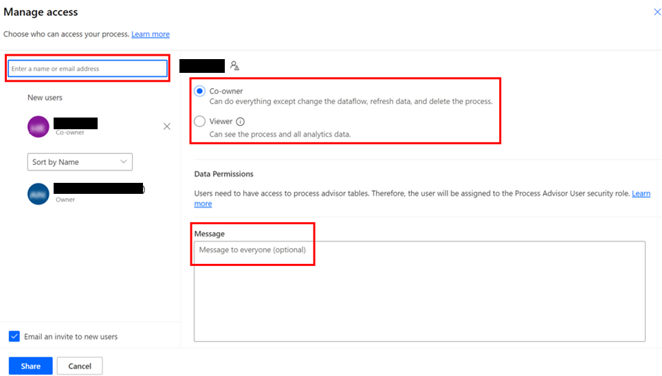

# Share process mining processes in process advisor

When you create a process in process advisor, only you can see it. But you may want to share the analytics and insights with others. Share your process mining processes with others in your organization so they can also glean insights to make decisions.

## Share action

The share action is available on the **Processes** screen for the following:

- Each process where you're an owner.

- The system administrator in the environment.

- Any security role that has share permissions on process advisor system entities.

The share action is also available on the process details page with the same conditions. For process mining, only the viewer role is available for sharing to.

> [!div class="mx-imgBorder"]
> 

## Share panel

When you select the share action, a share panel is displayed. The share panel is where you select Microsoft Dataverse users and teams in your organization, and share your process with them. You can search for any user to invite to your process in the Dataverse tenant.  

When sharing a process with others, the option to automatically send an email invitation is selected. Viewers are invited to view the process's analytics, and there's a link in the email invitation that leads them to the shared process's analytics.  

## Share a process with a viewer

  Adding a viewer to a process shares analytics and insights with other people. If the analytics have not been generated, the viewer would land on the process details page instead. A viewer can perform these actions:  

- View the process details.

- [View the process analytics](process-mining-visualize.md).

- Share the process with other viewers.

>[!NOTE]
>
>- The admin experience for processes they don't own isn't supported.
>- Removing all process roles from a user (such as viewer) does not remove that process from the user's process list view. They can't perform any actions on the process.
