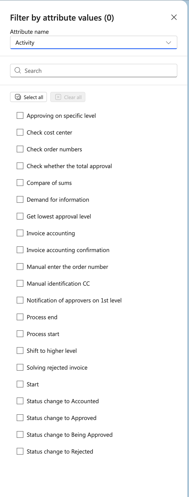

# Filter by Attribute Values

The attribute filter allows you to filter data by selecting specific values from an attribute.

## Configuration

### Attribute Name

Select the attribute you want to filter by from the dropdown menu. In the example, "Activity" is selected.

### Search

Use the search box to quickly find specific attribute values in the list. This is helpful when working with long lists of values.

### Select All / Clear All

- **Select all**: Checks all checkboxes in the list to include all attribute values
- **Clear all**: Unchecks all checkboxes to remove all selections

### Checkbox Selection

Select individual attribute values by checking the corresponding checkboxes. You can select multiple values at once.

## Selection Counter

The title displays a counter showing how many attribute values are currently selected: "Filter by attribute values (0)". The number updates as you select or deselect values.

When no values are selected, the counter shows "(0)".
