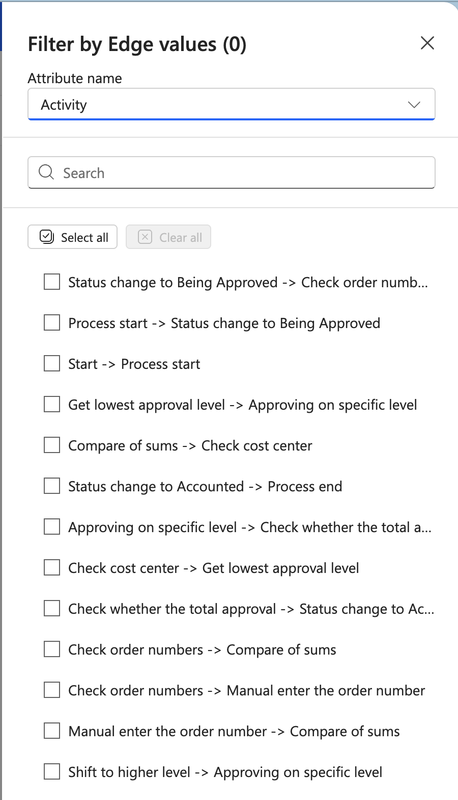

# Edge filter

The edge filter lets you filter cases based on specific edges (transitions between activities) in your process. An edge represents a path from one activity to another in your process flow.

## How it works

The edge filter displays edges in the format "Source activity -> Target activity". You can select which edges to filter by using checkboxes. The filter title shows how many edges are currently selected: "Filter by Edge values (N)".

## Configure the filter

### Attribute name

Choose which activity attribute to use for displaying edges. The default is "Activity". Select from the dropdown to use a different attribute.

### Search for edges

Use the search box to quickly find specific edges in the list. Type any part of the source or target activity name to filter the edge list.

### Select edges

- Check the boxes next to the edges you want to include in your filter
- Use **Select all** to check all edges at once
- Use **Clear all** to uncheck all edges

### Edge list examples

Edges appear in the list like:
- Status change to Being Approved -> Check order numbers
- Process start -> Status change to Being Approved
- Start -> Process start
- Get lowest approval level -> Approving on specific level
- Compare of sums -> Check cost center
- Status change to Accounted -> Process end
- Check order numbers -> Compare of sums
- Check order numbers -> Manual enter the order number
- Manual enter the order number -> Compare of sums
- Shift to higher level -> Approving on specific level
