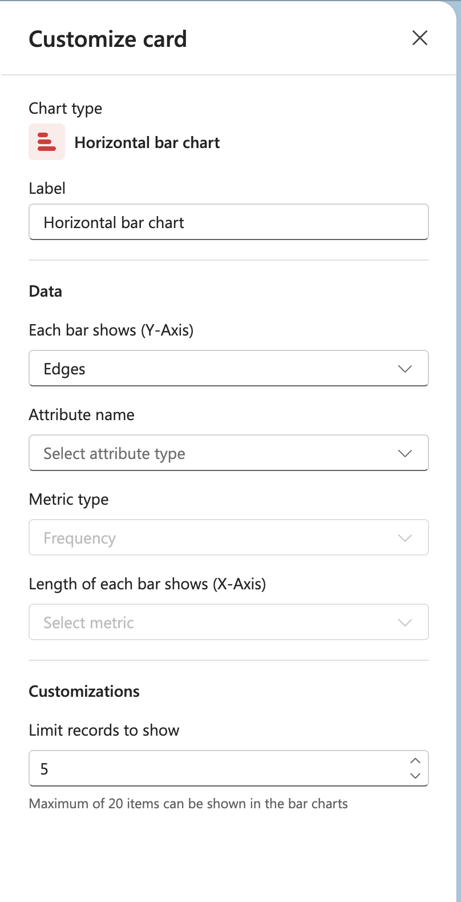

# Horizontal bar chart

## Label

Enter a label for the chart.

## Data

**Each bar shows (Y-Axis)**
Select what each bar represents from the dropdown (e.g., Edges).

**Attribute name**
Select the attribute type to analyze.

**Metric type**
Choose the type of metric to measure (e.g., Frequency).

**Length of each bar shows (X-Axis)**
Select the specific metric that determines the length of each bar.

## Customizations

**Limit records to show**
Set the number of records to display (default: 5).

Note: Maximum of 20 items can be shown in the bar charts.
