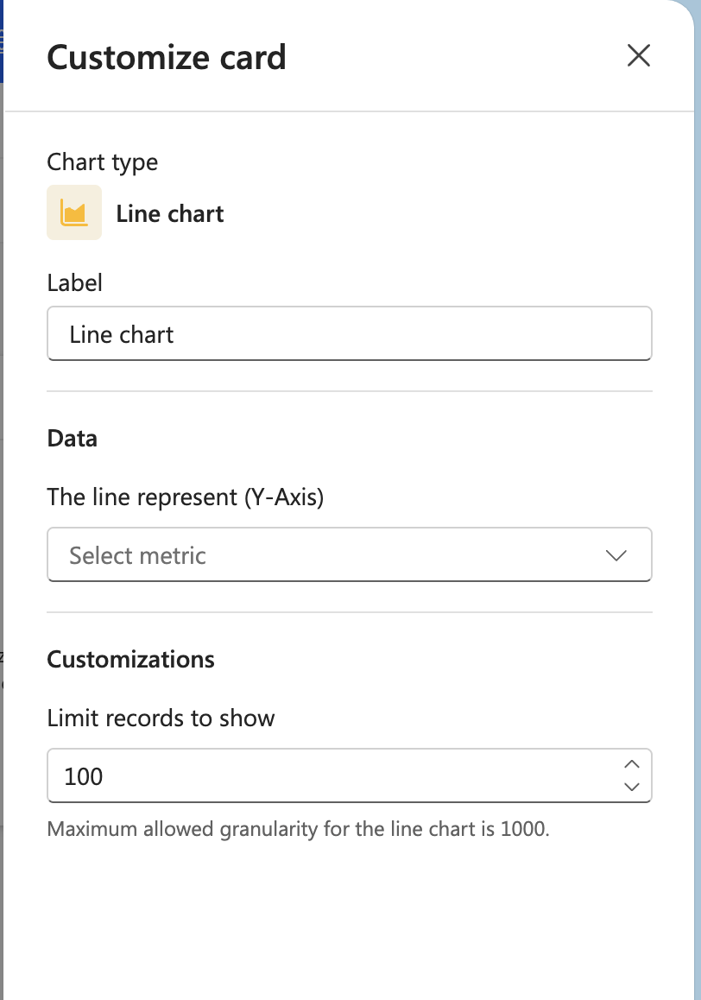

# Line chart

## Label

Enter a label for the chart.

## Data

**The line represent (Y-Axis)**
Select the metric to display on the Y-axis from the dropdown.

## Customizations

**Limit records to show**
Enter the number of records to display (default: 100).

Note: Maximum allowed granularity for the line chart is 1000.
