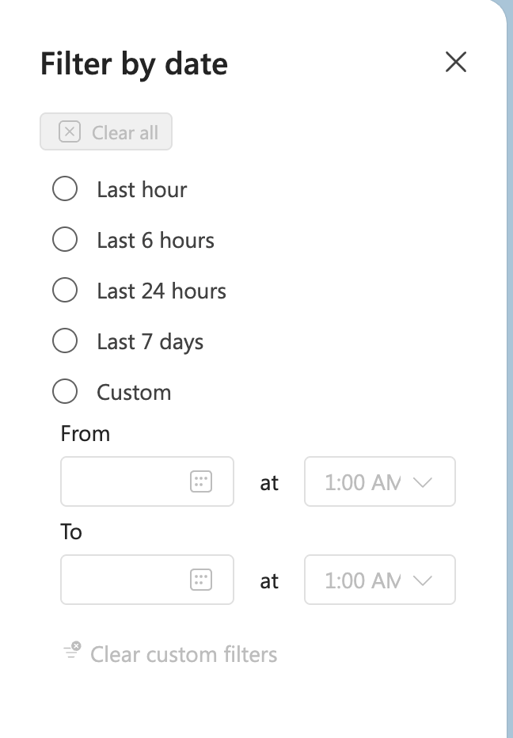
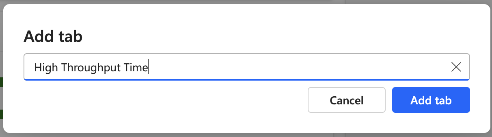
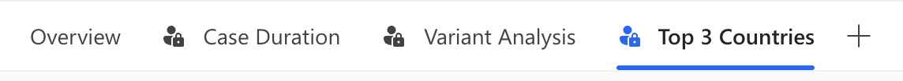
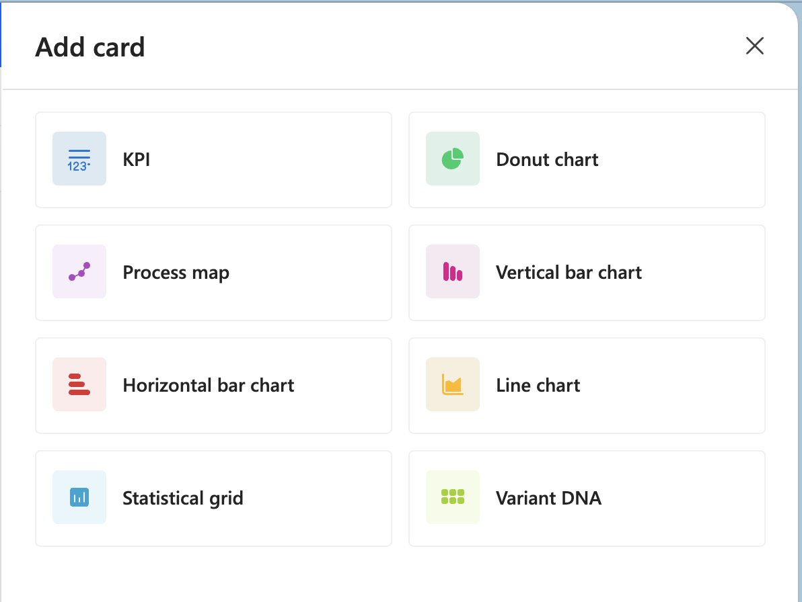
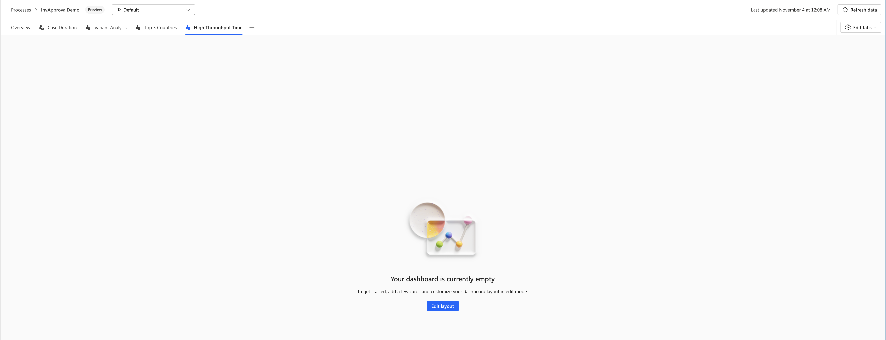
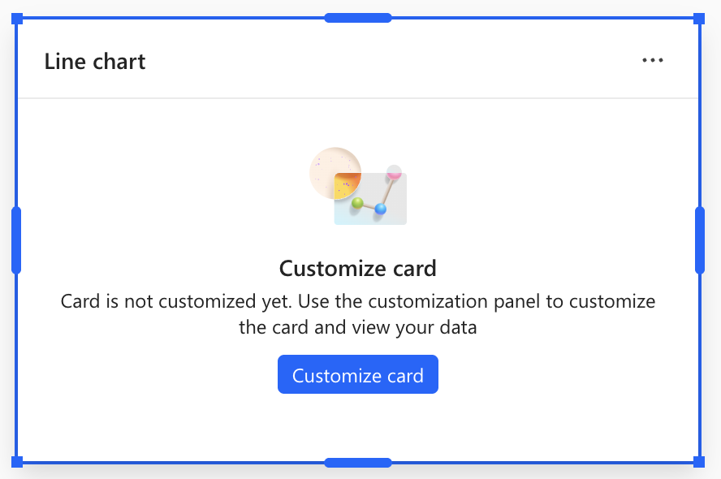
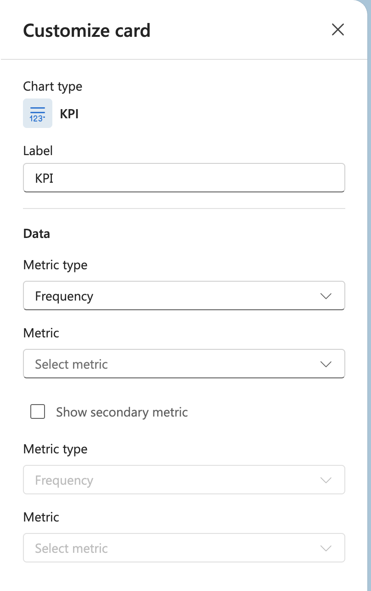
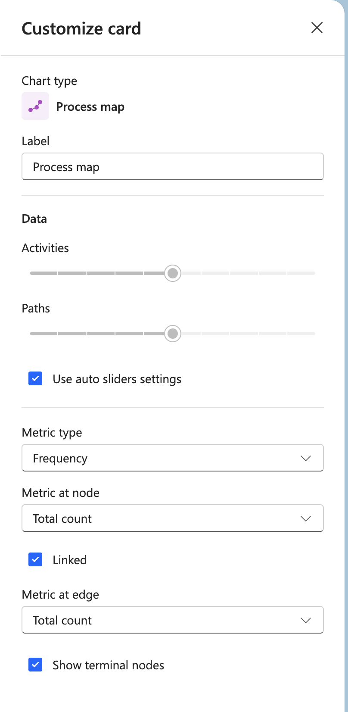
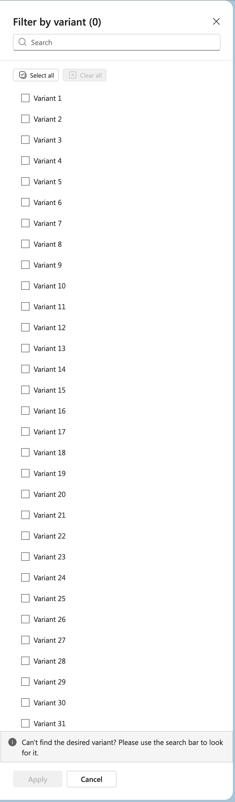

# Quick Start Guide

Get up and running with Process Intelligence Studio in minutes.

## What is Process Intelligence Studio?

Process Intelligence Studio is a customizable dashboard workspace for analyzing process mining data in Power Automate. Unlike the fixed Process Overview, you can create multiple tabs, add various visualization cards, and arrange them to match your analytical needs.

## 5-Minute Getting Started

### Step 1: Open your process
1. Navigate to your process in Power Automate
2. The default "Overview" tab loads with pre-configured cards

### Step 2: Explore existing cards
- **Process map**: Shows your process flow with activities and paths
- **KPI cards**: Display key metrics like Cases, Events, and Throughput Time
- **Charts**: Show distributions (Donut charts, Bar charts) and trends (Line charts)
- **Variants**: View variant analysis in bar charts
- Scroll to see all cards on the current tab

### Step 3: Apply filters
1. Select **Add persistent filters** in the filter bar
2. Choose a filter type:
   - **Timeframe**: Filter by date ranges (Last hour, Last 6 hours, Last 24 hours, Last 7 days, or Custom)
   - **Attribute**: Filter by specific attribute values
   - **Variant**: Select specific process variants
   - **Edge**: Filter by edge (activity transitions)
3. Configure the filter and apply
4. All cards update to show filtered data

### Step 4: Create your first custom tab
1. Select the **+** button in the tab bar
2. Name your tab (e.g., "High Throughput Time")
3. Select **Add tab**

### Step 5: Add cards to your tab
1. Select **Edit layout** in the top-right corner
2. The tab shows "Your dashboard is currently empty" message
3. Select **Edit layout** button
4. Select **+ Add card** to open the card selection panel
5. Choose a card type:
   - **KPI**: Single metric display
   - **Process map**: Visualize your process flow
   - **Donut chart**: Show proportions and distributions
   - **Vertical bar chart**: Compare values vertically
   - **Horizontal bar chart**: Compare values horizontally
   - **Line chart**: Show trends over time
   - **Statistical grid**: Display tabular data
   - **Variant DNA**: Visualize variant patterns
6. After adding a card, select **Customize card** to configure it
7. Repeat to add more cards

### Step 6: Customize your layout
1. **Resize cards**: Drag the corner and edge handles on each card
2. **Move cards**: Drag cards to new positions
3. Cards automatically adjust to fit the grid layout
4. Select **Done editing** when finished

## Common Tasks

### Create an executive dashboard
1. Create a new tab named "Executive Dashboard"
2. Add 4-6 KPI cards showing key metrics:
   - Configure each KPI card using the customization panel
   - Select Metric type and specific Metric
   - Optionally enable "Show secondary metric" for comparisons
3. Add a Process map to visualize the flow
4. Add a Donut chart showing distributions
5. Arrange KPIs at the top, larger visualizations below

### Analyze performance bottlenecks
1. Create a tab named "Bottleneck Analysis"
2. Add a Process map and customize it:
   - Use the Activities and Paths sliders to control complexity
   - Select Metric type (Frequency, Duration, Cost, or Rework)
   - Configure Metric at node and Metric at edge
   - Enable "Show terminal nodes" if needed
3. Add a Horizontal bar chart to compare activities
4. Apply Timeframe or Attribute filters to focus on specific cases

### Compare time periods
1. Create two tabs: "This Quarter" and "Last Quarter"
2. On each tab, add the same visualizations
3. Apply different Timeframe filters:
   - Use predefined options (Last 7 days) or Custom date ranges
4. Switch between tabs to compare

### Investigate specific variants
1. Add a Variant DNA card to see all variants visually
2. Add a Variant filter:
   - Use the search bar to find specific variants
   - Select or deselect variants from the list
   - Apply the filter
3. Add charts to analyze those variants:
   - Process map showing only selected variants
   - Bar charts comparing variant performance

## Essential Tips

### Navigation
- **Switch tabs**: Click any tab in the tab bar to switch views
- **Edit mode**: Select "Edit layout" to modify your dashboard
- **View mode**: Exit edit mode to interact with cards and view data
- **Edit tabs**: Select "Edit tabs" in the top-right to manage tab settings

### Filtering Best Practices
- Apply persistent filters to focus your entire tab on specific data
- Use **Timeframe filters** for date-based analysis (Last hour, Last 6 hours, Last 24 hours, Last 7 days, or Custom ranges)
- Use **Attribute filters** to include/exclude specific attribute values (searchable with Select all/Clear all options)
- Use **Variant filters** to analyze specific process variants
- Use **Edge filters** to focus on specific activity transitions
- Start broad, then narrow down progressively
- Save different filter combinations as separate tabs
- Remove filters by selecting the X on each filter chip

### Layout Best Practices
- Place important cards at the top
- Make KPI cards smaller (they don't need much space)
- Make process maps larger (they need room to display the flow)
- Use the resize handles on card corners and edges to adjust size
- Drag cards to rearrange them on the grid
- Cards automatically adjust to fit the layout

### Card Configuration
- New cards show "Customize card" prompt until configured
- Select **Customize card** button to open the configuration panel
- Each card type has specific options:
  - **KPI**: Metric type, Metric selection, optional secondary metric
  - **Process map**: Activities/Paths sliders, Metric type, Node/Edge metrics, Terminal nodes option
  - **Charts**: Label, Data dimensions, Metrics, Display options
- Changes apply when you configure and close the panel
- Experiment to find the right view for your needs

## Troubleshooting

### Cards are not showing data
- Check that filters aren't too restrictive (review active filters in the filter bar)
- Verify the process has data for the selected timeframe
- Use "Refresh data" button in the top-right corner
- Ensure the card is properly customized (some cards show "Customize card" prompt until configured)

### Layout is messy after adding many cards
- Enter edit mode by selecting "Edit layout"
- Drag cards to rearrange them into a cleaner grid
- Use resize handles to make cards more uniform in size
- Remove unnecessary cards

### Too many cards on one tab
- Create multiple tabs for different analytical purposes
- Organize tabs by theme (e.g., "Overview", "Performance Analysis", "Variant Analysis")
- Use the tab bar to switch between different views

### Process map is too complex
- Use the **Activities slider** in the Process map customization panel to reduce the number of activities shown
- Use the **Paths slider** to hide less frequent paths
- Enable "Use auto sliders settings" for automatic simplification
- Apply Variant or Edge filters to focus on specific flows
- Consider using Attribute filters to reduce the case count

## Next Steps

Now that you're familiar with the basics, explore:

1. **[Tab management](process-mining-studio-tab-management.md)** - Master organizing your workspace
2. **[Filtering and interactions](process-mining-studio-filtering-overview.md)** - Learn advanced filtering
3. **[Process map](process-mining-studio-process-map.md)** - Deep dive into process visualization
4. **[All tile types](process-mining-studio-tiles-overview.md)** - Discover all visualization options

## Need Help?

- **Documentation**: See [README.md](README.md) for complete documentation
- **Examples**: Check existing tabs in your process for inspiration
- **Support**: Contact your Power Automate administrator
