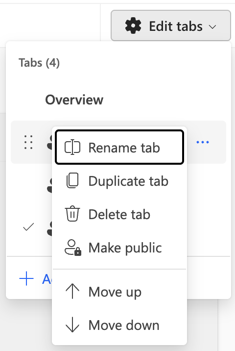

# Tab Management

## Overview

Tabs are the organizational backbone of Process Intelligence Studio, allowing you to create multiple specialized views within a single process. Each tab maintains its own collection of cards, visualizations, and layout configuration, making it easy to switch between different analytical perspectives without losing your work.

## The Tab Bar

The tab bar is located at the top of the Process Intelligence Studio interface, just below the navigation breadcrumb. As shown in the screenshot above, it displays:

- **Tab names**: "Overview", "Case Duration", "Variant Analysis", "Top 3 Countries"
- **Person icons**: Each tab shows a small person icon indicating visibility settings
- **Active tab indicator**: The currently selected tab (in this case, "Top 3 Countries") is highlighted with a blue underline
- **Add button**: A "+" button on the far right for creating new tabs

Click any tab name to switch to that view and see its configured cards and visualizations.

## Creating New Tabs

### Using the "+" Button

To create a new tab:

1. Click the "+" button at the end of the tab bar
2. The "Add tab" dialog opens (shown in screenshot above)
3. Enter a descriptive name in the text field (e.g., "High Throughput Time")
4. Click the blue "Add tab" button to create the tab
5. Or click "Cancel" to dismiss the dialog without creating a tab

The text field includes an X button on the right side to quickly clear your entered text if needed.

Once created, the new tab appears in the tab bar and becomes the active tab, displaying an empty state where you can begin adding cards.

## Managing Tabs with the Edit Menu

The "Edit tabs" menu provides comprehensive tab management capabilities. Access it by clicking the gear icon button labeled "Edit tabs" in the top-right area of the interface.

### The Edit Tabs Panel

When opened, the Edit tabs panel displays:

- **Header**: "Edit tabs" with a gear icon and dropdown arrow
- **Tab count**: "Tabs (4)" showing the total number of tabs
- **Tab list**: All tabs in your dashboard with management controls
- **Add tab button**: "+ Add tab" option at the bottom

### Tab Context Menu Options

Each tab in the list has a three-dot menu button that opens a context menu with the following options:

1. **Rename tab**: Change the tab's name
2. **Duplicate tab**: Create a copy of the tab with all its cards and layout
3. **Delete tab**: Remove the tab from the dashboard
4. **Make public**: Share the tab with other users (indicated by person icon with lock)
5. **Move up**: Shift the tab one position to the left in the tab bar
6. **Move down**: Shift the tab one position to the right in the tab bar

The context menu appears as a white panel overlaying the tab list, with each option shown with an icon and label.

### Reordering Tabs

Tabs can be reordered in two ways:

**Using Move Commands:**
1. Open the tab's context menu (three dots)
2. Select "Move up" to move the tab left
3. Or select "Move down" to move the tab right

**Using Drag Handles:**
1. Locate the six-dot drag handle icon on the left side of any tab in the list
2. Click and hold the drag handle
3. Drag the tab to your desired position
4. Release to drop it in place

The tab order in this management panel directly corresponds to the order displayed in the tab bar.

### Tab Indicators

In the tab list, you'll see:
- **Drag handle**: Six dots on the left for reordering
- **Person icon**: Next to each tab name, indicating sharing status
- **Checkmark**: Appears next to the currently active tab
- **Three-dot menu**: On the right side for accessing context menu options

## Empty Tab State

When you create a new tab or navigate to a tab without any content, Process Intelligence Studio displays an empty state (shown in the screenshot above). This state includes:

- **Empty tab illustration**: A visual showing a magnifying glass over colorful charts
- **Message**: "Your dashboard is currently empty"
- **Instructions**: "To get started, add a few cards and customize your dashboard layout in edit mode."
- **Edit layout button**: A blue button to enter edit mode

The empty tab screenshot shows the tab bar at the top with tabs "Overview", "Case Duration", "Variant Analysis", "Top 3 Countries", and the newly created "High Throughput Time" tab (which is active and empty).

Click the "Edit layout" button to enter customization mode and begin adding cards to populate your tab. See [Dynamic Layouting](process-mining-studio-dynamic-layouting.md) for details on adding and arranging cards.

## Best Practices

- **Name tabs descriptively**: Use clear names that indicate the analytical purpose (e.g., "Top 3 Countries", "High Throughput Time")
- **Organize by audience**: Create separate tabs for different stakeholders (executives, analysts, operations)
- **Group related metrics**: Keep logically connected visualizations on the same tab
- **Use duplication**: Start from an existing tab and modify it rather than building from scratch
- **Order strategically**: Place most frequently accessed tabs on the left for quick access
