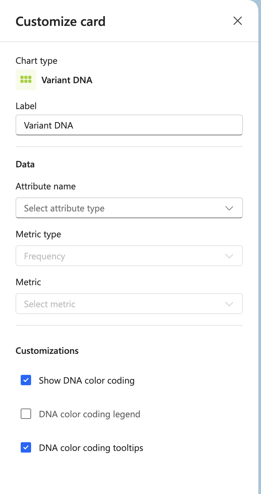

# Variant DNA

## Label

Enter a custom label for the card.

## Data

**Attribute name**
Select the attribute type to analyze from the dropdown menu.

**Metric type**
Choose the metric type for your analysis (e.g., Frequency).

**Metric**
Select the specific metric to display from the dropdown menu.

## Customizations

**Show DNA color coding**
Enable or disable color coding for the DNA visualization. Checked by default.

**DNA color coding legend**
Display a legend showing the color-to-activity mapping. Unchecked by default.

**DNA color coding tooltips**
Show tooltips when hovering over DNA blocks. Checked by default.
