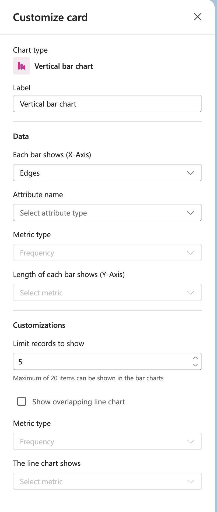

# Vertical bar chart

## Label

Enter a name for your vertical bar chart.

## Data

**Each bar shows (X-Axis)**
Select what each bar represents from the dropdown (e.g., Edges).

**Attribute name**
Select the attribute type to display.

**Metric type**
Choose the type of metric to measure (e.g., Frequency).

**Length of each bar shows (Y-Axis)**
Select the specific metric to display on the Y-axis.

## Customizations

**Limit records to show**
Set the number of records to display (default: 5).

Note: Maximum of 20 items can be shown in the bar charts.

**Show overlapping line chart**
Enable this checkbox to overlay a line chart on top of the bar chart.

**Metric type**
Select the metric type for the line chart (e.g., Frequency).

**The line chart shows**
Select the specific metric to display on the line chart.
