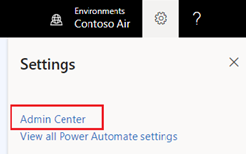
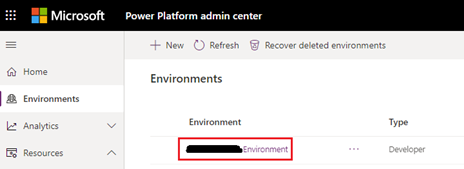
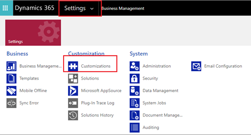
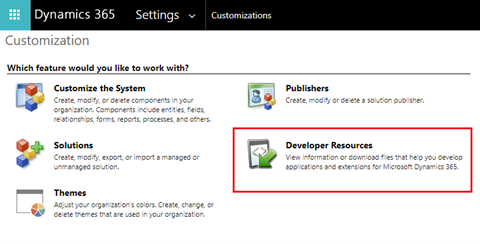
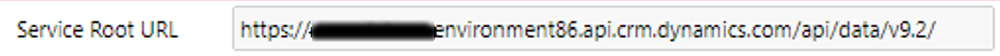
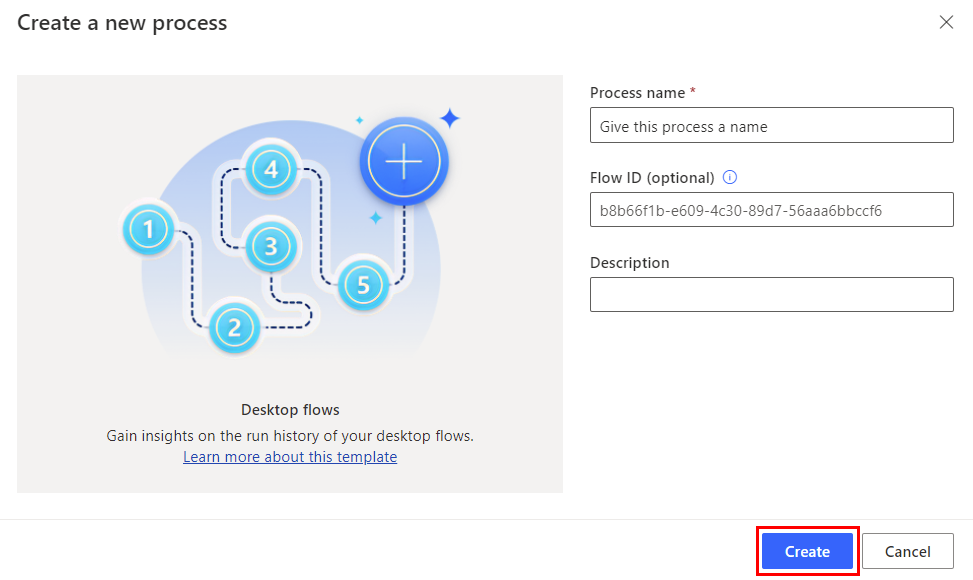
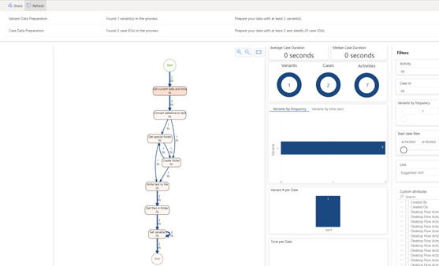
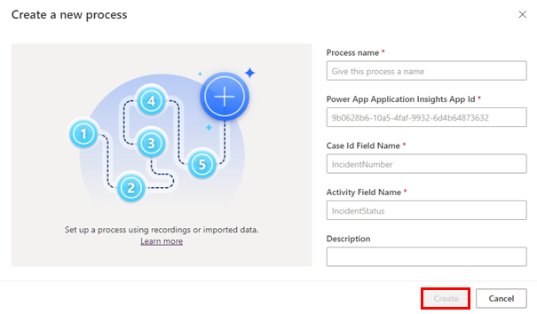

# Templates overview

Process advisor templates allow you to easily onboard your data with a few selections, which avoids the traditional data identification and manipulation required in traditional process mining tools. Templates will enable users to reach their insights quickly and without the previously required data mastery. Our  templates like ADO, Power Apps, Bot Framework, and more, will empower all to reach process insights and implement optimizations and automations.

## Power Platform Desktop Flows template

The Process advisor Power Automate **Desktop Flows** template will enable you to visualize the actions your RPA bots are executing. Insights will allow you to maximize your RPA functionality and manage bot success rate.

To learn more about Power Automate desktop flows, go to [Introduction to desktop flows](desktop-flows/introduction.md).  

### Prerequisites

Before you can visualize your Power Automate Desktop Flows, you must have a Power Automate RPA license. To learn more, go to [Introduction to desktop flows](desktop-flows/introduction.md).

### Create and run the Desktop Flows template

The process of running a template is similar for all templates. Once you know how to run one template, it should be easy to run any template.

1. In the **Power Platform** tab in the **Start with a popular template** section, select the **Desktop Flows** tile.

    > [!div class="mx-imgBorder"]
    > 

1. In the **Process name** field, enter a name for your process.

1. Select the gear icon, and then select **Admin Center**.

    > [!div class="mx-imgBorder"]
    > 

1. On the left pane, select **Environments**.

1. On the right pane, select your environment.

    > [!div class="mx-imgBorder"]
    > 

    (I don't see "...and then Settings > Resources > All legacy Settings.)

1. On the toolbar, select **Settings** > **Customizations**.

    > [!div class="mx-imgBorder"]
    > 

1. On the **Customization** screen, select **Developer Resources**.

    > [!div class="mx-imgBorder"]
    > 

1. Copy the **Service Root URL**. You'll use this as your Dataverse API.

    > [!div class="mx-imgBorder"]
    > 

1. Go back to your Template and paste this in the **Dataverse API URL** field.

1. (Optional) Enter a description of the process in the **Description** field.

1. Select **Create**.

    > [!div class="mx-imgBorder"]
    > 

1. In the **Connect to data source** screen in the **Authentication Kind** field, replace "Anonymous" with **Organizational account**.

1. Select **Sign in** and authenticate through AAD.

    > [!div class="mx-imgBorder"]
    > 

1. After connection credentials are established, select **Save**. Process advisor will analyze your process. This might take at least two minutes to complete.

### Visualize the process map

When your process report has been published, you can visualize the process map and use the custom attributes filter to dig deeper into your insights.

> [!div class="mx-imgBorder"]
> 

## Power Virtual Agents template

The Power Virtual Agents template will enable you to visualize the process map and variant use of your virtual agents. Insights will allow you to better understand your users' journey and be able to maximize the bots effectiveness.

To learn more, go to [Power Virtual Agents overview](/power-virtual-agents/fundamentals-what-is-power-virtual-agents).

### Prerequisites

Before you can visualize your Power Virtual Agents, you must have a Power Virtual Agent license. To learn more, go to [Power Virtual Agents overview](/power-virtual-agents/fundamentals-what-is-power-virtual-agents).

### Create and run the Power Virtual Agents template

The process of running a template is similar for all templates. Once you know how to run one template, it should be easy to run any template.

1. In the **Power Platform** tab in the **Start with a popular template** section, select the **Power Virtual Agents** tile.

    > [!div class="mx-imgBorder"]
    > 

1. Repeat steps 2 trough 14 in the [Create and run the Desktop Flows template](#create-and-run-the-desktop-flows-template) section earlier in this article.

### Visualize the process map and variants

After your process report has been published, you can visualize the process map and the variants of the customer journey through your virtual agents. You can also leverage the custom attributes filter to dig deeper into your insights.

> [!div class="mx-imgBorder"]
> 

## Power Apps Insights template

The **Power Apps Insights** template will enable you to visualize the actions and success of your Power Apps. The template will enable you to maximize your apps' functionality and manage its success rate.

To learn more about Power Apps, go to the [Microsoft Power Apps documentation](/power-apps/).

### Prerequisites

Before you can visualize your Power Apps, you must have a Power Apps license. To learn more, go to the [Microsoft Power Apps documentation](/power-apps/).

### Create and run the Power Apps Insights template

In order to deploy the **Power Apps Insights** template, you'll need to create an Application Insights resource.

1.	Create an Application Insights resource by following the instructions in [Create an Application Insights resource](/azure/azure-monitor/app/create-new-resource).

1. In the **Power Platform** tab in the **Start with a popular template** section, select the **Power Apps Insights** tile.

    > [!div class="mx-imgBorder"]
    > 

1. In the **Process name** field, enter a name for your process.

1. Go to the Application Insights Azure Resource you created in step 1.

1. On left panel, select **Configure** > **API Access**.

    > [!div class="mx-imgBorder"]
    > 

1. Copy the Power App **Application App ID**.

    > [!div class="mx-imgBorder"]
    > 

1. Go back to the Process Advisor **Create a new process** screen and paste it in the **Power App Application Insights App Id** field.

1. Identify the parameter you are looking to analyze from your Power Apps and enter it in the **Case Id Field Name** and **Activity Field Name** fields. This can be identified by navigating to the trace details of your Power App.

1. (Optional) Enter a description of the process in the **Description** field.

1. Select **Create**.

    > [!div class="mx-imgBorder"]
    > 

1. Repeat steps 12 through 14 in the [Create and run the Desktop Flows template](#create-and-run-the-desktop-flows-template) section in this article.

### Visualize the process map

After your process report has been published, you can visualize the process map and use the custom attributes filter to dig deeper into your insights.

> [!div class="mx-imgBorder"]
> 
