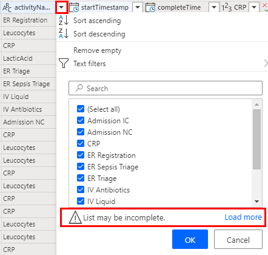
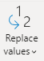
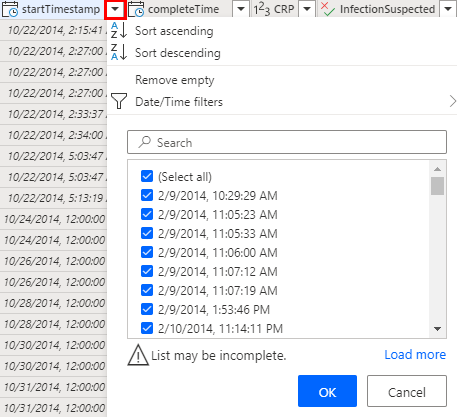
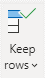
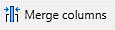
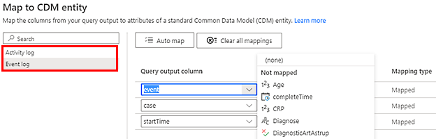
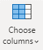
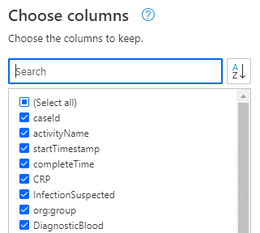

# Transform and map data in process advisor

Once you select the data source you want to use, you're taken to the Power Query editor. The query editor is a powerful tool to transform your data. To learn more, go to [The Power Query user interface](/power-query/power-query-ui).

Here are some reasons why you might want to transform the data:

- You might not be interested in all the activity names that are logged, and so you want to filter for specific activity names that are important to the process you are trying to mine.

- You might want to rename some of the activity names to be more descriptive and understandable. This is often not the case with names in a database.

- You might be interested in only the most recent year's history, and not the entire history. 

    > [!NOTE]
    > For public preview, we only support up to 150K rows of data. Because of this, filtering to a specific period may be necessary.

- You might want to combine multiple ID columns to form the case ID. This is often done when the ID you want to use for process mining does not exist or is a combination of multiple IDs in the application. For example, when a customer files support tickets, the support ticket itself may be assigned to multiple customer service agents. If you want to analyze how each agent handles each ticket, then you would combine the agent ID and the ticket ID into the case ID.

## Filter activity names

1.	Select the carat next to the activity name column to bring up the sort and filter menu.

1.	If there's a message that says **List may be incomplete**, select **Load more**.

    > [!div class="mx-imgBorder"]
    > 

1. Select only the activity names that you want to analyze (uncheck any name you want to exclude).

1. Alternatively, you can use the **Text filter** menu for more advanced filtering. See this documentation for more information on filtering by value. go to [Filter by values in a column](/power-query/filter-values).

## Rename activities

1. Ensure that the **Activity Name** column is selected.

1. Select the **Transform** tab above the command bar.

1. Select **Replace values** in the toolbar.

    > [!div class="mx-imgBorder"]
    > 

1. Under **Values to find**, type the activity name as it appears in the data source that you want to replace.

1. Under Replace with, type the activity name you want to show in the process map.

1. You can do this multiple times for all the different values you want to replace.

## Reduce the number of total records

One strategy for reducing the total number of records is to only use the latest records. To do this, you need to first sort the data by time.

1. Select the carat next to the start timestamp column to bring up the sort and filter menu.

    > [!div class="mx-imgBorder"]
    > 

1. Select **Sort descending** to have the most recent records show up first.

1. Select **OK** and then select **Keep rows** in the command bar.

    > [!div class="mx-imgBorder"]
    > 

1. Enter 150000 under Number of rows.

1. Click OK to filter for the top 150K rows.

## Combine multiple IDs

You can use **Ctrl** + **click** to select multiple columns that you want to combine.

1. In the Transform tab, select **Merge columns** in the command bar.

    > [!div class="mx-imgBorder"]
    > 

1. (Optional) Select a separator from the dropdown. Alternatively, you can select **none**.

1. Change the name (or make a note of the default name that's generated), so you can select it when mapping to case ID.

## Map data

Mapping tells process advisor what columns represent case ID, activity name or timestamp.

1. In the toolbar, select ***Map to entity***.

    > [!div class="mx-imgBorder"]
    > 

1. Select the **Event log** entity on the left side of the modal if your data only has one timestamp. If your data has both a start and an end timestamp, select the **Activity log** entity.

    > [!div class="mx-imgBorder"]
    > 

1. Select each of the dropdowns under Query output column, and select the corresponding column in your data that maps to:
    1. Activity name (activityName)
    1. Case ID (caseId)
    1. Start timestamp (startTimestamp)
    1. End timestamp (endTimestamp) only if you select Activity log

1. After everything is mapped, select **OK** to close the map to entity modal.

### Select additional columns

When performing process mining, having additional information about a process will be especially useful. If your data only contains five or fewer columns outside of the required columns that you've mapped in the previous procedure, nothing else needs to be done. You can select **Save** and all the columns will be analyzed. You'll also be able to filter on those columns in the Analytics page.

If you have more than five additional columns:

1. Select Choose columns in the toolbar.
 
    > [!div class="mx-imgBorder"]
    > 

1. Deselect any column you don't want to include in the analysis.
 
    > [!div class="mx-imgBorder"]
    > 

Ensure that the mapped columns (activityName, caseId, startTimestamp, endTimestamp) from the previous procedure are selected. The five additional columns are on top of the mapped columns.
